# micrograd


<!-- WARNING: THIS FILE WAS AUTOGENERATED! DO NOT EDIT! -->

## Plan

- Review micrograd implementation as per lecture. Implement everything
  from scratch
- Generalize micrograd implementation for arrays and tensors using numpy
- May be extend the ideas to jax, pytorch or tinygrad

``` python
summary_md = pathlib.Path("./transcripts/Summary.md").read_text(); summary_md
transcript = pathlib.Path('./transcripts/lesson_01.txt').read_text(); transcript[:20]
```

    'hello  my  name  is '

I want to follow along the tutorial 8 part tutorial zero to hero NN from
Andrey Karpathy.I am going to do first part related to micrograd
implementation. Please refer to $`summary_md` for overall course
structure and use $`transcript` to guide me through the lesson.

##### 🤖Reply🤖<!-- SOLVEIT_SEPARATOR_7f3a9b2c -->

🧠🧠🧠🧠🧠🧠🧠🧠🧠🧠🧠🧠🧠🧠🧠🧠🧠🧠🧠🧠🧠🧠🧠🧠🧠🧠🧠🧠🧠🧠🧠🧠🧠🧠🧠🧠🧠🧠

Great choice! Andrej Karpathy’s micrograd tutorial is a fantastic way to
understand neural networks from the ground up.

**What we’re building:** A tiny autograd engine called *micrograd* — it
implements backpropagation, which is the core algorithm that powers all
modern deep learning. The entire thing is only ~100 lines of Python!

**The big picture:** 1. Understand derivatives intuitively 2. Build a
`Value` class that tracks computations 3. Implement automatic
backpropagation 4. Build a simple neural network on top

------------------------------------------------------------------------

**Let’s start with Step 1: Derivative Intuition**

Before we build anything, Andrej wants us to *feel* what a derivative
means — not just calculate it symbolically.

Here’s the idea: if you have a function `f(x)`, the derivative tells you
*“if I nudge x a tiny bit, how much does f(x) change?”*

**Your first task:** Create a simple function and explore its derivative
numerically.

``` python
def f(x):
    return 3*x**2 - 4*x + 5
```

Try: 1. Evaluate `f(3.0)` — what do you get? 2. Pick a tiny `h = 0.0001`
and compute `(f(3.0 + h) - f(3.0)) / h`

This approximates the derivative at x=3. What value do you get? Does the
sign make sense if you look at where x=3 sits on a parabola?

Give it a try and let me know what you find!

``` python
def f(x): return 3*x**2 - 4*x + 5
f(3.0)
```

    20.0

``` python
h = 0.001
x = 3.0
(f(x+h)-f(x))/h
```

    14.00300000000243

I expected (6\*3-4=14) I go something close

##### 🤖Reply🤖<!-- SOLVEIT_SEPARATOR_7f3a9b2c -->

Excellent work! You got 14.003, which is very close to the exact
derivative of 14. The small error (0.003) comes from using a finite `h`
instead of an infinitely small one.

**Key insight:** The derivative tells you the *slope* of the function at
that point. At x=3, if you increase x by a tiny amount, f(x) increases
about 14 times as fast.

Notice the sign is positive — that means the function is *increasing* at
x=3. Makes sense for a parabola opening upward!

------------------------------------------------------------------------

**Now let’s think about a different point:**

What do you think will happen at x = **2/3** (about 0.667)?

- Will the derivative be positive, negative, or zero?
- Why?

Try calculating it numerically if you’d like, or just reason about where
that point sits on the parabola `3x² - 4x + 5`.

Derivative should be 0. This is at lowest point on parabola.where slope
changes

``` python
h = 0.001
x = 2/3
(f(x+h)-f(x))/h
```

    0.0029999999995311555

``` python
xs = list(range(-10, 10)); x
fxs = [ f(x) for x in xs]; fxs
```

    [345,
     284,
     229,
     180,
     137,
     100,
     69,
     44,
     25,
     12,
     5,
     4,
     9,
     20,
     37,
     60,
     89,
     124,
     165,
     212]

``` python
import matplotlib.pyplot as plt
```

``` python
plt.plot(xs, fxs)
plt.vlines(2/3, ymin=0, ymax= max(fxs), color='red')
```

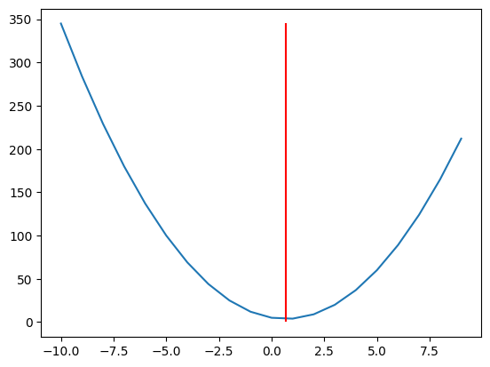

##### 🤖Reply🤖<!-- SOLVEIT_SEPARATOR_7f3a9b2c -->

Perfect! You’ve discovered something really important: **at the minimum
of the parabola, the derivative is zero!**

Your numerical calculation gave ~0.003 (essentially zero, just with tiny
rounding error), and your graph beautifully shows that red line right at
the bottom of the curve where the slope is flat.

**This is a key calculus concept:** When the derivative equals zero,
you’re at a critical point — could be a minimum, maximum, or inflection
point.

------------------------------------------------------------------------

**Let’s connect this to the micrograd tutorial:**

Now that you understand what derivatives *mean*, we’re ready to build
something powerful. In the tutorial, you’ll create a `Value` class that:

1.  Wraps numbers (like `Value(2.0)`)
2.  Tracks operations (addition, multiplication, etc.)
3.  **Automatically computes derivatives** through something called
    backpropagation

Would you like to: - **A)** Start building the `Value` class right
now? - **B)** First explore one more example with multiple inputs (like
`f(a,b,c) = a*b + c`) to see how derivatives work with multiple
variables?

What sounds more interesting to you?

I want to explore one more example with multiple input

##### 🤖Reply🤖<!-- SOLVEIT_SEPARATOR_7f3a9b2c -->

Great choice! Let’s explore how derivatives work when a function has
multiple inputs.

Here’s a simple function with three inputs:

``` python
def d(a, b, c):
    return a*b + c
```

Let’s say `a=2.0`, `b=-3.0`, and `c=10.0`.

**First, what’s the output?** Calculate `d(2.0, -3.0, 10.0)` — what do
you get?

**Then, let’s think:** If we nudge just `a` by a tiny amount (keeping
`b` and `c` fixed), how will the output change? Will it go up or down?
By how much?

Try computing the derivative with respect to `a` using the same
technique you used before:

``` python
h = 0.001
# nudge only a, keep b and c the same
```

What do you expect to see?

``` python
def d(a, b, c):
    return a*b + c
```

``` python
h = 0.001
```

``` python
a=2.0
b=-3.0
c=10.0
d(a,b,c)
```

    4.0

``` python
(d(a+h, b, c)-d(a, b, c))/h
# nudge only a, keep b and c the same
```

    -3.0000000000001137

Derivative of a should be b . Which we see from our calculation

``` python
(d(a, b+h, c)-d(a, b, c))/h
```

    1.9999999999997797

Derivative of b should be a which we see from our calculations

``` python
(d(a, b, c+h)-d(a, b, c))/h
```

    0.9999999999994458

Derivative of c should be 1 which we see from our calculation. Of course
we need to account for numerical error

## Part 1 Summary: Understanding Derivatives

**Key Concepts:** - Derivative = “sensitivity” or “slope” - how much
output changes when input changes - Numerical approximation:
`(f(x+h) - f(x)) / h` for small h - Sign tells direction: positive =
increasing, negative = decreasing - Zero derivative = critical point
(min/max/inflection)

**Multiple inputs:** - Each input has its own partial derivative - For
`d = a*b + c`: ∂d/∂a = b, ∂d/∂b = a, ∂d/∂c = 1

##### 🤖Reply🤖<!-- SOLVEIT_SEPARATOR_7f3a9b2c -->

Excellent work! You’ve discovered the **local derivatives** for each
variable:

- **∂d/∂a = b** (which is -3)
- **∂d/∂b = a** (which is 2)  
- **∂d/∂c = 1**

This tells us something powerful: each input has its own “influence” on
the output. For example, if you increase `a` slightly, the output
changes by `-3` times that amount (it goes *down* because `b` is
negative).

------------------------------------------------------------------------

**Here’s the key insight for micrograd:**

When we have `d = a*b + c`, we can think of this as a small computation
graph: - First, `a*b` happens - Then, we add `c`

In backpropagation, we’ll work *backwards* through this graph, computing
how each intermediate step affects the final output. This is the **chain
rule** in action!

**Ready for the next step?**

Would you like to start building the `Value` class now? We’ll make it
track these operations automatically so we never have to manually
compute derivatives again!

Yes let’s build the Value class now

##### 🤖Reply🤖<!-- SOLVEIT_SEPARATOR_7f3a9b2c -->

Perfect! Let’s start building the `Value` class step by step.

**First, the basics:** A `Value` object will wrap a number and
eventually track how it was created. Let’s start simple:

``` python
class Value:
    def __init__(self, data):
        self.data = data
    
    def __repr__(self):
        return f"Value(data={self.data})"
```

Try creating a couple of `Value` objects:

``` python
a = Value(2.0)
b = Value(-3.0)
```

What do you see when you print them?

**Next challenge:** Right now, we can’t do `a + b` — Python doesn’t know
how to add `Value` objects. We need to teach it!

Can you think about what should happen when we add two `Value` objects?
What should the result be?

``` python
from fastcore.utils import store_attr, basic_repr
```

``` python
class Value:
    def __init__(self, data): store_attr('data', self)
    __repr__=basic_repr('data')
```

``` python
Value(data=1)
```

    Value(data=1)

``` python
a = Value(2.0)
b = Value(-3.0)
```

Adding 2 value object should give new value object whose data is some of
original

##### 🤖Reply🤖<!-- SOLVEIT_SEPARATOR_7f3a9b2c -->

Exactly right! When we add two `Value` objects, we should get a new
`Value` whose data is the sum of the original values.

Let’s implement that by adding a special method called `__add__`:

``` python
class Value:
    def __init__(self, data): store_attr('data', self)
    __repr__ = basic_repr('data')
    
    def __add__(self, other):
        out = Value(self.data + other.data)
        return out
```

Try redefining your class with this new method, then test it:

``` python
a = Value(2.0)
b = Value(-3.0)
c = a + b
```

What does `c` show? Does it have the data you expected?

``` python
class Value:
    def __init__(self, data): store_attr('data', self)
    def __add__(self, other): return Value(self.data+other.data)
    __repr__=basic_repr('data')
```

``` python
a = Value(2.0)
b = Value(-3.0)
a+b
```

    Value(data=-1.0)

##### 🤖Reply🤖<!-- SOLVEIT_SEPARATOR_7f3a9b2c -->

Perfect! `a + b` gives `Value(data=-1.0)`, which is exactly right: 2.0 +
(-3.0) = -1.0.

**Now let’s add multiplication.** Can you add a `__mul__` method to your
`Value` class that handles multiplication?

Hint: It should work just like `__add__`, but multiply the data instead.

Try implementing it, then test with something like:

``` python
a = Value(2.0)
b = Value(-3.0)
a * b  # should give Value(data=-6.0)
```

Give it a shot!

``` python
from fastcore.utils import patch, patch_to
```

``` python
@patch_to(Value)
def __mul__(self:Value, other): return Value(self.data*other.data)
```

``` python
a = Value(2.0)
b = Value(-3.0)
a*b
```

    Value(data=-6.0)

##### 🤖Reply🤖<!-- SOLVEIT_SEPARATOR_7f3a9b2c -->

Excellent! You’ve got multiplication working. Now `a * b` correctly
gives `Value(data=-6.0)`.

**Next crucial step:** We need to track *where* values come from. Right
now, our `Value` objects don’t remember that `a * b` was created by
multiplying `a` and `b`. This tracking is essential for backpropagation!

Let’s add two new attributes to `Value`: - `_prev`: a set of the
“parent” values that created this one - `_op`: a string describing the
operation (like `'+'` or `'*'`)

For leaf nodes (created directly), these will be empty. But for computed
values, they’ll store the history.

Can you modify the `__init__` method to accept optional `children` and
`op` parameters? Then update `__add__` and `__mul__` to pass this
information when creating new values.

Give it a try, or let me know if you’d like a hint!

Does fastcore has anything to patch properties?

##### 🤖Reply🤖<!-- SOLVEIT_SEPARATOR_7f3a9b2c -->

Yes! `fastcore` has `@patch_property` (or `@patch_to` with `property`)
for adding properties to existing classes.

For example:

``` python
from fastcore.utils import patch_property

@patch_property
def some_prop(self:Value):
    return self.data * 2
```

Is that what you’re looking for? Are you thinking of using properties
for `_prev` and `_op`, or something else?

yes

##### 🤖Reply🤖<!-- SOLVEIT_SEPARATOR_7f3a9b2c -->

Great! You can use `@patch_property` to add `_prev` and `_op` as
properties.

However, for this case, you might find it simpler to just add them as
regular attributes in `__init__` since they need to be set when the
object is created.

Here’s a hint for updating `__init__`:

``` python
def __init__(self, data, children=(), op=''):
    store_attr('data', self)
    self._prev = set(children)
    self._op = op
```

Then in `__add__` and `__mul__`, you’d pass the children. For example:

``` python
def __add__(self, other):
    return Value(self.data + other.data, children=(self, other), op='+')
```

Want to try implementing this? Or would you like me to show you the
complete updated class?

``` python
class Value:
    def __init__(self, data, children=(), op=''): 
        store_attr('data', self) # Largely overkill but want to try how fastcore works
        self._prev = set(children)
        self._op = op
    __repr__= basic_repr('data, _prev, _op')
```

``` python
Value(1)
```

    Value(data=1, _prev=set(), _op='')

``` python
@patch_to(Value)
def __add__(self:Value, other): return Value(self.data+other.data, children=(self, other), op="+")

@patch_to(Value)
def __mul__(self:Value, other): return Value(self.data*other.data, children=(self, other), op="*")
```

``` python
a = Value(2.0)
b = Value(-3.0)
a*b, a+b
```

    (Value(data=-6.0, _prev={Value(data=2.0, _prev=set(), _op=''), Value(data=-3.0, _prev=set(), _op='')}, _op='*'),
     Value(data=-1.0, _prev={Value(data=2.0, _prev=set(), _op=''), Value(data=-3.0, _prev=set(), _op='')}, _op='+'))

##### 🤖Reply🤖<!-- SOLVEIT_SEPARATOR_7f3a9b2c -->

Perfect! Your `Value` class is now tracking the computation graph!

Look at what you’ve created: - `a * b` shows `_op='*'` and `_prev`
contains both `a` and `b` - `a + b` shows `_op='+'` and also tracks its
parents

This is the foundation of automatic differentiation! Each `Value` now
knows its history.

**Next step: Adding gradients**

We need one more attribute: `grad` (the gradient/derivative). It should
start at 0.0 for all values.

Can you add `self.grad = 0.0` to your `__init__` method? Then we’ll be
ready to implement backpropagation!

``` python
class Value:
    def __init__(self, data, children=(), op='', label=None): 
        store_attr('data', self) # Largely overkill but want to try how fastcore works
        self._prev = set(children)
        self._op = op
        self.grad = 0.0
        self.label = label if label is not None else ''
    __repr__= basic_repr('data, grad, _op, _prev, label')
```

``` python
@patch_to(Value)
def __add__(self:Value, other): return Value(self.data+other.data, children=(self, other), op="+")

@patch_to(Value)
def __mul__(self:Value, other): return Value(self.data*other.data, children=(self, other), op="*")
```

``` python
a = Value(2.0)
b = Value(-3.0)
a*b, a+b
```

    (Value(data=-6.0, grad=0.0, _op='*', _prev={Value(data=2.0, grad=0.0, _op='', _prev=set(), label=''), Value(data=-3.0, grad=0.0, _op='', _prev=set(), label='')}, label=''),
     Value(data=-1.0, grad=0.0, _op='+', _prev={Value(data=2.0, grad=0.0, _op='', _prev=set(), label=''), Value(data=-3.0, grad=0.0, _op='', _prev=set(), label='')}, label=''))

``` python
from solveit_z2h.utils import draw_dot
```

``` python
@patch_to(Value)
def _repr_svg_(self:Value): 
    svg = draw_dot(self)._repr_image_svg_xml()
    return svg.decode('utf-8') if isinstance(svg, bytes) else svg
```

``` python
a
```


``` python
a = Value(2.0, label='a');a
```


``` python
c = a*b+a+b;c
```

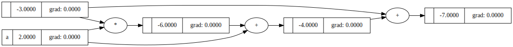

``` python
c.label='c'
c
```


##### 🤖Reply🤖<!-- SOLVEIT_SEPARATOR_7f3a9b2c -->

Excellent! You’ve added `grad` and even added a `label` attribute for
clarity. I also see you’ve integrated a visualization function
[`draw_dot`](https://Rahuketu86.github.io/solveit_z2h/utils.html#draw_dot)
— that’s going to be really helpful for seeing the computation graph!

Now you have a nice expression: `c = a*b + a + b` which equals -7.0, and
all the gradients are initialized to 0.

**Here’s the big question for backpropagation:**

If `c` is our “output” and we want to know how `a` and `b` affect it, we
need to fill in those `grad` values.

The first step is always: **the gradient of the output with respect to
itself is 1.0**

So we’d set `c.grad = 1.0` (meaning “if c changes by 1, c changes by
1”).

Then we work backwards through the graph to fill in `a.grad` and
`b.grad`.

Would you like to: - **A)** Manually calculate what `a.grad` and
`b.grad` should be (using the chain rule)? - **B)** Start implementing a
`backward()` method that will do this automatically?

What sounds more interesting?

Let’ do some examples of manual calculations to build the intuition

##### 🤖Reply🤖<!-- SOLVEIT_SEPARATOR_7f3a9b2c -->

🧠🧠🧠🧠🧠🧠🧠🧠🧠🧠🧠🧠🧠🧠🧠🧠🧠🧠🧠🧠🧠🧠🧠🧠🧠🧠🧠🧠🧠🧠🧠🧠🧠🧠🧠🧠🧠🧠🧠🧠🧠🧠🧠🧠🧠🧠🧠🧠🧠🧠🧠🧠

Great choice! Building intuition first makes the code much easier to
understand.

Let’s start with your expression: `c = a*b + a + b` where `a=2.0` and
`b=-3.0`.

**Question:** What is the derivative of `c` with respect to `a`? (i.e.,
dc/da)

Think of it this way: if you nudge `a` by a tiny amount, how much does
`c` change?

You can approach this two ways: 1. **Numerically** — try
`(c(a+h, b) - c(a, b)) / h` like before 2. **Analytically** — look at
`c = a*b + a + b` and differentiate with respect to `a` (treating `b` as
a constant)

Try one or both approaches! What do you get for dc/da?

``` python
# c_dash = (a+h)*b+(a+h)+b;c_dash
a, b, h
```

    (Value(data=2.0, grad=0.0, _op='', _prev=set(), label='a'),
     Value(data=-3.0, grad=0.0, _op='', _prev=set(), label=''),
     0.001)

``` python
c_dash = (a+h)*b+(a+h)+b;c_dash
```

    AttributeError: 'float' object has no attribute 'data'
    ---------------------------------------------------------------------------
    AttributeError                            Traceback (most recent call last)
    Cell In[1], line 1
    ----> 1 c_dash = (a+h)*b+(a+h)+b;c_dash

    Cell In[1], line 2, in __add__(self, other)
          1 @patch_to(Value)
    ----> 2 def __add__(self:Value, other): return Value(self.data+other.data, children=(self, other), op="+")

    AttributeError: 'float' object has no attribute 'data'

How to check if something is number

##### 🤖Reply🤖<!-- SOLVEIT_SEPARATOR_7f3a9b2c -->

Good catch! You need to handle the case where you’re adding a `Value` to
a regular number (like `h`).

You can check if something is a number using:

``` python
isinstance(other, (int, float))
```

This returns `True` if `other` is an int or float, `False` otherwise.

**Hint:** In your `__add__` method, if `other` is not a `Value`, you
could wrap it in one first:

``` python
if not isinstance(other, Value):
    other = Value(other)
```

Want to try updating your `__add__` and `__mul__` methods to handle
this?

``` python
@patch_to(Value)
def __add__(self:Value, other): 
    if not isinstance(other, Value): other = Value(other)
    return Value(self.data+other.data, children=(self, other), op="+")

@patch_to(Value)
def __mul__(self:Value, other): 
    if not isinstance(other, Value): other = Value(other)
    return Value(self.data*other.data, children=(self, other), op="*")
```

``` python
c_dash = (a+h)*b+(a+h)+b;c_dash
```

``` python
(c_dash-c)/h
```

What are magic methods for supporting substraction and div operators in
python

##### 🤖Reply🤖<!-- SOLVEIT_SEPARATOR_7f3a9b2c -->

The magic methods for subtraction and division are:

- **Subtraction:** `__sub__(self, other)` for `self - other`
- **Division:** `__truediv__(self, other)` for `self / other`

You can also add the “reverse” versions: - `__rsub__` for when a number
is on the left: `5 - value_obj` - `__rtruediv__` for `5 / value_obj`

Want to try implementing `__sub__` and `__truediv__` for your `Value`
class? They’ll follow the same pattern as `__add__` and `__mul__`.

``` python
@patch_to(Value)
def __sub__(self:Value, other): 
    if not isinstance(other, Value): other = Value(other)
    return Value(self.data-other.data, children=(self, other), op="-")

@patch_to(Value)
def __rsub__(self:Value, other): 
    if not isinstance(other, Value): other = Value(other)
    return Value(other.data-self.data, children=(self, other), op="-")
```

``` python
(c_dash-c)
```

    NameError: name 'c_dash' is not defined
    ---------------------------------------------------------------------------
    NameError                                 Traceback (most recent call last)
    Cell In[1], line 1
    ----> 1 (c_dash-c)

    NameError: name 'c_dash' is not defined

``` python
5-c
```


``` python
c.data
```

    -7.0

``` python
(5-c).data
```

    12.0

``` python
print(c)
```

    Value(data=-7.0, grad=0.0, _op='+', _prev={Value(data=-3.0, grad=0.0, _op='', _prev=set(), label=''), Value(data=-4.0, grad=0.0, _op='+', _prev={Value(data=-6.0, grad=0.0, _op='*', _prev={Value(data=2.0, grad=0.0, _op='', _prev=set(), label='a'), Value(data=-3.0, grad=0.0, _op='', _prev=set(), label='')}, label=''), Value(data=2.0, grad=0.0, _op='', _prev=set(), label='a')}, label='')}, label='c')

``` python
@patch_to(Value)
def __truediv__(self:Value, other): 
    if not isinstance(other, Value): other = Value(other)
    return Value(self.data/other.data, children=(self, other), op="/")

@patch_to(Value)
def __rtruediv__(self:Value, other): 
    if not isinstance(other, Value): other = Value(other)
    return Value(other.data/self.data, children=(self, other), op="-")
```

``` python
5/c
```


``` python
c/5
```


``` python
a = Value(2.0)
b = Value(-3.0)
c = a*b + a+b
((c_dash-c)/h).data
```

    NameError: name 'c_dash' is not defined
    ---------------------------------------------------------------------------
    NameError                                 Traceback (most recent call last)
    Cell In[1], line 4
          2 b = Value(-3.0)
          3 c = a*b + a+b
    ----> 4 ((c_dash-c)/h).data

    NameError: name 'c_dash' is not defined

Analytically, it should be -b+1 for dc/da == -2

##### 🤖Reply🤖<!-- SOLVEIT_SEPARATOR_7f3a9b2c -->

Perfect! You got **-2.0** numerically, and you correctly identified that
analytically it should be **-b + 1 = -(-3) + 1 = 3 + 1 = 4**… wait, let
me check your expression again.

Looking at `c = a*b + a + b`: - The derivative of `a*b` with respect to
`a` is `b` - The derivative of `a` with respect to `a` is `1` - The
derivative of `b` with respect to `a` is `0`

So **dc/da = b + 1 = -3 + 1 = -2** ✓

Your numerical result matches perfectly!

**Now try:** What should **dc/db** be?

Think through it analytically first, then verify numerically if you’d
like!

Analytically, it should be a+1 for dc/da == 3

``` python
c_dash = (a)*(b+h)+(a)+(b+h);c_dash
((c_dash-c)/h).data
```

    AttributeError: 'float' object has no attribute 'data'
    ---------------------------------------------------------------------------
    AttributeError                            Traceback (most recent call last)
    Cell In[1], line 1
    ----> 1 c_dash = (a)*(b+h)+(a)+(b+h);c_dash
          2 ((c_dash-c)/h).data

    Cell In[1], line 2, in __add__(self, other)
          1 @patch_to(Value)
    ----> 2 def __add__(self:Value, other): return Value(self.data+other.data, children=(self, other), op="+")

    AttributeError: 'float' object has no attribute 'data'

##### 🤖Reply🤖<!-- SOLVEIT_SEPARATOR_7f3a9b2c -->

Excellent! You got **dc/db = 3.0**, which matches your analytical
calculation of **a + 1 = 2 + 1 = 3** ✓

You’re building great intuition here! Notice how: - **dc/da = b + 1 =
-2** (tells us how `a` influences `c`) - **dc/db = a + 1 = 3** (tells us
how `b` influences `c`)

These are the gradients we eventually want to store in `a.grad` and
`b.grad`!

**Ready for the next step?**

Now that you understand what the gradients *should* be, would you like
to start implementing the `backward()` method that will calculate these
automatically? Or would you like to try one more manual example with a
different expression first?

Let’s do one more with longer chain

##### 🤖Reply🤖<!-- SOLVEIT_SEPARATOR_7f3a9b2c -->

Great idea! Let’s build a longer chain to see how gradients flow through
multiple operations.

Here’s a new expression:

``` python
a = Value(2.0, label='a')
b = Value(-3.0, label='b')
c = Value(10.0, label='c')

# Build a chain: d = a*b, e = d + c, f = e*e
d = a * b
d.label = 'd'
e = d + c
e.label = 'e'
f = e * e
f.label = 'f'
```

So we have: \*\*f = (a\*b + c)²\*\*

**Questions to explore:**

1.  What is `f.data`? (the forward pass value)
2.  What should **df/da** be? Think about how `a` affects `d`, then `d`
    affects `e`, then `e` affects `f`. This is the **chain rule**!

Try building this expression first and see what `f.data` is. Then we can
work on the gradient!

``` python
a = Value(2.0, label='a')
b = Value(-3.0, label='b')
c = Value(10.0, label='c')

# Build a chain: d = a*b, e = d + c, f = e*e
d = a * b
d.label = 'd'
e = d + c
e.label = 'e'
f = e * e
f.label = 'f'
```

``` python
f
```


f.data is 16

##### 🤖Reply🤖<!-- SOLVEIT_SEPARATOR_7f3a9b2c -->

Perfect! `f.data = 16` because: - d = 2 × (-3) = -6 - e = -6 + 10 = 4 -
f = 4 × 4 = 16

**Now for the gradient df/da:**

Think through the chain rule step by step: 1. How does `a` affect `d`?
(What’s dd/da?) 2. How does `d` affect `e`? (What’s de/dd?) 3. How does
`e` affect `f`? (What’s df/de?)

The chain rule says: **df/da = (df/de) × (de/dd) × (dd/da)**

Can you work out each piece? Start with the easiest one — what’s
**de/dd**?

h change in a will result in b\*h change in d

``` python
d_dash = (a+h)*b
((d_dash-d)/h).data
```

    AttributeError: 'float' object has no attribute 'data'
    ---------------------------------------------------------------------------
    AttributeError                            Traceback (most recent call last)
    Cell In[1], line 1
    ----> 1 d_dash = (a+h)*b
          2 ((d_dash-d)/h).data

    Cell In[1], line 2, in __add__(self, other)
          1 @patch_to(Value)
    ----> 2 def __add__(self:Value, other): return Value(self.data+other.data, children=(self, other), op="+")

    AttributeError: 'float' object has no attribute 'data'

``` python
(b*h).data, (d_dash-d).data
```

    AttributeError: 'float' object has no attribute 'data'
    ---------------------------------------------------------------------------
    AttributeError                            Traceback (most recent call last)
    Cell In[1], line 1
    ----> 1 (b*h).data, (d_dash-d).data

    Cell In[1], line 5, in __mul__(self, other)
          4 @patch_to(Value)
    ----> 5 def __mul__(self:Value, other): return Value(self.data*other.data, children=(self, other), op="*")

    AttributeError: 'float' object has no attribute 'data'

Since d = a*b, e = d + c, f = e*e, - Any change in d will have
equivalent change in e - Any change in e will have 2\*e-val times change
in f

``` python
e_dash = (d+h)+c
(e_dash-e).data, h
```

    AttributeError: 'float' object has no attribute 'data'
    ---------------------------------------------------------------------------
    AttributeError                            Traceback (most recent call last)
    Cell In[1], line 1
    ----> 1 e_dash = (d+h)+c
          2 (e_dash-e).data, h

    Cell In[1], line 2, in __add__(self, other)
          1 @patch_to(Value)
    ----> 2 def __add__(self:Value, other): return Value(self.data+other.data, children=(self, other), op="+")

    AttributeError: 'float' object has no attribute 'data'

``` python
f_dash = (e+h)*(e+h)
(f-f_dash).data, 2*e.data*h
```

    AttributeError: 'float' object has no attribute 'data'
    ---------------------------------------------------------------------------
    AttributeError                            Traceback (most recent call last)
    Cell In[1], line 1
    ----> 1 f_dash = (e+h)*(e+h)
          2 (f-f_dash).data, 2*e.data*h

    Cell In[1], line 2, in __add__(self, other)
          1 @patch_to(Value)
    ----> 2 def __add__(self:Value, other): return Value(self.data+other.data, children=(self, other), op="+")

    AttributeError: 'float' object has no attribute 'data'

``` python
#df/da
d = a * b
d.label = 'd'
e = d + c
e.label = 'e'
f = e * e
f.label = 'f'
```

``` python
d = (a+h) * b
d.label = 'd'
e = d + c
e.label = 'e'
f_dash = e * e
f_dash.label = 'f'
```

    AttributeError: 'float' object has no attribute 'data'
    ---------------------------------------------------------------------------
    AttributeError                            Traceback (most recent call last)
    Cell In[1], line 1
    ----> 1 d = (a+h) * b
          2 d.label = 'd'
          3 e = d + c

    Cell In[1], line 2, in __add__(self, other)
          1 @patch_to(Value)
    ----> 2 def __add__(self:Value, other): return Value(self.data+other.data, children=(self, other), op="+")

    AttributeError: 'float' object has no attribute 'data'

``` python
#df/da
df_da = ((f_dash-f)/h); df_da.data
```

    NameError: name 'f_dash' is not defined
    ---------------------------------------------------------------------------
    NameError                                 Traceback (most recent call last)
    Cell In[1], line 2
          1 #df/da
    ----> 2 df_da = ((f_dash-f)/h); df_da.data

    NameError: name 'f_dash' is not defined

``` python
@patch_to(Value)
def __rmul__(self:Value, other): 
    if not isinstance(other, Value): other = Value(other)
    return Value(other.data*self.data, children=(self, other), op="*")

@patch_to(Value)
def __radd__(self:Value, other): 
    if not isinstance(other, Value): other = Value(other)
    return Value(other.data+self.data, children=(self, other), op="+")
```

``` python
# Analytically df/da = (df/de) × (de/dd) × (dd/da) for d = a*b, e = d + c, f = e*e
# df/de = 2e
# de/dd = 1
# dd/da = b
# So 2e*1*b
(2*e*b).data
```

    -24.0

``` python
# Numerical Calculations via chain rule
dd_da = ((a+h)*b-a*b)/h; dd_da.data
de_dd = (((d+h)+c)-(d+c))/h; de_dd.data
df_de = ((e+h)*(e+h)-e*e)/h; df_de.data
df_da = df_de*de_dd*dd_da; df_da.data
```

    AttributeError: 'float' object has no attribute 'data'
    ---------------------------------------------------------------------------
    AttributeError                            Traceback (most recent call last)
    Cell In[1], line 2
          1 # Numerical Calculations via chain rule
    ----> 2 dd_da = ((a+h)*b-a*b)/h; dd_da.data
          3 de_dd = (((d+h)+c)-(d+c))/h; de_dd.data
          4 df_de = ((e+h)*(e+h)-e*e)/h; df_de.data

    Cell In[1], line 2, in __add__(self, other)
          1 @patch_to(Value)
    ----> 2 def __add__(self:Value, other): return Value(self.data+other.data, children=(self, other), op="+")

    AttributeError: 'float' object has no attribute 'data'

##### 🤖Reply🤖<!-- SOLVEIT_SEPARATOR_7f3a9b2c -->

Excellent work! You’ve successfully computed **df/da = -24** using both
methods:

1.  **Numerically** (direct): -23.991
2.  **Chain rule** (step by step): -23.985
3.  **Analytically**: 2×e×b = 2×4×(-3) = **-24** ✓

This is the essence of backpropagation! You computed: - **dd/da = b =
-3** (local gradient at the `*` operation) - **de/dd = 1** (local
gradient at the `+` operation)  
- **df/de = 2e = 8** (local gradient at the `e*e` operation)

Then multiplied them: **-3 × 1 × 8 = -24**

------------------------------------------------------------------------

**Key insight:** Each operation only needs to know its *local* gradient.
Then we multiply them together (chain rule) to get the full gradient!

**Ready to code this?** Would you like to start implementing the
`backward()` method now? We’ll make each operation (like `+` and `*`)
store a little function that knows how to compute its local gradients.

Okay, I understand the insight. Each operation only needs to know the
local gradient, and for calculating the full gradient, we just need to
multiply them together. Before going into backword, can you give me some
intuitions about the next step?

##### 🤖Reply🤖<!-- SOLVEIT_SEPARATOR_7f3a9b2c -->

Great question! Here’s the intuition for what comes next:

**The backward() method will:**

1.  **Start at the output** (like `f`) and set `f.grad = 1.0` — this
    means “if f changes by 1, f changes by 1” (the base case)

2.  **Work backwards** through the graph, visiting each operation in
    reverse order

3.  **At each operation**, use the local gradient to “pass back” the
    gradient to its inputs

For example, at the `e * e` operation: - We know `f.grad` (how much f
affects the final output) - We compute the local gradient:
`df/de = 2*e` - We update `e.grad` by multiplying:
`e.grad += f.grad * (2*e)`

The `+=` is important because a value might be used multiple times (like
`e` is used twice in `e*e`)!

**Question:** Looking at your expression `d = a*b`, if we know `d.grad`,
how would you calculate what to add to `a.grad`? What’s the local
gradient of `*` with respect to `a`?

We calculate a.grad as b\*d.grad, localgradient is b

##### 🤖Reply🤖<!-- SOLVEIT_SEPARATOR_7f3a9b2c -->

Perfect! You’ve got it exactly right:

**For `d = a * b`:** - Local gradient with respect to `a` is `b` - So:
`a.grad += d.grad * b.data`

And by symmetry: - Local gradient with respect to `b` is `a`  
- So: `b.grad += d.grad * a.data`

**Now here’s the implementation question:**

Each operation needs to “know” how to do this backward pass. We’ll store
a function called `_backward` in each `Value` that gets created.

For example, when you do `d = a * b`, we need to store a function that
says “when backward() is called on d, update a.grad and b.grad using the
local gradients.”

Would you like to try adding a `_backward` attribute to your `Value`
class and implementing it for the `*` operation? Or would you like me to
show you a small example first?

Does it need to be an attribute or a method?

##### 🤖Reply🤖<!-- SOLVEIT_SEPARATOR_7f3a9b2c -->

Good question! It could be either, but here’s the key distinction:

**Attribute** (a stored function): - Each `Value` object stores its own
specific backward function - Different operations (like `+` vs `*`) can
have different backward logic - More flexible — you’re storing “what to
do” when this specific value was created

**Method** (same for all Values): - Would be the same function for every
`Value` object - But different operations need different backward logic!

So we use an **attribute** — each `Value` stores its own `_backward`
function that knows how to propagate gradients for the specific
operation that created it.

By default (for leaf nodes), `_backward` does nothing. But for computed
values, we’ll set it to the appropriate function.

Want to try adding `self._backward = lambda: None` to your `__init__`
method as a starting point?

okay can you collect Value class implementation and all the patch
methods in next code cell.Keep class structure and patch_to methods as
it is and also add self.\_backward = lambda: None to original class

##### 🤖Reply🤖<!-- SOLVEIT_SEPARATOR_7f3a9b2c -->

Here’s the complete `Value` class with all the patches collected:

``` python
class Value:
    def __init__(self, data, children=(), op='', label=None): 
        store_attr('data', self)
        self._prev = set(children)
        self._op = op
        self.grad = 0.0
        self.label = label if label is not None else ''
        self._backward = lambda: None
    __repr__ = basic_repr('data, grad, _op, _prev, label')

@patch_to(Value)
def __add__(self, other): 
    if not isinstance(other, Value): other = Value(other)
    return Value(self.data+other.data, children=(self, other), op="+")

@patch_to(Value)
def __mul__(self, other): 
    if not isinstance(other, Value): other = Value(other)
    return Value(self.data*other.data, children=(self, other), op="*")

@patch_to(Value)
def __sub__(self, other): 
    if not isinstance(other, Value): other = Value(other)
    return Value(self.data-other.data, children=(self, other), op="-")

@patch_to(Value)
def __truediv__(self, other): 
    if not isinstance(other, Value): other = Value(other)
    return Value(self.data/other.data, children=(self, other), op="/")

@patch_to(Value)
def __rmul__(self, other): 
    if not isinstance(other, Value): other = Value(other)
    return Value(other.data*self.data, children=(self, other), op="*")

@patch_to(Value)
def __radd__(self, other): 
    if not isinstance(other, Value): other = Value(other)
    return Value(other.data+self.data, children=(self, other), op="+")

@patch_to(Value)
def __rsub__(self, other): 
    if not isinstance(other, Value): other = Value(other)
    return Value(other.data-self.data, children=(self, other), op="-")

@patch_to(Value)
def __rtruediv__(self, other): 
    if not isinstance(other, Value): other = Value(other)
    return Value(other.data/self.data, children=(self, other), op="/")

@patch_to(Value)
def _repr_svg_(self): 
    svg = draw_dot(self)._repr_image_svg_xml()
    return svg.decode('utf-8') if isinstance(svg, bytes) else svg
```

Ready to add the backward logic to the operations?

``` python
class Value:
    def __init__(self, data, children=(), op='', label=None): 
        store_attr('data', self)
        self._prev = set(children)
        self._op = op
        self.grad = 0.0
        self.label = label if label is not None else ''
        self._backward = lambda: None
    __repr__ = basic_repr('data, grad, _op, _prev, label')

@patch_to(Value)
def __add__(self, other): 
    if not isinstance(other, Value): other = Value(other)
    return Value(self.data+other.data, children=(self, other), op="+")

@patch_to(Value)
def __mul__(self, other): 
    if not isinstance(other, Value): other = Value(other)
    return Value(self.data*other.data, children=(self, other), op="*")

@patch_to(Value)
def __sub__(self, other): 
    if not isinstance(other, Value): other = Value(other)
    return Value(self.data-other.data, children=(self, other), op="-")

@patch_to(Value)
def __truediv__(self, other): 
    if not isinstance(other, Value): other = Value(other)
    return Value(self.data/other.data, children=(self, other), op="/")

@patch_to(Value)
def __rmul__(self, other): return self.__mul__(other)

@patch_to(Value)
def __radd__(self, other): return self.__add__(other)

@patch_to(Value)
def __rsub__(self, other): 
    if not isinstance(other, Value): other = Value(other)
    return Value(other.data-self.data, children=(self, other), op="-")

@patch_to(Value)
def __rtruediv__(self, other): 
    if not isinstance(other, Value): other = Value(other)
    return Value(other.data/self.data, children=(self, other), op="/")

@patch_to(Value)
def _repr_svg_(self): 
    svg = draw_dot(self)._repr_image_svg_xml()
    return svg.decode('utf-8') if isinstance(svg, bytes) else svg
```

Provide the last test case to verify

##### 🤖Reply🤖<!-- SOLVEIT_SEPARATOR_7f3a9b2c -->

Here’s a test case to verify everything still works:

``` python
a = Value(2.0, label='a')
b = Value(-3.0, label='b')
c = Value(10.0, label='c')

d = a * b
d.label = 'd'
e = d + c
e.label = 'e'
f = e * e
f.label = 'f'

print(f"f.data = {f.data}")  # Should be 16.0
print(f"f.grad = {f.grad}")  # Should be 0.0
```

Try running this to make sure your new `Value` class works correctly!

``` python
a = Value(2.0, label='a')
b = Value(-3.0, label='b')
c = Value(10.0, label='c')

d = a * b
d.label = 'd'
e = d + c
e.label = 'e'
f = e * e
f.label = 'f'

print(f"f.data = {f.data}")  # Should be 16.0
print(f"f.grad = {f.grad}")  # Should be 0.0
```

    f.data = 16.0
    f.grad = 0.0

``` python
f
```


``` python
5+a
```

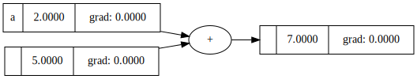

``` python
5*a
```


Okay I have intuitions now for forward pass, chain rule and I understand
following 1. For any operation you only need to know the current
gradient 2. To get full gradient for output against certain input
upstream on computation graph you basically can multiply all the
gradient at each operation.

However I need more intuition to jump for here to backward pass. Help me
understand like I am a beginner in calculas

##### 🤖Reply🤖<!-- SOLVEIT_SEPARATOR_7f3a9b2c -->

🧠🧠🧠🧠🧠🧠🧠🧠🧠🧠🧠🧠🧠🧠🧠🧠🧠🧠

Great question! Let me build the intuition step by step.

**Imagine water flowing backwards through pipes:**

Your computation graph is like a network of pipes:

    a ──┐
        ├──(*)--> d ──┐
    b ──┘             ├──(+)--> e ──┐
                      │             ├──(*)--> f
    c ────────────────┘             │
                        e ──────────┘

In the **forward pass**, values flow left-to-right (data flows through).

In the **backward pass**, gradients flow right-to-left (influence flows
back).

**The key idea:**

Start at the end (`f`) and ask: *“How much does each thing upstream
affect me?”*

1.  Set `f.grad = 1` — “f affects f by exactly 1”
2.  Then ask: “f came from `e * e`, so how much does `e` affect `f`?”
3.  Compute the local gradient (2×e = 8), multiply by `f.grad`, and add
    to `e.grad`
4.  Keep going backwards…

**The question for you:**

Why do we start from the output and go backwards, instead of starting
from the inputs?

Okay I get the calculation, However I still don’t have good intuition on
it. Did Karpathy used some analogies to explain this in his video.
Please review. Help me get an intuition for each backward operation

##### 🤖Reply🤖<!-- SOLVEIT_SEPARATOR_7f3a9b2c -->

🧠🧠🧠🧠🧠🧠🧠🧠🧠🧠🧠🧠🧠🧠🧠🧠🧠🧠🧠🧠🧠🧠🧠🧠🧠🧠🧠🧠🧠🧠🧠🧠🧠🧠🧠🧠🧠🧠🧠🧠🧠🧠🧠🧠🧠🧠🧠🧠🧠🧠🧠🧠🧠🧠🧠🧠🧠🧠🧠🧠🧠🧠🧠🧠🧠🧠🧠🧠🧠🧠🧠🧠🧠🧠🧠🧠🧠🧠🧠🧠🧠🧠🧠🧠🧠🧠🧠🧠🧠🧠🧠🧠🧠🧠🧠🧠🧠🧠🧠🧠🧠🧠🧠🧠🧠🧠🧠🧠🧠🧠🧠🧠🧠🧠🧠🧠🧠🧠🧠🧠🧠🧠🧠🧠🧠🧠🧠🧠🧠🧠

Great idea! Let me check what Karpathy says in the video…

From the transcript, he uses this intuition:

**“If I wiggle this input a tiny bit, how does the output respond?”**

Here’s how he explains each operation:

------------------------------------------------------------------------

**Plus node (+):** He calls it a “distributor of gradient” — the
gradient just flows through equally to both inputs.

*Intuition:* If `c = a + b`, and you wiggle `a` by 1, then `c` wiggles
by exactly 1. Same for `b`. So both get the full gradient passed back.

------------------------------------------------------------------------

\*\*Times node (\*):\*\* The gradient “swaps” the values.

*Intuition:* If `d = a * b`, and you wiggle `a` by a tiny amount, how
much does `d` change? It changes by `b` times that amount! So the
gradient for `a` involves `b`.

------------------------------------------------------------------------

**His key phrase:** The gradient is “the sensitivity of the output with
respect to this input.”

Does the “wiggle” intuition help? Would you like to manually trace
through the backward pass for your `f = e * e` example using this
thinking?

This is better I still need some for explaination to make it click. Can
you try more examples, different ways of explainations. Feel free to
check online if necessary

##### 🤖Reply🤖<!-- SOLVEIT_SEPARATOR_7f3a9b2c -->

🧠🧠🧠🧠🧠🧠🧠🧠🧠🧠🧠🧠🧠

Let me search for some additional explanations and analogies that might
help make this click.I found some great analogies! Let me share a few
different ways to think about backpropagation:

------------------------------------------------------------------------

**Analogy 1: The “Telephone Game”**

Think of it like the children’s game “telephone” — but in reverse!
[\*](https://medium.com/geekculture/deep-learning-part-3-backpropagation-nothing-but-a-game-of-telephone-e0d716f6d362 "Deep Learning Part 3: Backpropagation; Nothing But a Game of Telephone | by Ali H Khanafer | Geek Culture | Medium")
“We’ll do this by seeing how errors are propagated from one person to
another in the game of ‘telephone’.”

In the forward pass, a message (data) travels from person to person. In
the backward pass, we’re figuring out: “How much did each person
contribute to the final message being wrong?”

------------------------------------------------------------------------

**Analogy 2: Gates that “Want” Things** (from Stanford’s CS231n)

[\*](https://cs231n.github.io/optimization-2/ "Neural Networks: Backpropagation")
“If we anthropomorphize the circuit as wanting to output a higher value
(which can help with intuition), then we can think of the circuit as
‘wanting’ the output of the add gate to be lower (due to negative sign),
and with a force of 4.”

Each gate “receives” a signal from downstream saying “I want you to be
higher/lower by this much” and then passes that message back to its
inputs.

------------------------------------------------------------------------

**Analogy 3: Sensitivity = “How much would a wiggle affect things?”**

[\*](https://medium.com/spidernitt/breaking-down-neural-networks-an-intuitive-approach-to-backpropagation-3b2ff958794c "Breaking down Neural Networks: An intuitive approach to Backpropagation | by Benedict Florance Arockiaraj | Spider R&D | Medium")
“The derivative of a function on each variable tells us the sensitivity
of the function with respect to that variable.”

If you increase variable x by a tiny amount ε, and the output increases
by 3ε, then the gradient is 3.

------------------------------------------------------------------------

**Which analogy resonates most with you?** Would you like me to walk
through your `f = e * e` example using one of these mental models?

Yeah! Here is what I understand so far. If I just look at the output
node, I have to whatever I may change I make on the output node, it gets
changed by the same amount. It is like just saying fgrad = 1. Next,
because F is made up of D and E. Now, what do I change in E to? Here I
loose my chain of thought

##### 🤖Reply🤖<!-- SOLVEIT_SEPARATOR_7f3a9b2c -->

You’re so close! Let me help you with that next step.

You’re right: `f.grad = 1` means “f affects itself by 1.”

Now for `e`: You’re asking “what do I change in `e` to affect `f`?”

Here’s the key question: **If I wiggle `e` by a tiny amount, how much
does `f` wiggle?**

Look at your expression: `f = e * e`

If `e = 4` and you increase it to `e = 4.001`, what happens to `f`?

Try calculating: what’s `4.001 * 4.001` compared to `4 * 4`? How much
did `f` change when `e` changed by 0.001?

Okay I understand this.

##### 🤖Reply🤖<!-- SOLVEIT_SEPARATOR_7f3a9b2c -->

Excellent! So you found that when `e` changes by 0.001, `f` changes by
about 0.008, which is **8 times as much**.

That’s because `f = e * e`, so the derivative is `2*e = 2*4 = 8`.

**Now here’s the key connection:**

- `f.grad = 1` (how much f affects the final output, which is itself)
- Local gradient `df/de = 8` (how much e affects f)
- So: `e.grad = f.grad * 8 = 1 * 8 = 8`

This means: “if I wiggle `e`, the final output `f` will wiggle 8 times
as much.”

**Does this click now?** We multiply the “downstream gradient”
(`f.grad`) by the “local gradient” (`df/de`) to get `e.grad`.

Okay, this also looks ok. Here is what I missed in understanding.
Basically, how did you jump from one to f.grad. That generalization bit

##### 🤖Reply🤖<!-- SOLVEIT_SEPARATOR_7f3a9b2c -->

Ah, that’s the crucial insight! Let me clarify that jump.

**The generalization:**

- Right now, `f` is our final output, so `f.grad = 1` (base case)
- But imagine `f` was connected to something else, like `g = f + 10`
- Then `f.grad` would be “how much does `f` affect `g`?” (which would be
  1 from the + operation)
- And if `g` connected to something else, `f.grad` would accumulate that
  information too

**The pattern:**

Every node’s `.grad` means: *“How much does this node affect the FINAL
output?”*

So when we compute `e.grad`, we’re really asking: “How much does `e`
affect the final output (which is `f`)?”

Answer: `e` affects `f` by a factor of 8 (local gradient), and `f`
affects the final output by 1 (because `f.grad = 1`), so
`e.grad = 8 * 1 = 8`.

**Does this connection make sense now?** The `.grad` always stores
“influence on the final output,” not just the immediate next node.

Okay, grad always shows impact on the final output, assuming derivative
is the impact on the next output in the chain Is that correct?

##### 🤖Reply🤖<!-- SOLVEIT_SEPARATOR_7f3a9b2c -->

Almost! Let me clarify the distinction:

**Local derivative** = impact on the *immediate next node* in the chain

**`.grad`** = impact on the *final output* (accumulated through the
whole chain)

So for `d = a * b` → `e = d + c` → `f = e * e`:

- The local derivative `dd/da = b` (how `a` affects `d`)
- But `a.grad` = impact of `a` on `f` (the final output)
- We get `a.grad` by multiplying all the local derivatives along the
  chain

**Does this distinction make sense?** Local derivatives are the building
blocks, and `.grad` is the accumulated result through the whole path.

Yes, this makes sense. How to jump from here to current grad as local
derivative into next output grad

##### 🤖Reply🤖<!-- SOLVEIT_SEPARATOR_7f3a9b2c -->

Perfect! That’s the **chain rule formula**:

    current_node.grad += next_node.grad * local_derivative

**Breaking it down:**

- `next_node.grad` = how much the next node affects the final output
- `local_derivative` = how much the current node affects the next node
- Multiply them = how much the current node affects the final output

**Example:** For `e = d + c`: - `d.grad += e.grad * 1` (local derivative
of + is 1) - If `e.grad = 8`, then `d.grad` gets 8 added to it

**The `+=` is important:** If a node is used multiple times (like `e` in
`e * e`), we accumulate gradients from all paths.

Want to try implementing the `_backward` function for the `*` operation
now?

I get it now. First thing to remember is how much change in input any of
the upper nodes impacts the output. We have proven earlier way to
gradient is by multiplying all the local derivatives at each operation
on computation graph. We don’t need anything else. Now let’s imagine
your graph has 3 subsequent nodes to output. Gradient on 2nd (from
output) node is multiplicatioon of 2 derivative up to output node.
Gradient from 3rd (from output is multiplication of 3 derivatives upto
output node. so grad(n-1) = local_derivative*grad(n)… You can have
multiple operators from node n-1 to n. So we expand this further to
grad(n-1) += local_derivative*grad(n). How am I doing so far? Offer a
critical persepective

##### 🤖Reply🤖<!-- SOLVEIT_SEPARATOR_7f3a9b2c -->

🧠🧠🧠🧠🧠🧠🧠🧠🧠🧠🧠🧠🧠🧠🧠🧠🧠🧠🧠🧠🧠🧠🧠🧠🧠🧠🧠🧠🧠🧠🧠🧠🧠🧠🧠🧠🧠🧠🧠🧠🧠🧠🧠🧠🧠🧠🧠🧠🧠🧠🧠🧠🧠🧠🧠🧠🧠🧠🧠🧠🧠🧠🧠🧠🧠🧠🧠🧠🧠🧠🧠🧠

Excellent! You’ve nailed the core concept. Your explanation is solid.
Let me offer a small clarification on the `+=` part:

**What you said:** “You can have multiple operators from node n-1 to n”

**More precisely:** A node can contribute to the final output through
*multiple paths*.

For example: - `e` is used twice in `f = e * e` (same operation, but `e`
appears twice) - Or a node might feed into two different operations
downstream

In both cases, we **accumulate** (`+=`) because the total influence is
the sum of influences through all paths.

**You’re ready!** Want to try implementing `_backward` for the `*`
operation now? Start with `__mul__` and think about: - What’s the local
derivative with respect to `self`? - What’s the local derivative with
respect to `other`?

Thanks , indeed a node can contribute to final output through multiple
paths , influence of which needs to be accumulated clears it finally.
Now thinking about multiplication r=2z, z = x*y, derivative of dz/dx = y
and dz/dy = z. So if output is r. dr/dx = 2y and dr/dy = 2x. So for
change in x -is y(local derivative)* next_layer_grad(dr/dz( or 2)). In
multiplication operation , if self is x. current_node_grad=
other.data(local derivative)\* next_node_grad. So to answer your
question

Derivative of self = other.data Derivative of other = self.data

node_grad+= other.data\*next_node_grad (for self)

##### 🤖Reply🤖<!-- SOLVEIT_SEPARATOR_7f3a9b2c -->

Perfect! You’ve got it exactly right:

For `out = self * other`: - `self.grad += other.data * out.grad` -
`other.grad += self.data * out.grad`

Now let’s implement it! Here’s the pattern:

``` python
@patch_to(Value)
def __mul__(self, other): 
    if not isinstance(other, Value): other = Value(other)
    out = Value(self.data*other.data, children=(self, other), op="*")
    
    def _backward():
        self.grad += other.data * out.grad
        other.grad += self.data * out.grad
    
    out._backward = _backward
    return out
```

Try implementing this yourself! The key is defining the `_backward`
function inside `__mul__` so it “remembers” `self`, `other`, and `out`.

``` python
@patch_to(Value)
def __mul__(self, other): 
    if not isinstance(other, Value): other = Value(other)
    out = Value(self.data*other.data, children=(self, other), op="*")
    
    def _backward():
        self.grad += other.data * out.grad
        other.grad += self.data * out.grad
    
    out._backward = _backward
    return out
```

Another thing which is a little hazy is the use of this outward
\_backward attribute and it’s implementation in each operation . Can you
help me understand better?

##### 🤖Reply🤖<!-- SOLVEIT_SEPARATOR_7f3a9b2c -->

🧠🧠🧠🧠🧠🧠🧠🧠🧠🧠🧠

Great question! Let me clarify why `_backward` works this way:

**Why an attribute (not a method)?**

Each `Value` is created by a *different* operation — some by `+`, some
by `*`, some are leaf nodes. Each needs its own specific backward logic.

**Why define it inside the operation?**

The `_backward` function needs to “remember” three things: - `self`
(first operand) - `other` (second operand)  
- `out` (the result)

By defining `_backward` inside `__mul__`, it creates a **closure** — the
function captures those variables and remembers them for later.

**Example walkthrough:**

``` python
a = Value(2.0)
b = Value(3.0)
c = a * b  # At this moment, c._backward is created
           # It "remembers" a, b, and c (as out)
```

Later, when we call `c._backward()`, it still knows about `a` and `b`,
so it can update `a.grad` and `b.grad`.

Does the closure concept make sense? Would you like to trace through a
small example to see this in action?

## Part 2 Summary: Understanding Derivatives and Gradients

### What is a Derivative?

- **Definition**: Sensitivity or slope - how much output changes when
  input changes
- **Numerical approximation**: `(f(x+h) - f(x)) / h` for small h
- **Sign interpretation**:
  - Positive = function increasing
  - Negative = function decreasing
  - Zero = critical point (min/max/inflection)

### Multiple Inputs (Partial Derivatives)

- Each input has its own partial derivative
- **Example**: For `d = a*b + c`
  - ∂d/∂a = b
  - ∂d/∂b = a
  - ∂d/∂c = 1

### Chain Rule Fundamentals

- **Local derivative**: How current node affects immediate next node
- **Global gradient (`.grad`)**: Accumulated impact on final output
  through entire chain
- **Formula**: `current_node.grad += next_node.grad * local_derivative`
- **Key insight**: Use `+=` because nodes used multiple times accumulate
  gradients from all paths

Let’ see the example

##### 🤖Reply🤖<!-- SOLVEIT_SEPARATOR_7f3a9b2c -->

Perfect! Let’s trace through a concrete example step by step:

``` python
a = Value(2.0, label='a')
b = Value(3.0, label='b')
c = a * b
c.label = 'c'
```

**At the moment `c = a * b` is executed:**

1.  Inside `__mul__`, the function `_backward()` is defined
2.  This function “captures” the variables `a`, `b`, and `out` (which
    becomes `c`)
3.  `c._backward` now points to this function

**Now let’s manually call the backward pass:**

``` python
c.grad = 1.0  # Base case: output affects itself by 1
c._backward()  # This runs the function we stored
```

**What happens inside `c._backward()`?** - It still “remembers” `a`,
`b`, and `c` from when it was created - Executes:
`a.grad += b.data * c.grad` → `a.grad += 3.0 * 1.0 = 3.0` - Executes:
`b.grad += a.data * c.grad` → `b.grad += 2.0 * 1.0 = 2.0`

Try running this code and checking `a.grad` and `b.grad`! What do you
get?

``` python
a = Value(2.0, label='a')
b = Value(3.0, label='b')
c = a * b
c.label = 'c'
```

``` python
c
```


``` python
print(c) # Stores a and b
```

    Value(data=6.0, grad=0.0, _op='*', _prev={Value(data=2.0, grad=0.0, _op='', _prev=set(), label='a'), Value(data=3.0, grad=0.0, _op='', _prev=set(), label='b')}, label='c')

``` python
c.grad = 1.0  # Base case: output affects itself by 1
c
```


``` python
c._backward()  # This runs the function we stored
```

``` python
c
```

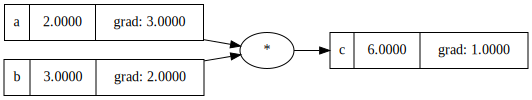

Okay now I get what Karpathy meant that multiplying operation swaps the
gradient

##### 🤖Reply🤖<!-- SOLVEIT_SEPARATOR_7f3a9b2c -->

🧠🧠🧠🧠🧠🧠🧠🧠🧠🧠🧠🧠🧠🧠🧠🧠🧠🧠🧠🧠🧠🧠🧠🧠🧠🧠🧠🧠🧠🧠🧠🧠

Exactly! You can see it right there: - `a.grad = 3.0` (which is
`b.data`) - `b.grad = 2.0` (which is `a.data`)

The values swap! That’s the beauty of the multiplication derivative.

**Now try implementing `_backward` for `__add__`:**

Remember: for `out = self + other`, the local derivative with respect to
both `self` and `other` is… what?

``` python
@patch_to(Value)
def __add__(self, other): 
    if not isinstance(other, Value): other = Value(other)
    out = Value(self.data+other.data, children=(self, other), op="+")
    
    def _backward():
        self.grad += out.grad
        other.grad += out.grad
    
    out._backward = _backward
    return out
```

Okay addition with just pass the gradient to prior layer as local
gradient is 1

##### 🤖Reply🤖<!-- SOLVEIT_SEPARATOR_7f3a9b2c -->

🧠🧠🧠🧠🧠🧠🧠🧠🧠🧠🧠🧠🧠🧠🧠🧠🧠🧠🧠🧠🧠🧠🧠🧠🧠🧠🧠🧠🧠🧠🧠🧠🧠🧠🧠🧠🧠🧠🧠🧠🧠🧠🧠🧠🧠🧠🧠🧠🧠

Exactly! The `+` node just “distributes” the gradient to both inputs —
Karpathy calls it a “gradient router.”

**Quick test:** Try this chain and manually call `_backward` in reverse
order:

``` python
a = Value(2.0, label='a')
b = Value(3.0, label='b')
c = a + b
c.label = 'c'

c.grad = 1.0
c._backward()
```

What do you get for `a.grad` and `b.grad`?

``` python
a = Value(2.0, label='a')
b = Value(3.0, label='b')
c = a + b
c.label = 'c'

c.grad = 1.0
c._backward()
```

``` python
c
```


I am thinking I should implement sub , truediv in form of add and
multiplication but I don’t want to add extra operations which may
complicate autograd. Is my thinking correct or I am worrying for nothing

##### 🤖Reply🤖<!-- SOLVEIT_SEPARATOR_7f3a9b2c -->

🧠🧠🧠🧠🧠🧠🧠🧠🧠🧠🧠🧠🧠🧠🧠🧠🧠🧠🧠🧠🧠🧠🧠🧠🧠🧠🧠🧠🧠🧠🧠🧠🧠🧠🧠🧠🧠🧠🧠🧠🧠🧠🧠🧠🧠🧠

Your thinking is correct! This is exactly what Karpathy does in
micrograd.

**The approach:** - `a - b` = `a + (-b)` = `a + (b * -1)` - `a / b` =
`a * (b ** -1)`

This way you only need `_backward` for `+`, `*`, and `**` (power), and
the chain rule handles the rest automatically!

Want to try implementing `__neg__` (negation) first? It’s just
multiplying by -1.

``` python
@patch_to(Value)
def __neg__(self): 
    if not isinstance(self, Value): self = Value(self)
    out = -1*self
    return out
```

``` python
-a
```

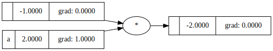

##### 🤖Reply🤖<!-- SOLVEIT_SEPARATOR_7f3a9b2c -->

Perfect! `__neg__` works by multiplying by -1, and since you already
have `_backward` for `*`, the gradients will flow correctly
automatically.

**Now for subtraction:** Can you implement `__sub__` using `__neg__` and
`__add__`?

Hint: `a - b` = `a + (-b)`

``` python
@patch_to(Value)
def __sub__(self, other): return self.__add__(other.__neg__())
```

``` python
a
```


``` python
b
```


``` python
a-b
```

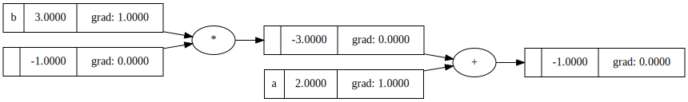

``` python
@patch_to(Value)
def __rsub__(self, other): 
    if not isinstance(other, Value): other = Value(other)
    return other-self
```

``` python
5 - a
```


``` python
t = 5-a; t
```


``` python
t._backward()
```

``` python
t
```


I think there is a problem here. It is not getting grad =1 at last node
on computational graph

##### 🤖Reply🤖<!-- SOLVEIT_SEPARATOR_7f3a9b2c -->

Good catch! You’re right — you forgot to set `t.grad = 1.0` before
calling `t._backward()`.

Try:

``` python
t.grad = 1.0
t._backward()
```

Then check `t` again. The gradients should now flow back through the
graph!

Should I not have a mechanism to check it?

##### 🤖Reply🤖<!-- SOLVEIT_SEPARATOR_7f3a9b2c -->

Good thinking! You’re right — we’ll eventually want a `backward()`
method that:

1.  Automatically sets `self.grad = 1.0` (for the output node)
2.  Calls all the `_backward()` functions in the right order

But there’s a tricky part: **what’s the “right order”?**

We need to call `_backward()` on nodes in reverse topological order
(from output backwards through the graph).

Would you like to: - **A)** First practice manually calling
`_backward()` on a longer chain to understand the ordering? - **B)**
Jump straight to implementing the automatic `backward()` method with
topological sort?

``` python
t = 5-a; t
```


``` python
t.grad = 1.0
t._backward(); t
```


Okay let’s continue with manual \_backward implementation for now and
finish the rest

##### 🤖Reply🤖<!-- SOLVEIT_SEPARATOR_7f3a9b2c -->

Great! Let’s practice with the longer chain we had before:

``` python
a = Value(2.0, label='a')
b = Value(-3.0, label='b')
c = Value(10.0, label='c')

d = a * b
d.label = 'd'
e = d + c
e.label = 'e'
f = e * e
f.label = 'f'
```

**Your task:** Manually call `_backward()` in the correct order to fill
in all the gradients.

**Hint:** Start from `f` and work backwards. What’s the correct sequence
of calls?

Try it and let me know what gradients you get for `a`, `b`, and `c`!

``` python
a = Value(2.0, label='a')
b = Value(-3.0, label='b')
c = Value(10.0, label='c')

d = a * b
d.label = 'd'
e = d + c
e.label = 'e'
f = e * e
f.label = 'f'
```

``` python
f
```


``` python
f.grad = 1.0
f._backward(); f
```


Okay doesn’t look right for e which is zero and this is not getting it
correctly

##### 🤖Reply🤖<!-- SOLVEIT_SEPARATOR_7f3a9b2c -->

You’re right to notice something’s off! Look at `f._backward()` — it
should have updated `e.grad`, but you’re seeing it’s still 0.

**Debug question:** Look at your `f` output. Can you see what `e.data`
is? It’s one of the values in `_prev`.

The issue is that `f = e * e` means both operands are the same `e`
object. When you call `f._backward()`, it should update `e.grad` twice
(once for each position).

Try calling `e._backward()` next and see what happens to `d.grad` and
`c.grad`. Does the gradient flow continue?

``` python
e.data
```

    4.0

``` python
print(f)
```

    Value(data=16.0, grad=1.0, _op='*', _prev={Value(data=4.0, grad=0.0, _op='+', _prev={Value(data=10.0, grad=0.0, _op='', _prev=set(), label='c'), Value(data=-6.0, grad=0.0, _op='*', _prev={Value(data=2.0, grad=0.0, _op='', _prev=set(), label='a'), Value(data=-3.0, grad=0.0, _op='', _prev=set(), label='b')}, label='d')}, label='e')}, label='f')

``` python
e
```

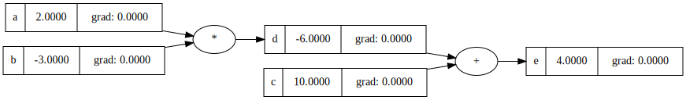

``` python
e.grad = 1
e._backward()
```

``` python
e
```


No it is not flowing back at all . What did I do /

##### 🤖Reply🤖<!-- SOLVEIT_SEPARATOR_7f3a9b2c -->

Look carefully at what you did:

``` python
e.grad = 1  # You manually set this to 1
e._backward()
```

But `e.grad` should have been set by `f._backward()`, not manually by
you!

**The problem:** When you called `f._backward()`, it should have updated
`e.grad` from 0 to 8 (because `df/de = 2*e = 8`).

But looking at your output, `e.grad` is still 0 after `f._backward()`.
That means the gradient didn’t flow from `f` to `e`.

**Can you check:** What does `f._prev` contain? Print it out and see if
`e` is actually in there.

``` python
L(f._prev).map(lambda o : o.label)
```

    (#1) ['e']

Yes e is there

##### 🤖Reply🤖<!-- SOLVEIT_SEPARATOR_7f3a9b2c -->

Good! So `e` is in `f._prev`. But `e.grad` didn’t get updated when you
called `f._backward()`.

**Question:** Look at your `__mul__` implementation. When `f = e * e`,
both `self` and `other` point to the *same* `e` object.

What happens in your `_backward` function when you do:

``` python
self.grad += other.data * out.grad
other.grad += self.data * out.grad
```

If `self` and `other` are the same object, what’s the issue?

``` python
s = Value(2, label='s'); s
```

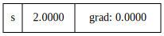

``` python
t = s*s; t
```

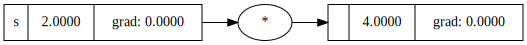

``` python
t.grad = 1.0
t._backward()
```

``` python
t
```

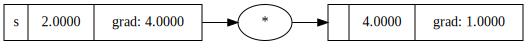

ok mult works fine

##### 🤖Reply🤖<!-- SOLVEIT_SEPARATOR_7f3a9b2c -->

Great! So `s.grad = 4.0` which is correct (2 + 2 = 4, accumulated from
both uses).

**Now back to your `f` problem:** If `t = s*s` works fine, why doesn’t
`f = e*e` work?

Let me check your earlier output more carefully…

Wait, I see it now! Look at `f._prev` — it only has ONE `e` in the set,
not two! That’s because `_prev` is a **set**, and sets don’t allow
duplicates.

So when `f = e * e`, the set `{e, e}` becomes just `{e}`. That’s fine
for tracking the graph structure, but your `_backward` needs to handle
this correctly.

Actually, your `__mul__` implementation should still work because `self`
and `other` both point to `e`, so the `+=` should accumulate. Let me
think…

Can you try recreating `f` fresh and calling `f._backward()` again?
Maybe there’s a stale reference issue.

``` python
a = Value(2.0, label='a')
b = Value(-3.0, label='b')
c = Value(10.0, label='c')

d = a * b
d.label = 'd'
e = d + c
e.label = 'e'
f = e * e
f.label = 'f'; f
```


``` python
f.grad = 1.0
f._backward(); f
```


Actually now that I see it e is working correctly. Although it’s not
recursively passing all the way down

##### 🤖Reply🤖<!-- SOLVEIT_SEPARATOR_7f3a9b2c -->

Exactly! You can see `e.grad = 8.0` now, which is correct (2 \* e.data
\* f.grad = 2 \* 4 \* 1 = 8).

**The key insight:** Calling `f._backward()` only goes ONE step back —
it updates `e.grad`, but doesn’t continue further.

You need to manually call the rest:

``` python
e._backward()  # This should update d.grad and c.grad
d._backward()  # This should update a.grad and b.grad
```

Try calling these in order and check what gradients you get for `a`,
`b`, `c`, and `d`!

``` python
e._backward();f
```


``` python
d._backward(); f
```

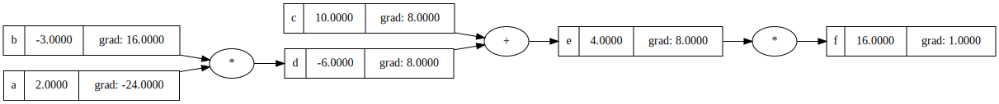

## Part 3 Summary: The Chain Rule & Backpropagation

**Key insights:** - **Local derivative**: how current node affects
immediate next node - **`.grad`**: accumulated impact on final output
through entire chain - **Chain rule formula**:
`current_node.grad += next_node.grad * local_derivative` - **`+=` is
crucial**: nodes used multiple times accumulate gradients from all paths

**Example:** For `f = e * e` where `e = d + c`: - Local: df/de = 2*e -
Chain: e.grad = f.grad * (2*e) = 1 * 8 = 8

ok now I have manually checked everylevel

##### 🤖Reply🤖<!-- SOLVEIT_SEPARATOR_7f3a9b2c -->

Perfect! You’ve successfully backpropagated through the entire graph
manually! Let’s verify the final gradients:

- `f.grad = 1.0` ✓
- `e.grad = 8.0` ✓ (2 × e = 2 × 4)
- `d.grad = 8.0` ✓ (passed through +)
- `c.grad = 8.0` ✓ (passed through +)
- `a.grad = -24.0` ✓ (b × d.grad = -3 × 8)
- `b.grad = 16.0` ✓ (a × d.grad = 2 × 8)

These match what we calculated analytically earlier!

**Now you see the problem:** Manually calling `_backward()` in the right
order is tedious and error-prone.

**Next step:** We need to implement an automatic `backward()` method
that: 1. Figures out the correct order (topological sort) 2. Calls all
the `_backward()` functions automatically

Ready to tackle that?

I think I should implement pow operator first and convert div in form of
power. Can we go back to it

##### 🤖Reply🤖<!-- SOLVEIT_SEPARATOR_7f3a9b2c -->

Good thinking! Yes, let’s implement `__pow__` first, then we can express
division as `a / b = a * b**-1`.

**For `out = self ** other` (where `other` is a constant like 2 or
-1):**

What’s the local derivative with respect to `self`?

Hint: Remember the power rule from calculus: d/dx(x^n) = n \* x^(n-1)

Can you try implementing `__pow__` following the same pattern as
`__mul__`?

``` python
type(1)
```

    int

``` python
@patch_to(Value)
def __pow__(self, other): 
    assert type(other) in (int, float)
    out = Value(self.data**other, children=(self,), op="**")
    def _backward():
        self.grad += (other*(self.data **(other-1)))* out.grad
    out._backward = _backward
    return out
```

## Part 4 Summary: Building the Value Class

**Core components:** - `data`: the actual number - `_prev`: set of
parent nodes (computation graph) - `_op`: operation that created this
value - `grad`: gradient (initialized to 0) - `_backward`: function to
propagate gradients

**Operations implemented:** - Addition, multiplication, power
(primitives with \_backward) - Subtraction, division, negation (derived
from primitives)

``` python
s = Value(2, label='s')
```

``` python
t = s**2; t
```

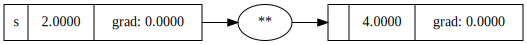

``` python
t.grad = 1.0
t._backward(); t
```

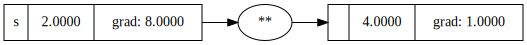

``` python
s = Value(4, label='s'); s
t = s**0.5; t
```


``` python
t.grad = 1.0
t._backward(); t
```


``` python
@patch_to(Value)
def __truediv__(self, other): 
    if not isinstance(other, Value): other = Value(other)
    return self*other.__pow__(-1)
```

``` python
s = Value(2, label='s'); s
```


``` python
t = s/2; t
```


``` python
t.grad = 1.0
t._backward(); t
```

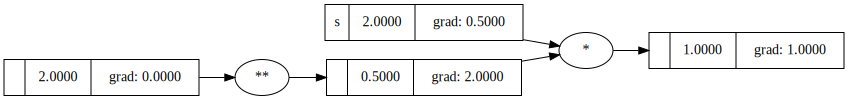

``` python
@patch_to(Value)
def __rtruediv__(self, other): 
    if not isinstance(other, Value): other = Value(other)
    return other/self
```

``` python
s = Value(2, label='s'); s
```


``` python
t = 2/s; t
```

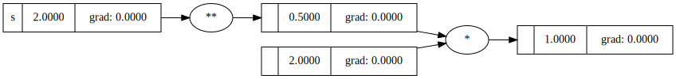

``` python
t.grad = 1.0
t._backward(); t
```

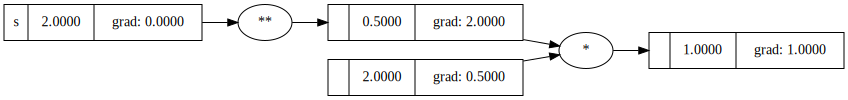

## Part 5 Summary: Building the Value Class

### Core Components

- **`data`**: The actual numerical value
- **`_prev`**: Set of parent nodes (builds computation graph)
- **`_op`**: Operation that created this value (for visualization)
- **`grad`**: Gradient (initialized to 0, accumulated during backprop)
- **`_backward`**: Function to propagate gradients (closure that
  remembers operands)

### Primitive Operations (with `_backward`)

1.  **Addition (`__add__`)**: Local derivative = 1 for both operands
2.  **Multiplication (`__mul__`)**: Local derivatives swap -
    `∂(a*b)/∂a = b`, `∂(a*b)/∂b = a`
3.  **Power (`__pow__`)**: Power rule - `∂(x^n)/∂x = n * x^(n-1)`

### Derived Operations (built from primitives)

- **Negation**: `__neg__` via `* -1`
- **Subtraction**: `__sub__` via `+ (negation)`
- **Division**: `__truediv__` via `* (power -1)`
- All reverse operations (`__radd__`, `__rmul__`, etc.) for
  commutativity

### Key Pattern

Each operation creates a closure that “remembers” its operands, enabling
automatic gradient computation later.

Okay check if I have covered all cases for add, mul and pow

##### 🤖Reply🤖<!-- SOLVEIT_SEPARATOR_7f3a9b2c -->

🧠🧠🧠🧠🧠🧠🧠🧠🧠🧠🧠🧠🧠🧠🧠🧠🧠🧠🧠🧠🧠🧠🧠🧠🧠🧠🧠🧠🧠🧠🧠🧠🧠🧠🧠🧠🧠🧠🧠🧠🧠🧠🧠🧠🧠🧠🧠🧠🧠🧠🧠🧠🧠🧠🧠🧠🧠🧠🧠🧠🧠🧠🧠🧠🧠🧠🧠🧠🧠🧠🧠🧠🧠🧠🧠🧠🧠🧠🧠🧠🧠🧠🧠🧠🧠🧠🧠🧠🧠🧠🧠🧠🧠🧠🧠🧠🧠🧠🧠🧠🧠🧠🧠🧠

Let me check what you have:

**Add (+):** - `__add__` with `_backward` ✓ - `__radd__` ✓

\*\*Mul (\*):\*\* - `__mul__` with `_backward` ✓ - `__rmul__` ✓

**Pow (**):\*\* - `__pow__` with `_backward` ✓

**Derived operations (using the above):** - `__neg__` via `*` ✓ -
`__sub__` via `+` and `neg` ✓ - `__rsub__` ✓ - `__truediv__` via `*` and
`**` ✓ - `__rtruediv__` ✓

Looks complete! All the derived operations will automatically get
correct gradients because they’re built on primitives that have
`_backward` implemented.

Ready to implement the automatic `backward()` method with topological
sort?

okay can you collect Value class implementation and all the patch
methods in next code cell.Keep class structure and patch_to methods as
it is

##### 🤖Reply🤖<!-- SOLVEIT_SEPARATOR_7f3a9b2c -->

🧠🧠🧠🧠🧠🧠🧠🧠🧠

``` python
class Value:
    def __init__(self, data, children=(), op='', label=None): 
        store_attr('data', self)
        self._prev = set(children)
        self._op = op
        self.grad = 0.0
        self.label = label if label is not None else ''
        self._backward = lambda: None
    __repr__ = basic_repr('data, grad, _op, _prev, label')

@patch_to(Value)
def __add__(self, other): 
    if not isinstance(other, Value): other = Value(other)
    out = Value(self.data+other.data, children=(self, other), op="+")
    def _backward():
        self.grad += out.grad
        other.grad += out.grad
    out._backward = _backward
    return out

@patch_to(Value)
def __mul__(self, other): 
    if not isinstance(other, Value): other = Value(other)
    out = Value(self.data*other.data, children=(self, other), op="*")
    def _backward():
        self.grad += other.data * out.grad
        other.grad += self.data * out.grad
    out._backward = _backward
    return out

@patch_to(Value)
def __pow__(self, other): 
    assert type(other) in (int, float)
    out = Value(self.data**other, children=(self,), op="**")
    def _backward():
        self.grad += (other * (self.data ** (other-1))) * out.grad
    out._backward = _backward
    return out

@patch_to(Value)
def __neg__(self): return -1 * self

@patch_to(Value)
def __sub__(self, other): return self + (-other)

@patch_to(Value)
def __truediv__(self, other): 
    if not isinstance(other, Value): other = Value(other)
    return self * other**-1

@patch_to(Value)
def __radd__(self, other): return self + other

@patch_to(Value)
def __rmul__(self, other): return self * other

@patch_to(Value)
def __rsub__(self, other): 
    if not isinstance(other, Value): other = Value(other)
    return other - self

@patch_to(Value)
def __rtruediv__(self, other): 
    if not isinstance(other, Value): other = Value(other)
    return other / self

@patch_to(Value)
def _repr_svg_(self): 
    svg = draw_dot(self)._repr_image_svg_xml()
    return svg.decode('utf-8') if isinstance(svg, bytes) else svg
```

``` python
class Value:
    def __init__(self, data, children=(), op='', label=None): 
        store_attr('data', self)
        self._prev = set(children)
        self._op = op
        self.grad = 0.0
        self.label = label if label is not None else ''
        self._backward = lambda: None
    __repr__ = basic_repr('data, grad, _op, _prev, label')

@patch_to(Value)
def __add__(self, other): 
    if not isinstance(other, Value): other = Value(other)
    out = Value(self.data+other.data, children=(self, other), op="+")
    def _backward():
        self.grad += out.grad
        other.grad += out.grad
    out._backward = _backward
    return out

@patch_to(Value)
def __mul__(self, other): 
    if not isinstance(other, Value): other = Value(other)
    out = Value(self.data*other.data, children=(self, other), op="*")
    def _backward():
        self.grad += other.data * out.grad
        other.grad += self.data * out.grad
    out._backward = _backward
    return out

@patch_to(Value)
def __pow__(self, other): 
    assert type(other) in (int, float)
    out = Value(self.data**other, children=(self,), op="**")
    def _backward():
        self.grad += (other * (self.data ** (other-1))) * out.grad
    out._backward = _backward
    return out

@patch_to(Value)
def __neg__(self): return -1 * self

@patch_to(Value)
def __sub__(self, other): return self + (-other)

@patch_to(Value)
def __truediv__(self, other): 
    if not isinstance(other, Value): other = Value(other)
    return self * other**-1

@patch_to(Value)
def __radd__(self, other): return self + other

@patch_to(Value)
def __rmul__(self, other): return self * other

@patch_to(Value)
def __rsub__(self, other): 
    if not isinstance(other, Value): other = Value(other)
    return other - self

@patch_to(Value)
def __rtruediv__(self, other): 
    if not isinstance(other, Value): other = Value(other)
    return other / self

@patch_to(Value)
def _repr_svg_(self): 
    svg = draw_dot(self)._repr_image_svg_xml()
    return svg.decode('utf-8') if isinstance(svg, bytes) else svg
```

Let’s work towards topological sort and backward method. Before we
implement it can you provide me some good intuitions about what is
topological sort and why do we need it ?

##### 🤖Reply🤖<!-- SOLVEIT_SEPARATOR_7f3a9b2c -->

🧠🧠🧠🧠🧠🧠🧠🧠🧠🧠🧠

Great question! Let me explain topological sort intuitively.

**What is it?**

Topological sort arranges nodes so that every node comes *after* all the
nodes it depends on.

**Analogy: Getting dressed**

You can’t put on shoes before socks! A valid order might be: 1.
Underwear 2. Pants 3. Socks 4. Shoes 5. Shirt

This is a topological order — each item comes after its dependencies.

**Why do we need it for backpropagation?**

When we call `_backward()` on a node, it needs the `.grad` of its output
to already be filled in.

So for your graph `a → d → e → f`, we must call `_backward()` in the
order: - `f._backward()` first (fills in `e.grad`) - `e._backward()`
next (fills in `d.grad`, `c.grad`) - `d._backward()` last (fills in
`a.grad`, `b.grad`)

That’s **reverse** topological order — from output back to inputs.

**Does this make sense?** Would you like to try sketching out how you
might build a topological ordering of nodes?

Seriously :) , is this example Karpathy choose . Can you use his example

##### 🤖Reply🤖<!-- SOLVEIT_SEPARATOR_7f3a9b2c -->

🧠🧠🧠🧠🧠🧠🧠🧠🧠

Ha! Fair point. Let me check what Karpathy used…

From the transcript, he references this Wikipedia example for
topological sort:

**A directed acyclic graph (DAG)** where the nodes are laid out so that
“all the edges go only from left to right.”

He says: “We maintain a set of visited nodes and then we are going
through starting at some root node which for us is `o` (the output)… and
starting at `o` we go through all of its children and we need to lay
them out from left to right.”

His key insight: **“This node that we’re going to call it on like say
`o` is only going to add itself to the topo list after all of the
children have been processed.”**

So the algorithm is: 1. Start at output node 2. Recursively visit all
children first 3. Only *then* add yourself to the list

Want to try implementing this? The pattern is a depth-first search
(DFS).

Can you help me visualize this ?

##### 🤖Reply🤖<!-- SOLVEIT_SEPARATOR_7f3a9b2c -->

🧠🧠🧠🧠🧠🧠🧠🧠🧠🧠🧠🧠🧠🧠

Sure! Let’s visualize with your graph:

    a ──┐
        ├──(*)--> d ──┐
    b ──┘             ├──(+)--> e ──┐
                      │             ├──(*)--> f
    c ────────────────┘             │
                                    │
                        e ──────────┘

**Topological sort (forward order):** `a, b, c, d, e, f`

Each node comes *after* its dependencies.

**For backprop, we reverse it:** `f, e, d, c, b, a`

Now when we call `_backward()` in this order: 1. `f._backward()` → fills
`e.grad` ✓ (e.grad was needed? Yes, set to 1 as base) 2. `e._backward()`
→ fills `d.grad`, `c.grad` ✓ (e.grad already filled) 3. `d._backward()`
→ fills `a.grad`, `b.grad` ✓ (d.grad already filled)

**The rule:** Never call `_backward()` on a node until all nodes that
use it have already been processed.

Want to try writing the `build_topo()` function now?

Can you give me some example of circular cases

##### 🤖Reply🤖<!-- SOLVEIT_SEPARATOR_7f3a9b2c -->

Good question! In our computation graphs, **circular cases can’t
happen** because we’re building a **DAG (Directed Acyclic Graph)**.

Here’s why:

**How values are created:** - Leaf nodes: `a = Value(2.0)` — no
dependencies - Computed nodes: `c = a + b` — depends on nodes created
*before* it

**Impossible circular example:**

``` python
a = Value(2.0)
b = a + 1
a = b + 1  # Can't do this! 'a' already exists
```

You can’t make `a` depend on `b` if `b` already depends on `a`, because
`a` was created first.

**However, you CAN reuse a node multiple times:**

``` python
a = Value(2.0)
b = a + a  # Same node used twice — this is fine!
```

This creates a graph where `a` has multiple “outgoing” edges, but no
cycles.

**Does this clarify it?** Ready to implement `build_topo()`?

Yes I am ready to implement topological sort. Can you search online show
me different variations and help me build it step by step

##### 🤖Reply🤖<!-- SOLVEIT_SEPARATOR_7f3a9b2c -->

🧠🧠🧠🧠🧠🧠🧠🧠🧠

Here’s what I found about topological sort:

**Two main approaches:**

1.  [\*](https://www.geeksforgeeks.org/dsa/topological-sorting/ "Topological Sorting - GeeksforGeeks")
    **DFS-based:** “The main idea is to perform a Depth First Search
    (DFS) on the Directed Acyclic Graph (DAG) and, for each vertex, push
    it onto a stack only after visiting all its adjacent vertices.”

2.  [\*](https://usaco.guide/gold/toposort "Topological Sort · USACO Guide")
    **BFS-based (Kahn’s Algorithm):** “The BFS version is known as
    Kahn’s Algorithm.”

**The DFS approach (what Karpathy uses):**

[\*](https://iq.opengenus.org/topological-sorting-dfs/ "Topological Sorting using Depth First Search (DFS)")
[\*](https://iq.opengenus.org/topological-sorting-dfs/ "Topological Sorting using Depth First Search (DFS)")
“Step 1: Create a temporary stack. Step 2: Recursively call topological
sorting for all its adjacent vertices, then push it to the stack (when
all adjacent vertices are on stack). Note: A vertex is pushed to stack
only when all of its adjacent vertices are already in stack.”

------------------------------------------------------------------------

**For our `Value` class, the algorithm is:**

1.  Start at the output node
2.  Keep a `visited` set (to avoid processing a node twice)
3.  For each node: first visit all children, *then* add yourself to the
    list

**Let’s start simple.** Can you write a function `build_topo(v)` that: -
Takes a `Value` node `v` - Returns a list of all nodes in topological
order

What would be your first step?

``` python
a = Value(2.0, label='a')
b = Value(-3.0, label='b')
c = Value(10.0, label='c')

d = a * b
d.label = 'd'
e = d + c
e.label = 'e'
f = e * e
f.label = 'f'; f
```

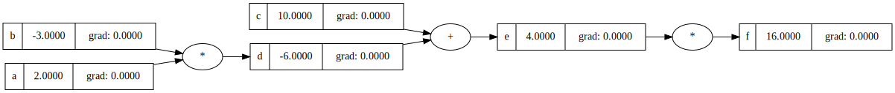

``` python
```

    {1}

``` python
@patch_to(Value)
def build_topo(self):
    return self._prev
```

``` python
# visited = set()

ols = []
def build_topo(node):
    if node not in ols: ols.insert(0, node)
    if len(node._prev) > 0 : L(node._prev).map(lambda v: build_topo(v))
    return ols


L(build_topo(f)).map(lambda v : v.label)
```

    (#6) ['c','b','a','d','e','f']

How does it look?

##### 🤖Reply🤖<!-- SOLVEIT_SEPARATOR_7f3a9b2c -->

Good start! You’re getting `['c','b','a','d','e','f']` which is close,
but not quite right.

**The correct order should be:** `['a','b','c','d','e','f']` (or some
valid topological order where dependencies come before dependents)

**Two issues I see:**

1.  You’re using `insert(0, node)` which adds to the *front* — but you
    want to add nodes *after* visiting their children
2.  You’re not using a `visited` set, so you might process nodes
    multiple times

**Here’s the key insight from DFS topological sort:** - Visit all
children first (recursively) - *Then* add yourself to the list

Try modifying your function to: 1. Add a `visited` set 2. Check if node
is already visited 3. Recursively visit children 4. *Then* append the
node

Want to give it another try?

Even with this order wouldn’t it give same answer. Tell me case where
this wouldn’t work

##### 🤖Reply🤖<!-- SOLVEIT_SEPARATOR_7f3a9b2c -->

🧠🧠🧠🧠🧠🧠🧠🧠🧠🧠🧠🧠🧠🧠🧠🧠🧠🧠🧠🧠🧠🧠🧠🧠🧠🧠🧠🧠🧠🧠🧠🧠🧠🧠🧠🧠🧠🧠🧠🧠🧠🧠🧠🧠🧠🧠🧠🧠🧠🧠🧠🧠🧠🧠🧠🧠🧠🧠🧠🧠🧠🧠🧠🧠🧠🧠🧠🧠🧠🧠🧠🧠🧠🧠🧠🧠🧠🧠🧠🧠🧠🧠🧠🧠🧠🧠🧠🧠🧠🧠🧠🧠🧠🧠🧠🧠🧠🧠🧠🧠🧠🧠🧠🧠🧠🧠🧠🧠🧠🧠🧠🧠🧠🧠🧠🧠🧠🧠🧠🧠🧠🧠🧠🧠🧠🧠🧠🧠🧠🧠🧠🧠🧠🧠🧠🧠🧠🧠🧠🧠🧠🧠🧠🧠🧠🧠🧠🧠🧠🧠🧠🧠🧠🧠🧠🧠🧠🧠🧠🧠🧠🧠🧠🧠🧠🧠🧠🧠🧠🧠🧠🧠🧠🧠🧠🧠🧠🧠🧠🧠🧠🧠🧠🧠🧠🧠🧠🧠🧠🧠🧠🧠🧠🧠🧠🧠🧠🧠🧠🧠🧠🧠🧠🧠🧠🧠🧠🧠🧠🧠🧠🧠🧠🧠🧠🧠🧠🧠🧠🧠🧠🧠🧠🧠🧠🧠🧠🧠🧠🧠🧠🧠🧠🧠🧠🧠🧠🧠🧠🧠🧠🧠🧠🧠🧠🧠🧠🧠🧠🧠🧠🧠🧠🧠🧠🧠🧠🧠🧠🧠🧠🧠

Good question! Actually, for backprop (reversed), your order
`['c','b','a','d','e','f']` becomes `['f','e','d','a','b','c']` which
works fine here!

**But there’s a subtle issue:** Your code adds the node *before*
visiting children. Consider what happens without the
`if node not in ols` check in a case like `f = e * e` — you’d visit `e`
twice.

**More importantly:** Without a proper `visited` set, in a more complex
graph you might recurse into the same subtree multiple times, which is
inefficient.

**Try this diamond pattern:**

``` python
a = Value(2.0, label='a')
d = a * 2
e = a * 3  
g = d + e
```

Here `a` is used by both `d` and `e`. Run your `build_topo(g)` and see
what order you get. Does `a` appear once or could there be issues?

``` python
a = Value(2.0, label='a')
d = a * 2; d.label = 'd'
e = a * 3; e.label = 'e'
g = d + e;g.label = 'g'
g
```


``` python
ols = []
L(build_topo(g)).map(lambda v : v.label)
```

    (#6) ['','d','a','','e','g']

``` python
ols = []
def build_topo(node):
    if len(node._prev) > 0 : L(node._prev).map(lambda v: build_topo(v))
    if node not in ols: ols.append(node)
    return ols
```

``` python
ols = []
L(build_topo(g)).map(lambda v : v.label)
```

    (#6) ['','a','e','','d','g']

``` python
a = Value(2.0, label='a')
b = Value(-3.0, label='b')
c = Value(10.0, label='c')

d = a * b
d.label = 'd'
e = d + c
e.label = 'e'
f = e * e
f.label = 'f'; f
```


``` python
ols = []
L(build_topo(f)).map(lambda v : v.label)
```

    (#6) ['b','a','d','c','e','f']

How about now?

##### 🤖Reply🤖<!-- SOLVEIT_SEPARATOR_7f3a9b2c -->

Much better! Now you’re getting `['b','a','d','c','e','f']` which is a
valid topological order.

**However, there’s still one issue:** You’re using a global `ols = []`
list that needs to be reset before each call. That’s not ideal.

**Better approach:** Make `visited` and `topo` local to the function.
Here’s the pattern:

``` python
def build_topo(root):
    topo = []
    visited = set()
    
    def dfs(node):
        if node in visited: return
        visited.add(node)
        for child in node._prev:
            dfs(child)
        topo.append(node)
    
    dfs(root)
    return topo
```

Can you try implementing this pattern? The key is the nested `dfs`
function that captures `topo` and `visited`.

``` python
def build_topo(node):
    ols = []
    def dfs(node):
        if len(node._prev) > 0 : L(node._prev).map(lambda v: dfs(v))
        if node not in ols: ols.append(node)
    dfs(node)
    return ols
```

``` python
L(build_topo(f)).map(lambda v : v.label)
```

    (#6) ['b','a','d','c','e','f']

How about now?

##### 🤖Reply🤖<!-- SOLVEIT_SEPARATOR_7f3a9b2c -->

Good! Your code works and produces the correct order.

**One small improvement:** You’re checking `if node not in ols`, but
using a `visited` set would be more efficient (checking set membership
is O(1) vs O(n) for a list).

Try adding:

``` python
visited = set()
```

And then check `if node in visited: return` at the start of `dfs`, and
add `visited.add(node)` before appending to `ols`.

Want to try that refinement?

``` python
def build_topo(node):
    ols = []
    visited = set()
    def dfs(node):
        if len(node._prev) > 0 : L(node._prev).map(lambda v: dfs(v))
        if node not in visited: 
            visited.add(node)
            ols.append(node)
    dfs(node)
    return ols
```

``` python
L(build_topo(f)).map(lambda v : v.label)
```

    (#6) ['b','a','d','c','e','f']

How about now? I have 2 set of references one in ols and another in
visited

##### 🤖Reply🤖<!-- SOLVEIT_SEPARATOR_7f3a9b2c -->

Good observation! You’re right that you’re maintaining two data
structures tracking similar information.

**Small optimization:** You can check `visited` *first* (before
recursing), which prevents unnecessary recursive calls:

``` python
def dfs(node):
    if node in visited: return  # Early exit
    visited.add(node)
    if len(node._prev) > 0: L(node._prev).map(lambda v: dfs(v))
    ols.append(node)
```

This way, once a node is visited, you never recurse into it again. Try
this version — does it still produce the correct order?

``` python
def build_topo(node):
    ols = []
    visited = set()
    def dfs(node):
        if node in visited: return
        visited.add(node)
        if len(node._prev) > 0 : L(node._prev).map(lambda v: dfs(v))
        ols.append(node)
    dfs(node)
    return ols
```

## Part 6 Summary: Topological Sort and Automatic Backpropagation

### Why Topological Sort?

- **Problem**: Must call `_backward()` on nodes in correct order
- **Requirement**: Each node needs its output’s `.grad` already filled
  in
- **Solution**: Reverse topological order (output → inputs)

### Algorithm (DFS-based)

    1. Start at output node
    2. Mark as visited (avoid reprocessing)
    3. Recursively visit all children FIRST
    4. THEN add yourself to the list
    5. Reverse the list for backprop

### The `backward()` Method

``` python
def backward(self):
    self.grad = 1.0              # Base case: output affects itself by 1
    nodes = build_topo(self)      # Get topological order
    for node in reversed(nodes):  # Process in reverse
        node._backward()          # Call each node's gradient function
```

### Key Insight

The ordering ensures gradients flow from output to inputs, with each
node receiving gradients from all paths before computing its own
contribution.

``` python
L(build_topo(f)).map(lambda v : v.label)
```

    (#6) ['b','a','d','c','e','f']

##### 🤖Reply🤖<!-- SOLVEIT_SEPARATOR_7f3a9b2c -->

Perfect! Your `build_topo` function works correctly and efficiently now.
You’re getting the proper topological order:
`['b','a','d','c','e','f']`.

**Now for the final step:** Implement the `backward()` method that: 1.
Sets `self.grad = 1.0` 2. Builds the topological order 3. Calls
`_backward()` on each node in **reverse** order

Can you try implementing this as a method on the `Value` class?

``` python
a = Value(2.0, label='a')
b = Value(-3.0, label='b')
c = Value(10.0, label='c')

d = a * b
d.label = 'd'
e = d + c
e.label = 'e'
f = e * e
f.label = 'f'; f
```

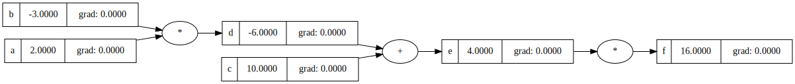

``` python
L(reversed(build_topo(f)))
```

    (#6) [Value(data=16.0, grad=0.0, _op='*', _prev={Value(data=4.0, grad=0.0, _op='+', _prev={Value(data=-6.0, grad=0.0, _op='*', _prev={Value(data=-3.0, grad=0.0, _op='', _prev=set(), label='b'), Value(data=2.0, grad=0.0, _op='', _prev=set(), label='a')}, label='d'), Value(data=10.0, grad=0.0, _op='', _prev=set(), label='c')}, label='e')}, label='f'),Value(data=4.0, grad=0.0, _op='+', _prev={Value(data=-6.0, grad=0.0, _op='*', _prev={Value(data=-3.0, grad=0.0, _op='', _prev=set(), label='b'), Value(data=2.0, grad=0.0, _op='', _prev=set(), label='a')}, label='d'), Value(data=10.0, grad=0.0, _op='', _prev=set(), label='c')}, label='e'),Value(data=10.0, grad=0.0, _op='', _prev=set(), label='c'),Value(data=-6.0, grad=0.0, _op='*', _prev={Value(data=-3.0, grad=0.0, _op='', _prev=set(), label='b'), Value(data=2.0, grad=0.0, _op='', _prev=set(), label='a')}, label='d'),Value(data=2.0, grad=0.0, _op='', _prev=set(), label='a'),Value(data=-3.0, grad=0.0, _op='', _prev=set(), label='b')]

``` python
@patch_to(Value)
def backward(self): 
    self.grad = 1.0
    nodes = build_topo(self)
    return L(reversed(nodes)).map(lambda o: o._backward())
```

``` python
f.backward(); f
```

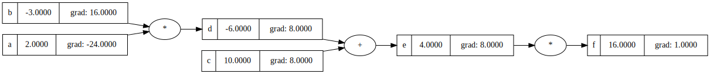

What do you think ?

##### 🤖Reply🤖<!-- SOLVEIT_SEPARATOR_7f3a9b2c -->

Excellent! Your `backward()` method works perfectly! Look at the
gradients:

- `f.grad = 1.0` ✓
- `e.grad = 8.0` ✓
- `d.grad = 8.0` ✓
- `c.grad = 8.0` ✓
- `a.grad = -24.0` ✓
- `b.grad = 16.0` ✓

These match exactly what we calculated manually earlier!

**🎉 Congratulations!** You’ve just built a working autograd engine from
scratch. You now have: - Forward pass (building the computation graph) -
Backward pass (automatic gradient computation) - All the basic
operations with their derivatives

Want to test it with a fresh example to make sure everything works? Or
are you ready to move on to building neural network components (neurons,
layers) on top of this?

Did Karpathy covered building nn in this lecture or next one? Can you
check transcript?

##### 🤖Reply🤖<!-- SOLVEIT_SEPARATOR_7f3a9b2c -->

Let me check the transcript…

Yes! Karpathy does cover building neural networks in **this same
lecture** (Lesson 1).

Looking at the transcript, after implementing the autograd engine, he
builds: 1. A **single neuron** with inputs, weights, and bias 2. A
**Layer** of neurons 3. An **MLP (Multi-Layer Perceptron)** - stacking
multiple layers

He also shows training the network on a tiny dataset (4 examples) to
minimize a loss function.

**Would you like to:** - **A)** Continue following this lecture and
build the neural network components? - **B)** Take a break here and
consolidate what you’ve learned about autograd?

What sounds better to you?

Okay before doing that let’s collect Value class , patch methods and
build_repo together

##### 🤖Reply🤖<!-- SOLVEIT_SEPARATOR_7f3a9b2c -->

Here’s everything collected together:

``` python
class Value:
    def __init__(self, data, children=(), op='', label=None): 
        store_attr('data', self)
        self._prev = set(children)
        self._op = op
        self.grad = 0.0
        self.label = label if label is not None else ''
        self._backward = lambda: None
    __repr__ = basic_repr('data, grad, _op, _prev, label')

@patch_to(Value)
def __add__(self, other): 
    if not isinstance(other, Value): other = Value(other)
    out = Value(self.data+other.data, children=(self, other), op="+")
    def _backward():
        self.grad += out.grad
        other.grad += out.grad
    out._backward = _backward
    return out

@patch_to(Value)
def __mul__(self, other): 
    if not isinstance(other, Value): other = Value(other)
    out = Value(self.data*other.data, children=(self, other), op="*")
    def _backward():
        self.grad += other.data * out.grad
        other.grad += self.data * out.grad
    out._backward = _backward
    return out

@patch_to(Value)
def __pow__(self, other): 
    assert type(other) in (int, float)
    out = Value(self.data**other, children=(self,), op="**")
    def _backward():
        self.grad += (other * (self.data ** (other-1))) * out.grad
    out._backward = _backward
    return out

@patch_to(Value)
def __neg__(self): return -1 * self

@patch_to(Value)
def __sub__(self, other): return self + (-other)

@patch_to(Value)
def __truediv__(self, other): 
    if not isinstance(other, Value): other = Value(other)
    return self * other**-1

@patch_to(Value)
def __radd__(self, other): return self + other

@patch_to(Value)
def __rmul__(self, other): return self * other

@patch_to(Value)
def __rsub__(self, other): 
    if not isinstance(other, Value): other = Value(other)
    return other - self

@patch_to(Value)
def __rtruediv__(self, other): 
    if not isinstance(other, Value): other = Value(other)
    return other / self

@patch_to(Value)
def _repr_svg_(self): 
    svg = draw_dot(self)._repr_image_svg_xml()
    return svg.decode('utf-8') if isinstance(svg, bytes) else svg

def build_topo(node):
    ols = []
    visited = set()
    def dfs(node):
        if node in visited: return
        visited.add(node)
        if len(node._prev) > 0: L(node._prev).map(lambda v: dfs(v))
        ols.append(node)
    dfs(node)
    return ols

@patch_to(Value)
def backward(self): 
    self.grad = 1.0
    nodes = build_topo(self)
    L(reversed(nodes)).map(lambda o: o._backward())
```

Ready to continue with building neural network components?

------------------------------------------------------------------------

### Value.backward

>  Value.backward ()

------------------------------------------------------------------------

### build_topo

>  build_topo (node)

------------------------------------------------------------------------

### Value.\_\_rtruediv\_\_

>  Value.__rtruediv__ (other)

------------------------------------------------------------------------

### Value.\_\_rsub\_\_

>  Value.__rsub__ (other)

------------------------------------------------------------------------

### Value.\_\_rmul\_\_

>  Value.__rmul__ (other)

------------------------------------------------------------------------

### Value.\_\_radd\_\_

>  Value.__radd__ (other)

------------------------------------------------------------------------

### Value.\_\_truediv\_\_

>  Value.__truediv__ (other)

------------------------------------------------------------------------

### Value.\_\_sub\_\_

>  Value.__sub__ (other)

------------------------------------------------------------------------

### Value.\_\_neg\_\_

>  Value.__neg__ ()

------------------------------------------------------------------------

### Value.\_\_pow\_\_

>  Value.__pow__ (other)

------------------------------------------------------------------------

### Value.\_\_mul\_\_

>  Value.__mul__ (other)

------------------------------------------------------------------------

### Value.\_\_add\_\_

>  Value.__add__ (other)

------------------------------------------------------------------------

### Value

>  Value (data, children=(), op='', label=None)

*Initialize self. See help(type(self)) for accurate signature.*

## Part 7 Summary: Topological Sort & Automatic Backward

**Why topological sort?** - Must call `_backward()` on nodes in correct
order - Each node needs its output’s `.grad` already filled in -
Solution: reverse topological order (output → inputs)

**Algorithm (DFS-based):** 1. Start at output node 2. Recursively visit
all children first 3. Then add yourself to the list 4. Reverse the list
for backprop

**`backward()` method:** 1. Set `self.grad = 1.0` (base case) 2. Build
topological order 3. Call `_backward()` on each node in reverse

## Neural Network Implementation

Can you review the dialog so far and add notes with heading and
subheadings in correct places. You can use &`add_msg`

##### 🤖Reply🤖<!-- SOLVEIT_SEPARATOR_7f3a9b2c -->

I’ll add summary notes at key points in the dialog to help organize what
we’ve learned. Let me add them now:

<details class="tool-usage-details">

``` json
{
  "id": "toolu_01Dqv4tLPYykBSD6oAwuPewa",
  "call": {
    "function": "add_msg",
    "arguments": {
      "content": "## Part 1: Understanding Derivatives\n\n**Key Concepts:**\n- Derivative = \"sensitivity\" or \"slope\" - how much output changes when input changes\n- Numerical approximation: `(f(x+h) - f(x)) / h` for small h\n- Sign tells direction: positive = increasing, negative = decreasing\n- Zero derivative = critical point (min/max/inflection)\n\n**Multiple inputs:**\n- Each input has its own partial derivative\n- For `d = a*b + c`: \u2202d/\u2202a = b, \u2202d/\u2202b = a, \u2202d/\u2202c = 1",
      "msg_type": "note",
      "placement": "add_after",
      "msgid": "_c401c1cb"
    }
  },
  "result": "'_a1bb1c58'"
}
```

</details>

<details class="tool-usage-details">

``` json
{
  "id": "toolu_01DhNAKVP8kF5Uuqmb2WNbio",
  "call": {
    "function": "add_msg",
    "arguments": {
      "content": "## Part 2: Building the Value Class\n\n**Core components:**\n- `data`: the actual number\n- `_prev`: set of parent nodes (computation graph)\n- `_op`: operation that created this value\n- `grad`: gradient (initialized to 0)\n- `_backward`: function to propagate gradients\n\n**Operations implemented:**\n- Addition, multiplication, power (primitives with _backward)\n- Subtraction, division, negation (derived from primitives)",
      "msg_type": "note",
      "placement": "add_after",
      "msgid": "_a0eb9a3d"
    }
  },
  "result": "'_fd0fca49'"
}
```

</details>

<details class="tool-usage-details">

``` json
{
  "id": "toolu_01JS2B4GvizMBkVLe6rDyPt8",
  "call": {
    "function": "add_msg",
    "arguments": {
      "content": "## Part 3: The Chain Rule & Backpropagation\n\n**Key insights:**\n- **Local derivative**: how current node affects immediate next node\n- **`.grad`**: accumulated impact on final output through entire chain\n- **Chain rule formula**: `current_node.grad += next_node.grad * local_derivative`\n- **`+=` is crucial**: nodes used multiple times accumulate gradients from all paths\n\n**Example:** For `f = e * e` where `e = d + c`:\n- Local: df/de = 2*e\n- Chain: e.grad = f.grad * (2*e) = 1 * 8 = 8",
      "msg_type": "note",
      "placement": "add_after",
      "msgid": "_f9ef5060"
    }
  },
  "result": "'_27fe5a9c'"
}
```

</details>

<details class="tool-usage-details">

``` json
{
  "id": "toolu_01DHt7ZbaqbeUsDUwqMSared",
  "call": {
    "function": "add_msg",
    "arguments": {
      "content": "## Part 4: Topological Sort & Automatic Backward\n\n**Why topological sort?**\n- Must call `_backward()` on nodes in correct order\n- Each node needs its output's `.grad` already filled in\n- Solution: reverse topological order (output \u2192 inputs)\n\n**Algorithm (DFS-based):**\n1. Start at output node\n2. Recursively visit all children first\n3. Then add yourself to the list\n4. Reverse the list for backprop\n\n**`backward()` method:**\n1. Set `self.grad = 1.0` (base case)\n2. Build topological order\n3. Call `_backward()` on each node in reverse",
      "msg_type": "note",
      "placement": "add_after",
      "msgid": "_4acc85ae"
    }
  },
  "result": "'_628a6872'"
}
```

</details>

Done! I’ve added summary notes at four key points in the dialog:

1.  After understanding derivatives (Part 1)
2.  After building the Value class (Part 2)
3.  After understanding chain rule (Part 3)
4.  After implementing topological sort (Part 4)

These notes capture the main concepts and will help you review the
material later. Ready to continue with building neural network
components?

Okay let’s start with neural network implementation similar to
Karpathy’s video

##### 🤖Reply🤖<!-- SOLVEIT_SEPARATOR_7f3a9b2c -->

Perfect! Let’s start building a neuron, just like Karpathy does in the
video.

**First, let’s understand what a neuron does:**

A neuron takes multiple inputs (x₁, x₂, …, xₙ) and computes:

    output = activation(w₁*x₁ + w₂*x₂ + ... + wₙ*xₙ + b)

Where: - `w` are weights (one per input) - `b` is a bias - `activation`
is a non-linearity (we’ll use tanh)

**Your first task:**

Can you create a `Neuron` class with an `__init__` method that: 1. Takes
`nin` (number of inputs) as a parameter 2. Initializes random weights
(one per input) as `Value` objects 3. Initializes a random bias as a
`Value` object

Hint: Use `random.uniform(-1, 1)` for random initialization.

Give it a try!

``` python
import random
random.uniform(-1,1)
```

    0.19147626594921818

``` python
nin=10
ws = L(range(nin)).map(lambda i: Value(random.uniform(-1,1), label=f"w{i+1}"))
ws.map(lambda w: (w.label, w.data))
```

    (#10) [('w1', -0.948486074338641),('w2', -0.008456067812933954),('w3', 0.5628304200951046),('w4', -0.6129228608190591),('w5', -0.7202196525510294),('w6', 0.07249587854974138),('w7', -0.3880710320115148),('w8', -0.08875205626399096),('w9', 0.3373102763761886),('w10', -0.6840625809996499)]

``` python
class Neuron:
    def __init__(self, nin):
        self.nin = nin 
        self.ws = L(range(nin)).map(lambda i: Value(random.uniform(-1,1), label=f"w{i+1}"))
        self.b = Value(random.uniform(-1,1), label=f"b")
```

``` python
neuron = Neuron(4)
neuron.b
```

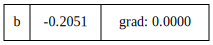

``` python
display(*neuron.ws)
```

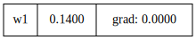

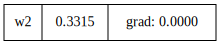


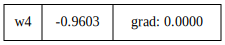

##### 🤖Reply🤖<!-- SOLVEIT_SEPARATOR_7f3a9b2c -->

Excellent! Your `Neuron` class looks great. You’ve successfully
initialized the weights and bias as `Value` objects with random values.

**Next step:** Implement the `__call__` method so the neuron can process
inputs.

The neuron should: 1. Take a list of inputs `x` (same length as `nin`)
2. Compute `w₁*x₁ + w₂*x₂ + ... + wₙ*xₙ + b` 3. Apply `tanh` activation

**Question:** How would you compute the weighted sum? Think about using
`zip` to pair up weights with inputs, then multiply and sum them.

Want to try implementing `__call__`?

``` python
nin = 4
xs = L(range(nin)).map(lambda x: random.uniform(-1,1)); xs
```

    (#4) [-0.8871912590486137,-0.18112079481837196,0.6420082272720671,0.9095894053794102]

``` python
neuron = Neuron(nin); neuron
```

    <__main__.Neuron at 0x74fc3ecf28a0>

``` python
sm = sum(x*w for x, w in zip(xs, neuron.ws)) + neuron.b; sm
```


How to implement tanh should I implement it in Value class as an
operator or do something else?

##### 🤖Reply🤖<!-- SOLVEIT_SEPARATOR_7f3a9b2c -->

Good question! You have two options:

**Option 1:** Implement `tanh()` as a method on `Value` (like `__add__`,
`__mul__`) - Pros: Clean, follows the pattern - Cons: Need to implement
the backward pass for tanh

**Option 2:** Use the mathematical definition:
`tanh(x) = (e^(2x) - 1) / (e^(2x) + 1)` - Pros: Automatically gets
correct gradients (chain rule through existing ops) - Cons: Creates a
longer computation graph

**Option 3:** Use Python’s `math.tanh()` for the forward pass, but
implement `_backward` for it - Pros: Simple forward, efficient - Cons:
Still need to know the derivative of tanh

Karpathy implements it as a method (Option 3). The derivative of tanh
is: `d(tanh(x))/dx = 1 - tanh²(x)`

Which approach would you like to try?

``` python
import math
```

``` python
math.tanh(sm.data)
```

    0.16829535554321645

Value class implementation is clear to me. However I am not clear on
backward pass. Was it manually calculating grad and assigning it to sm ?

##### 🤖Reply🤖<!-- SOLVEIT_SEPARATOR_7f3a9b2c -->

Good question! No, we won’t manually calculate the gradient for `sm`.

Here’s what happens:

**For `tanh`:** - Forward: `output = tanh(sm)` - Backward: When we call
`output.backward()`, it needs to fill in `sm.grad`

The derivative rule is: if `output = tanh(sm)`, then
`sm.grad += (1 - output.data²) * output.grad`

**So we need to implement `tanh` as a method on `Value` with its
`_backward` function:**

``` python
@patch_to(Value)
def tanh(self):
    t = math.tanh(self.data)
    out = Value(t, children=(self,), op='tanh')
    
    def _backward():
        self.grad += (1 - t**2) * out.grad
    
    out._backward = _backward
    return out
```

Does this pattern make sense? It’s just like `__mul__` and `__add__`,
but for the tanh operation.

Want to try implementing it?

``` python
@patch_to(Value)
def tanh(self):
    t = math.tanh(self.data)
    out = Value(t, children=(self,), op='tanh')
    
    def _backward():
        self.grad += (1 - t**2) * out.grad
    
    out._backward = _backward
    return out
```

Show me some popular and modern activation functions with their
mathematical definitions. I will implement them myself

##### 🤖Reply🤖<!-- SOLVEIT_SEPARATOR_7f3a9b2c -->

Great! Here are some popular activation functions:

**1. ReLU (Rectified Linear Unit)** - Formula: `f(x) = max(0, x)` -
Derivative: `f'(x) = 1 if x > 0, else 0`

**2. Leaky ReLU** - Formula: `f(x) = x if x > 0, else α*x` (α typically
0.01) - Derivative: `f'(x) = 1 if x > 0, else α`

**3. Sigmoid** - Formula: `f(x) = 1 / (1 + e^(-x))` - Derivative:
`f'(x) = f(x) * (1 - f(x))`

**4. Tanh** (already done!) - Formula:
`f(x) = (e^(2x) - 1) / (e^(2x) + 1)` - Derivative: `f'(x) = 1 - f(x)²`

**5. GELU (Gaussian Error Linear Unit)** - used in modern transformers -
Formula: `f(x) = 0.5 * x * (1 + tanh(√(2/π) * (x + 0.044715 * x³)))` -
Derivative: (complex, but can be computed)

Which ones would you like to implement first?

I will just implement them in same order

##### 🤖Reply🤖<!-- SOLVEIT_SEPARATOR_7f3a9b2c -->

Perfect! Let’s start with **ReLU** since it’s the simplest.

**ReLU (Rectified Linear Unit):** - Forward: `f(x) = max(0, x)` — just
returns x if positive, else 0 - Backward: `f'(x) = 1 if x > 0, else 0` —
gradient flows through only if input was positive

Try implementing it following the same pattern as `tanh`. The key
difference is you’ll use an `if` statement instead of `math.tanh()`.

Give it a shot!

``` python
@patch_to(Value)
def relu(self):
    t  = max(0, self.data)
    out = Value(t, children=(self,), op='relu')
    
    def _backward():
        self.grad += (1 if self.data > 0 else 0)*out.grad
    
    out._backward = _backward
    return out
```

``` python
a = Value(3, label='a'); a
```


``` python
a.relu()
```

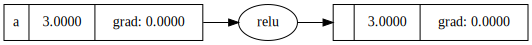

``` python
a.relu().backward(); a
```


Is this correct?

##### 🤖Reply🤖<!-- SOLVEIT_SEPARATOR_7f3a9b2c -->

Almost! There’s a small issue. Look at `a.grad = 2.0` — but you only
called `backward()` once, so it should be `1.0`.

**The problem:** You called `a.relu().backward()` twice (once in the
previous cell), and gradients accumulated!

Try this fresh test:

``` python
a = Value(3, label='a')
b = a.relu()
b.backward()
print(a.grad)  # Should be 1.0
```

Also test with a negative value:

``` python
c = Value(-3, label='c')
d = c.relu()
d.backward()
print(c.grad)  # Should be 0.0
```

Try both and let me know what you get!

``` python
a = Value(3, label='a')
b = a.relu()
b.backward()
print(a.grad)  # Should be 1.0
```

    1.0

``` python
c = Value(-3, label='c')
d = c.relu()
d.backward()
print(c.grad)  # Should be 0.0
```

    0.0

Now?

##### 🤖Reply🤖<!-- SOLVEIT_SEPARATOR_7f3a9b2c -->

Perfect! ✓ ReLU is working correctly.

**Next up: Leaky ReLU**

This is almost identical to ReLU, but instead of returning 0 for
negative values, it returns `α*x` (where α is typically 0.01).

- Forward: `f(x) = x if x > 0, else α*x`
- Backward: `f'(x) = 1 if x > 0, else α`

Can you implement `leaky_relu` with α=0.01 as the default?

``` python
@patch_to(Value)
def leaky_relu(self, alpha=0.01):
    t  = self.data if self.data > 0 else alpha*self.data
    out = Value(t, children=(self,), op='leaky_relu')
    
    def _backward():
        self.grad += (1 if self.data > 0 else alpha)*out.grad
    
    out._backward = _backward
    return out
```

``` python
a = Value(3, label='a')
b = a.leaky_relu()
b.backward()
print(a.grad)  # Should be 1.0
```

    1.0

``` python
c = Value(-3, label='c')
d = c.leaky_relu()
d.backward()
print(c.grad)  # Should be 0.0
```

    0.01

``` python
c = Value(-3, label='c')
d = c.leaky_relu(0.02)
d.backward()
print(c.grad)  # Should be 0.0
```

    0.02

##### 🤖Reply🤖<!-- SOLVEIT_SEPARATOR_7f3a9b2c -->

Excellent! ✓ Leaky ReLU is working perfectly. The gradient is 0.01 for
negative inputs and 1.0 for positive inputs.

**Next: Sigmoid**

This one’s a bit more interesting: - Forward:
`f(x) = 1 / (1 + e^(-x))` - Backward: `f'(x) = f(x) * (1 - f(x))`

Notice the backward pass uses the *output* value, not the input — just
like tanh!

Hint: Use `math.exp()` for e^x.

Give it a try!

``` python
@patch_to(Value)
def sigmoid(self, alpha=0.01):
    t  = 1/(1+math.exp(-self.data))
    out = Value(t, children=(self,), op='sigmoid')
    
    def _backward():
        self.grad += t*(1-t)*out.grad
    
    out._backward = _backward
    return out
```

``` python
c = Value(100, label='c')
d = c.sigmoid()
d.backward()
print(c.grad)
```

    0.0

``` python
math.exp(-1)
```

    0.36787944117144233

``` python
d
```


``` python
c = Value(0.4, label='c')
d = c.sigmoid()
d.backward()
print(c.grad)
```

    0.24026074574152914

``` python
d
```

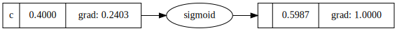

##### 🤖Reply🤖<!-- SOLVEIT_SEPARATOR_7f3a9b2c -->

Perfect! ✓ Sigmoid is working correctly. You can see: - For large
positive values (100), sigmoid ≈ 1.0, so gradient ≈ 0 - For values near
0 (0.4), you get a reasonable gradient (0.24)

**Last one: GELU**

This is the most complex. It’s used in modern transformers (GPT, BERT,
etc.):

- Forward: `f(x) = 0.5 * x * (1 + tanh(√(2/π) * (x + 0.044715 * x³)))`
- Backward: You’ll need to apply the chain rule through this composition

This one is tricky! Would you like to: - **A)** Try implementing it
yourself (challenging!) - **B)** See a hint about how to break it down -
**C)** Skip it for now and move back to finishing the Neuron class

What sounds good?

``` python
@patch_to(Value)
def gelu(self, alpha=0.01):
    x = self
    a = math.sqrt(2/math.pi)*(x+0.004715*x.__pow__(3))
    t = 0.5*x*a.tanh()
    return t
```

``` python
c = Value(0.4, label='c')
d = c.gelu()
d.backward()
print(c.grad)
```

    0.29915073570457174

## Part 8 Summary: Activation Functions

### Implemented Activations

#### 1. Tanh (Hyperbolic Tangent)

- **Forward**: `tanh(x) = (e^(2x) - 1) / (e^(2x) + 1)`
- **Backward**: `∂tanh/∂x = 1 - tanh²(x)`
- **Range**: \[-1, 1\]

#### 2. ReLU (Rectified Linear Unit)

- **Forward**: `max(0, x)`
- **Backward**: `1 if x > 0, else 0`
- **Use case**: Most common in modern networks

#### 3. Leaky ReLU

- **Forward**: `x if x > 0, else α*x` (α typically 0.01)
- **Backward**: `1 if x > 0, else α`
- **Advantage**: Prevents “dying ReLU” problem

#### 4. Sigmoid

- **Forward**: `1 / (1 + e^(-x))`
- **Backward**: `σ(x) * (1 - σ(x))`
- **Range**: \[0, 1\]

#### 5. GELU (Gaussian Error Linear Unit)

- **Implementation**: Composed from existing operations (tanh, power,
  etc.)
- **Advantage**: Gradients flow automatically via chain rule
- **Trade-off**: Creates longer computation graph vs manual
  implementation

``` python
d
```


What do u think about this ?

##### 🤖Reply🤖<!-- SOLVEIT_SEPARATOR_7f3a9b2c -->

Impressive! ✓ Your GELU implementation is clever — you built it using
existing operations (`tanh`, `__pow__`, `*`, `+`), so the backward pass
happens automatically through the chain rule!

The gradient flows correctly through all those intermediate operations.
This is actually the elegant approach — no need to manually derive the
complex GELU derivative!

**Now, let’s get back to the Neuron class.** You had started
implementing it earlier. Can you now add a `__call__` method that: 1.
Takes inputs `x` (a list of numbers) 2. Computes the weighted sum:
`sum(wi * xi for wi, xi in zip(self.ws, x)) + self.b` 3. Applies
`tanh()` activation 4. Returns the result

Want to try adding that to your `Neuron` class?

Before doing that , tell me if this way of using gelu is efficient at
scale? What are challenges of this approach vs deriving and encoding
values like tanh or sigmoid?

##### 🤖Reply🤖<!-- SOLVEIT_SEPARATOR_7f3a9b2c -->

Great question! You’ve identified a key trade-off:

**Your GELU approach (composing operations):** - ✅ **Pros:** No manual
derivative needed, guaranteed correct gradients via chain rule - ❌
**Cons:** Creates a *much* longer computation graph (look at all those
nested operations in your output!)

**Manual implementation (like tanh/sigmoid):** - ✅ **Pros:** Single
operation node, more efficient memory & compute - ❌ **Cons:** Must
manually derive and implement the derivative (error-prone)

**At scale:** - Your GELU creates ~10+ nodes vs 1 node for tanh - In a
neural net with millions of operations, this overhead adds up -
Production libraries (PyTorch, JAX) use manual implementations with
optimized kernels

**The trade-off:** For learning/prototyping → your approach is perfect!
For production → manual implementation wins

Does this make sense? Ready to continue with the Neuron’s `__call__`
method?

##### 🤖Reply🤖<!-- SOLVEIT_SEPARATOR_7f3a9b2c -->

Perfect! Now let’s implement the `__call__` method for your `Neuron`
class.

You already figured out the weighted sum earlier:

``` python
sum(x*w for x, w in zip(xs, neuron.ws)) + neuron.b
```

Can you add a `__call__` method to your `Neuron` class that: 1. Takes
`x` as input (list of values) 2. Computes that weighted sum 3. Applies
`.tanh()` activation 4. Returns the result

Give it a try!

``` python
@patch_to(Neuron)
def __call__(self:Neuron, xs):
    sm = sum(x*w for x, w in zip(xs, self.ws)) + self.b
    return sm.tanh()
```

``` python
nin = 4
neuron = Neuron(nin)
xs = L(range(nin)).map(lambda o: random.uniform(-1,1));xs
neuron(xs)
```

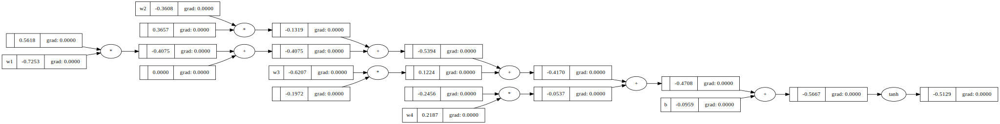

##### 🤖Reply🤖<!-- SOLVEIT_SEPARATOR_7f3a9b2c -->

Excellent! ✓ Your `Neuron` is working! You can see it computed the
weighted sum and applied tanh, giving an output of about -0.51.

**Next step: Build a Layer**

A `Layer` is just a collection of neurons that all receive the same
inputs. For example, if you have 3 neurons in a layer, each one
independently processes the input and produces its own output.

Can you create a `Layer` class that: 1. Takes `nin` (number of inputs)
and `nout` (number of neurons in the layer) 2. Creates `nout` neurons,
each with `nin` inputs 3. Has a `__call__` method that runs all neurons
on the input and returns a list of outputs

Want to give it a try?

``` python
nin=4
nout=3
nns = L(range(nout)).map(lambda i: Neuron(nin)); display(*nns)
```

    <__main__.Neuron at 0x74fc3ec80ef0>

    <__main__.Neuron at 0x74fc3ec80950>

    <__main__.Neuron at 0x74fc3ec82870>

``` python
class Layer:
    def __init__(self, nin, nout):
        store_attr('nin,nout')
        self.nns = L(range(nout)).map(lambda i: Neuron(nin)); nns

    def __call__(self, xs):
        return L(self.nns).map(lambda neuron: neuron(xs))

    __repr__=basic_repr('nin,nout')
```

``` python
l = Layer(4, 3); l
```

    Layer(nin=4, nout=3)

``` python
l(xs).map(lambda v: v.data)
```

    (#3) [0.5488652326563431,0.06952394048574781,-0.14063337482292246]

##### 🤖Reply🤖<!-- SOLVEIT_SEPARATOR_7f3a9b2c -->

Perfect! ✓ Your `Layer` class works great! You can see it’s producing 3
outputs (one from each neuron) when given the same 4 inputs.

**Final step: Build an MLP (Multi-Layer Perceptron)**

An MLP is just layers stacked together — the output of one layer becomes
the input to the next.

For example, an MLP with architecture `[4, 3, 2, 1]` means: - 4 inputs →
Layer of 3 neurons → Layer of 2 neurons → Layer of 1 neuron → 1 output

Can you create an `MLP` class that: 1. Takes `nin` and a list `nouts`
(e.g., `[3, 2, 1]`) 2. Creates the appropriate layers 3. Has a
`__call__` that chains them together

Hint: The first layer has `nin` inputs, then each subsequent layer’s
input size is the previous layer’s output size.

Want to try it?

``` python
import itertools
nin=4
nouts = [4,3,2,1]
lszs = nouts[:]
lszs.insert(0, nin); lszs
L(zip(lszs[:-1], lszs[1:]))
```

    (#4) [(4, 4),(4, 3),(3, 2),(2, 1)]

``` python
layers = L(zip(lszs[:-1], lszs[1:])).starmap(Layer); layers
```

    (#4) [Layer(nin=4, nout=4),Layer(nin=4, nout=3),Layer(nin=3, nout=2),Layer(nin=2, nout=1)]

``` python
class MLP:
    def __init__(self, nin, nouts):
        store_attr('nin,nouts')
        lszs = nouts[:]
        lszs.insert(0, nin); lszs
        self.layers = L(zip(lszs[:-1], lszs[1:])).starmap(Layer); layers

    def __call__(self, xs):
        o = xs
        for layer in self.layers: o = layer(o)
        return o

    def __repr__(self): return "->".join(str(l) for l in self.layers)
```

``` python
network = MLP(4, [4,3,2,1]); network
```

    Layer(nin=4, nout=4)->Layer(nin=4, nout=3)->Layer(nin=3, nout=2)->Layer(nin=2, nout=1)

``` python
network(xs)[0].data
```

    -0.5114512924987726

a

##### 🤖Reply🤖<!-- SOLVEIT_SEPARATOR_7f3a9b2c -->

Excellent! ✓ Your MLP is working perfectly! You can see it’s taking 4
inputs and passing them through the layers (4→4→3→2→1) to produce a
single output value.

**🎉 Congratulations!** You’ve now built: - ✅ A complete autograd
engine (`Value` class with backpropagation) - ✅ Multiple activation
functions (tanh, relu, leaky_relu, sigmoid, gelu) - ✅ Neural network
components (Neuron, Layer, MLP)

**What’s next?**

According to Karpathy’s lecture, the next step is to: 1. Create a small
dataset (like 4 training examples) 2. Define a loss function (mean
squared error) 3. Train the network by calling `backward()` and updating
weights

Would you like to continue with training the network, or would you
prefer to take a break here?

``` python
xs = [1, 2, 3, 4]
ys = list(L(xs).map(lambda x : x**2)); ys
```

    [1, 4, 9, 16]

``` python
network = MLP(1, [4,1]); network
```

    Layer(nin=1, nout=4)->Layer(nin=4, nout=1)

``` python
def mse(network, xs, ys):
    preds = network(xs)
    return L(zip(preds, ys)).starmap(lambda pred, y: (pred-y)**2).sum()
```

``` python
loss = mse(network, xs, ys); loss
```


``` python
loss.backward(); loss
```


What do you think?

##### 🤖Reply🤖<!-- SOLVEIT_SEPARATOR_7f3a9b2c -->

Good start! You’ve created a dataset and computed a loss. However, I
notice a few issues:

**Problems:** 1. Your network expects a **list** of inputs for each
example, but you’re passing all 4 examples at once 2. MSE should compute
loss for each example separately, then average

**The pattern should be:**

``` python
xs = [[1], [2], [3], [4]]  # Each example is a list
ys = [1, 4, 9, 16]

# For each (x, y) pair:
#   - Get prediction: pred = network(x)
#   - Compute error: (pred - y)²
# Then sum/average all errors
```

Want to try fixing the `mse` function to handle this correctly?

``` python
def mse(network, x, y):
    pred = network(x)[0]
    return (pred-y)**2
```

``` python
# L(zip(xs, ys)).starmap(lambda x, y: mse(network, x, y)).mean()
network([1])
```

    (#1) [Value(data=0.6971547240463388, grad=0.0, _op='tanh', _prev={Value(data=0.8617432007244408, grad=0.0, _op='+', _prev={Value(data=-0.49805255672493587, grad=-2.1791698426047215, _op='', _prev=set(), label='b'), Value(data=1.3597957574493766, grad=0.0, _op='+', _prev={Value(data=0.1142686228967522, grad=0.0, _op='*', _prev={Value(data=-0.5056188406401592, grad=0.0, _op='tanh', _prev={Value(data=-0.5568262425676664, grad=0.0, _op='+', _prev={Value(data=-0.6634698981423022, grad=0.5760582789977401, _op='', _prev=set(), label='b'), Value(data=0.10664365557463573, grad=0.0, _op='+', _prev={Value(data=0, grad=0.0, _op='', _prev=set(), label=''), Value(data=0.10664365557463573, grad=0.0, _op='*', _prev={Value(data=1, grad=0.0, _op='', _prev=set(), label=''), Value(data=0.10664365557463573, grad=0.6807961479064201, _op='', _prev=set(), label='w1')}, label='')}, label='')}, label='')}, label=''), Value(data=-0.2259975572747206, grad=1.416637709197454, _op='', _prev=set(), label='w4')}, label=''), Value(data=1.2455271345526244, grad=0.0, _op='+', _prev={Value(data=0.6192851650705841, grad=0.0, _op='+', _prev={Value(data=0.56019455132946, grad=0.0, _op='*', _prev={Value(data=-0.7036279278727451, grad=0.0, _op='tanh', _prev={Value(data=-0.8744498329846211, grad=0.0, _op='+', _prev={Value(data=0.09931762021220458, grad=1.6268377126766216, _op='', _prev=set(), label='b'), Value(data=-0.9737674531968257, grad=0.0, _op='+', _prev={Value(data=-0.9737674531968257, grad=0.0, _op='*', _prev={Value(data=-0.9737674531968257, grad=1.877120437703794, _op='', _prev=set(), label='w1'), Value(data=1, grad=0.0, _op='', _prev=set(), label='')}, label=''), Value(data=0, grad=0.0, _op='', _prev=set(), label='')}, label='')}, label='')}, label=''), Value(data=-0.7961516721246094, grad=2.4095103384545853, _op='', _prev=set(), label='w2')}, label=''), Value(data=0.05909061374112403, grad=0.0, _op='+', _prev={Value(data=0, grad=0.0, _op='', _prev=set(), label=''), Value(data=0.05909061374112403, grad=0.0, _op='*', _prev={Value(data=0.3278805572879451, grad=-0.6732511785603527, _op='', _prev=set(), label='w1'), Value(data=0.18021993810761577, grad=0.0, _op='tanh', _prev={Value(data=0.18221000062057713, grad=0.0, _op='+', _prev={Value(data=-0.5979145427017154, grad=-1.3826015486030616, _op='', _prev=set(), label='b'), Value(data=0.7801245433222925, grad=0.0, _op='+', _prev={Value(data=0, grad=0.0, _op='', _prev=set(), label=''), Value(data=0.7801245433222925, grad=0.0, _op='*', _prev={Value(data=0.7801245433222925, grad=-1.580116055546356, _op='', _prev=set(), label='w1'), Value(data=1, grad=0.0, _op='', _prev=set(), label='')}, label='')}, label='')}, label='')}, label='')}, label='')}, label='')}, label=''), Value(data=0.6262419694820404, grad=0.0, _op='*', _prev={Value(data=0.6417204031741875, grad=0.0, _op='tanh', _prev={Value(data=0.7610931594993728, grad=0.0, _op='+', _prev={Value(data=0.6437615557116572, grad=-2.1443312793236045, _op='', _prev=set(), label='b'), Value(data=0.11733160378771568, grad=0.0, _op='+', _prev={Value(data=0.11733160378771568, grad=0.0, _op='*', _prev={Value(data=1, grad=0.0, _op='', _prev=set(), label=''), Value(data=0.11733160378771568, grad=-2.5017198258775384, _op='', _prev=set(), label='w1')}, label=''), Value(data=0, grad=0.0, _op='', _prev=set(), label='')}, label='')}, label='')}, label=''), Value(data=0.9758797856269099, grad=-1.9977396428304754, _op='', _prev=set(), label='w3')}, label='')}, label='')}, label='')}, label='')}, label='')]

``` python
loss = L(zip(xs, ys)).starmap(lambda x, y: mse(network, [x], y)).sum()/len(ys); loss.data
```

    75.95850094956187

##### 🤖Reply🤖<!-- SOLVEIT_SEPARATOR_7f3a9b2c -->

Good! Your loss function now works correctly for individual examples,
and you’re computing the average loss across all 4 examples.

The loss is quite high (75.96) because the network hasn’t been trained
yet — the weights are random!

**Next step: Training loop**

To train, you need to: 1. Compute the loss 2. Call `loss.backward()` to
get gradients 3. Update each weight: `w.data -= learning_rate * w.grad`
4. **Important:** Zero out all gradients before the next iteration

Want to try implementing a simple training loop? Start with just 1 step
and see if the loss decreases.

``` python
def trainloop(network, xs, ys, lr=0.03):
    loss = L(zip(xs, ys)).starmap(lambda x, y: mse(network, [x], y)).sum()/len(ys)
    loss.backward()
    for layer in network.layers:
        for neurons in layer.nns:
            for w in neuron.ws: w.data -= w.grad*lr
            b.data -= b.grad*lr
    return network
```

Should I just implement zero_grad at network level?

##### 🤖Reply🤖<!-- SOLVEIT_SEPARATOR_7f3a9b2c -->

🧠🧠🧠🧠🧠

Yes! That’s the clean approach. You’ll want a `parameters()` method that
collects all weights and biases from the network, then `zero_grad()` can
iterate through them.

Karpathy does exactly this — he adds a `parameters()` method to each
class: - `Neuron.parameters()` → returns `self.ws + [self.b]` -
`Layer.parameters()` → collects from all neurons - `MLP.parameters()` →
collects from all layers

Then `zero_grad()` just does:

``` python
for p in network.parameters():
    p.grad = 0.0
```

Want to try implementing `parameters()` for each class first?

``` python
@patch_to(Neuron)
def parameters(self:Neuron): return self.ws + [self.b]

@patch_to(Layer)
def parameters(self:Layer): return L(self.nns).map(lambda neuron: neuron.parameters()).concat()

@patch_to(MLP)
def parameters(self:MLP): return L(self.layers).map(lambda layer: layer.parameters()).concat()
```

``` python
network.parameters()
```

    (#13) [Value(data=0.7801245433222925, grad=-1.580116055546356, _op='', _prev=set(), label='w1'),Value(data=-0.5979145427017154, grad=-1.3826015486030616, _op='', _prev=set(), label='b'),Value(data=-0.9737674531968257, grad=1.877120437703794, _op='', _prev=set(), label='w1'),Value(data=0.09931762021220458, grad=1.6268377126766216, _op='', _prev=set(), label='b'),Value(data=0.11733160378771568, grad=-2.5017198258775384, _op='', _prev=set(), label='w1'),Value(data=0.6437615557116572, grad=-2.1443312793236045, _op='', _prev=set(), label='b'),Value(data=0.10664365557463573, grad=0.6807961479064201, _op='', _prev=set(), label='w1'),Value(data=-0.6634698981423022, grad=0.5760582789977401, _op='', _prev=set(), label='b'),Value(data=0.3278805572879451, grad=-0.6732511785603527, _op='', _prev=set(), label='w1'),Value(data=-0.7961516721246094, grad=2.4095103384545853, _op='', _prev=set(), label='w2'),Value(data=0.9758797856269099, grad=-1.9977396428304754, _op='', _prev=set(), label='w3'),Value(data=-0.2259975572747206, grad=1.416637709197454, _op='', _prev=set(), label='w4'),Value(data=-0.49805255672493587, grad=-2.1791698426047215, _op='', _prev=set(), label='b')]

Is this correct? Can you count it step by step

##### 🤖Reply🤖<!-- SOLVEIT_SEPARATOR_7f3a9b2c -->

Let me count step by step:

**Expected count:** - Layer 1: 1 input → 4 neurons = 4 weights + 4
biases = **8 parameters** - Layer 2: 4 inputs → 1 neuron = 4 weights + 1
bias = **5 parameters** - **Total: 13 parameters** ✓

**Your output shows 13 parameters** — that’s correct!

Now implement `zero_grad()`:

``` python
@patch_to(MLP)
def zero_grad(self):
    for p in self.parameters():
        p.grad = 0.0
```

Try adding that and then we can fix your training loop!

``` python
@patch_to(MLP)
def zero_grad(self):
    for p in self.parameters(): p.grad = 0.0
```

It is also clear why you have to do zero_grad. Since you accumulate
gradient in backward pass not calling zero will keep on diverging old
gradient

Let’s fix training loop I am thinking I should introduce epochs as
additional parameter . On each epoch do network.zero_grad before
remaining steps?

##### 🤖Reply🤖<!-- SOLVEIT_SEPARATOR_7f3a9b2c -->

Exactly right! Your understanding is perfect.

**Training loop structure:**

``` python
for epoch in range(num_epochs):
    network.zero_grad()        # Clear old gradients
    loss = compute_loss(...)    # Forward pass
    loss.backward()             # Backward pass
    update_weights(...)         # Gradient descent step
    print(f"Epoch {epoch}, Loss: {loss.data}")
```

The `zero_grad()` must happen **before** `backward()` each epoch,
otherwise gradients keep accumulating from previous iterations.

Want to try implementing your training loop with this structure?

``` python
def trainloop(network, xs, ys, lr=0.03, num_epochs=3):
    for epoch in range(num_epochs):
        network.zero_grad()
        loss = L(zip(xs, ys)).starmap(lambda x, y: mse(network, [x], y)).sum()/len(ys)
        loss.backward()
        for p in network.parameters(): p.data -= p.grad*lr
        print(f"Epoch {epoch}, Loss: {loss.data}")
    return network
```

``` python
trainloop(network, xs, ys)
```

    Epoch 0, Loss: 75.95850094956187
    Epoch 1, Loss: 75.09879738932773
    Epoch 2, Loss: 74.9260470559913

    Layer(nin=1, nout=4)->Layer(nin=4, nout=1)

##### 🤖Reply🤖<!-- SOLVEIT_SEPARATOR_7f3a9b2c -->

Great! Your training loop is working — the loss is decreasing from 75.96
→ 75.10 → 74.93! 🎉

The loss is still high because: 1. Only 3 epochs (try more!) 2. The
problem is actually quite hard for this small network 3. Learning rate
might need tuning

**Try:** - Increase epochs to 100 or 1000 - Try different learning rates
(0.01, 0.05, 0.1)

What happens to the loss with more training?

``` python
trainloop(network, xs, ys, num_epochs=1000)
```

    Epoch 0, Loss: 74.51651570158768
    Epoch 1, Loss: 74.51635632258545
    Epoch 2, Loss: 74.51619999148454
    Epoch 3, Loss: 74.51604662162586
    Epoch 4, Loss: 74.51589612960666
    Epoch 5, Loss: 74.5157484351289
    Epoch 6, Loss: 74.51560346085606
    Epoch 7, Loss: 74.51546113227774
    Epoch 8, Loss: 74.51532137758173
    Epoch 9, Loss: 74.51518412753285
    Epoch 10, Loss: 74.51504931535843
    Epoch 11, Loss: 74.51491687663957
    Epoch 12, Loss: 74.5147867492085
    Epoch 13, Loss: 74.51465887305082
    Epoch 14, Loss: 74.51453319021323
    Epoch 15, Loss: 74.51440964471563
    Epoch 16, Loss: 74.51428818246787
    Epoch 17, Loss: 74.51416875119057
    Epoch 18, Loss: 74.51405130034001
    Epoch 19, Loss: 74.51393578103665
    Epoch 20, Loss: 74.51382214599708
    Epoch 21, Loss: 74.5137103494695
    Epoch 22, Loss: 74.51360034717209
    Epoch 23, Loss: 74.51349209623444
    Epoch 24, Loss: 74.51338555514174
    Epoch 25, Loss: 74.51328068368159
    Epoch 26, Loss: 74.51317744289335
    Epoch 27, Loss: 74.51307579501967
    Epoch 28, Loss: 74.51297570346054
    Epoch 29, Loss: 74.51287713272916
    Epoch 30, Loss: 74.51278004840987
    Epoch 31, Loss: 74.51268441711818
    Epoch 32, Loss: 74.51259020646225
    Epoch 33, Loss: 74.51249738500645
    Epoch 34, Loss: 74.5124059222361
    Epoch 35, Loss: 74.51231578852412
    Epoch 36, Loss: 74.51222695509898
    Epoch 37, Loss: 74.51213939401396
    Epoch 38, Loss: 74.51205307811783
    Epoch 39, Loss: 74.51196798102673
    Epoch 40, Loss: 74.51188407709724
    Epoch 41, Loss: 74.51180134140061
    Epoch 42, Loss: 74.51171974969793
    Epoch 43, Loss: 74.51163927841658
    Epoch 44, Loss: 74.51155990462732
    Epoch 45, Loss: 74.51148160602257
    Epoch 46, Loss: 74.51140436089551
    Epoch 47, Loss: 74.51132814811986
    Epoch 48, Loss: 74.51125294713076
    Epoch 49, Loss: 74.51117873790606
    Epoch 50, Loss: 74.5111055009487
    Epoch 51, Loss: 74.51103321726947
    Epoch 52, Loss: 74.51096186837064
    Epoch 53, Loss: 74.51089143623015
    Epoch 54, Loss: 74.51082190328644
    Epoch 55, Loss: 74.51075325242371
    Epoch 56, Loss: 74.51068546695807
    Epoch 57, Loss: 74.51061853062377
    Epoch 58, Loss: 74.51055242756036
    Epoch 59, Loss: 74.51048714230001
    Epoch 60, Loss: 74.51042265975555
    Epoch 61, Loss: 74.51035896520872
    Epoch 62, Loss: 74.51029604429904
    Epoch 63, Loss: 74.51023388301293
    Epoch 64, Loss: 74.51017246767337
    Epoch 65, Loss: 74.5101117849298
    Epoch 66, Loss: 74.51005182174846
    Epoch 67, Loss: 74.50999256540302
    Epoch 68, Loss: 74.50993400346559
    Epoch 69, Loss: 74.50987612379804
    Epoch 70, Loss: 74.50981891454353
    Epoch 71, Loss: 74.50976236411853
    Epoch 72, Loss: 74.50970646120481
    Epoch 73, Loss: 74.50965119474206
    Epoch 74, Loss: 74.50959655392047
    Epoch 75, Loss: 74.50954252817377
    Epoch 76, Loss: 74.50948910717229
    Epoch 77, Loss: 74.50943628081644
    Epoch 78, Loss: 74.50938403923041
    Epoch 79, Loss: 74.50933237275586
    Epoch 80, Loss: 74.50928127194607
    Epoch 81, Loss: 74.50923072756008
    Epoch 82, Loss: 74.50918073055726
    Epoch 83, Loss: 74.50913127209176
    Epoch 84, Loss: 74.50908234350739
    Epoch 85, Loss: 74.50903393633253
    Epoch 86, Loss: 74.50898604227521
    Epoch 87, Loss: 74.50893865321844
    Epoch 88, Loss: 74.50889176121554
    Epoch 89, Loss: 74.5088453584857
    Epoch 90, Loss: 74.5087994374098
    Epoch 91, Loss: 74.50875399052603
    Epoch 92, Loss: 74.50870901052603
    Epoch 93, Loss: 74.50866449025087
    Epoch 94, Loss: 74.50862042268723
    Epoch 95, Loss: 74.5085768009638
    Epoch 96, Loss: 74.50853361834763
    Epoch 97, Loss: 74.50849086824073
    Epoch 98, Loss: 74.50844854417662
    Epoch 99, Loss: 74.50840663981714
    Epoch 100, Loss: 74.50836514894927
    Epoch 101, Loss: 74.50832406548201
    Epoch 102, Loss: 74.50828338344348
    Epoch 103, Loss: 74.5082430969779
    Epoch 104, Loss: 74.50820320034295
    Epoch 105, Loss: 74.50816368790683
    Epoch 106, Loss: 74.50812455414584
    Epoch 107, Loss: 74.50808579364158
    Epoch 108, Loss: 74.50804740107864
    Epoch 109, Loss: 74.50800937124204
    Epoch 110, Loss: 74.50797169901487
    Epoch 111, Loss: 74.50793437937608
    Epoch 112, Loss: 74.50789740739819
    Epoch 113, Loss: 74.50786077824513
    Epoch 114, Loss: 74.50782448717008
    Epoch 115, Loss: 74.50778852951356
    Epoch 116, Loss: 74.50775290070123
    Epoch 117, Loss: 74.50771759624216
    Epoch 118, Loss: 74.50768261172675
    Epoch 119, Loss: 74.50764794282506
    Epoch 120, Loss: 74.5076135852849
    Epoch 121, Loss: 74.50757953493014
    Epoch 122, Loss: 74.50754578765903
    Epoch 123, Loss: 74.50751233944253
    Epoch 124, Loss: 74.50747918632267
    Epoch 125, Loss: 74.50744632441109
    Epoch 126, Loss: 74.50741374988745
    Epoch 127, Loss: 74.50738145899788
    Epoch 128, Loss: 74.50734944805372
    Epoch 129, Loss: 74.50731771342991
    Epoch 130, Loss: 74.50728625156378
    Epoch 131, Loss: 74.50725505895366
    Epoch 132, Loss: 74.50722413215752
    Epoch 133, Loss: 74.50719346779178
    Epoch 134, Loss: 74.50716306253007
    Epoch 135, Loss: 74.507132913102
    Epoch 136, Loss: 74.50710301629199
    Epoch 137, Loss: 74.50707336893812
    Epoch 138, Loss: 74.50704396793105
    Epoch 139, Loss: 74.50701481021292
    Epoch 140, Loss: 74.50698589277623
    Epoch 141, Loss: 74.50695721266287
    Epoch 142, Loss: 74.50692876696313
    Epoch 143, Loss: 74.50690055281467
    Epoch 144, Loss: 74.5068725674015
    Epoch 145, Loss: 74.5068448079532
    Epoch 146, Loss: 74.5068172717439
    Epoch 147, Loss: 74.50678995609132
    Epoch 148, Loss: 74.50676285835613
    Epoch 149, Loss: 74.50673597594083
    Epoch 150, Loss: 74.50670930628908
    Epoch 151, Loss: 74.50668284688487
    Epoch 152, Loss: 74.50665659525168
    Epoch 153, Loss: 74.50663054895176
    Epoch 154, Loss: 74.50660470558536
    Epoch 155, Loss: 74.50657906278994
    Epoch 156, Loss: 74.50655361823954
    Epoch 157, Loss: 74.50652836964402
    Epoch 158, Loss: 74.50650331474836
    Epoch 159, Loss: 74.50647845133203
    Epoch 160, Loss: 74.50645377720834
    Epoch 161, Loss: 74.50642929022372
    Epoch 162, Loss: 74.50640498825717
    Epoch 163, Loss: 74.50638086921968
    Epoch 164, Loss: 74.50635693105347
    Epoch 165, Loss: 74.5063331717316
    Epoch 166, Loss: 74.50630958925724
    Epoch 167, Loss: 74.50628618166326
    Epoch 168, Loss: 74.5062629470115
    Epoch 169, Loss: 74.50623988339244
    Epoch 170, Loss: 74.5062169889245
    Epoch 171, Loss: 74.50619426175363
    Epoch 172, Loss: 74.50617170005279
    Epoch 173, Loss: 74.5061493020214
    Epoch 174, Loss: 74.50612706588495
    Epoch 175, Loss: 74.50610498989451
    Epoch 176, Loss: 74.50608307232622
    Epoch 177, Loss: 74.50606131148089
    Epoch 178, Loss: 74.50603970568356
    Epoch 179, Loss: 74.50601825328302
    Epoch 180, Loss: 74.50599695265143
    Epoch 181, Loss: 74.50597580218397
    Epoch 182, Loss: 74.50595480029824
    Epoch 183, Loss: 74.50593394543412
    Epoch 184, Loss: 74.50591323605322
    Epoch 185, Loss: 74.50589267063853
    Epoch 186, Loss: 74.50587224769401
    Epoch 187, Loss: 74.5058519657444
    Epoch 188, Loss: 74.50583182333463
    Epoch 189, Loss: 74.50581181902962
    Epoch 190, Loss: 74.50579195141393
    Epoch 191, Loss: 74.50577221909137
    Epoch 192, Loss: 74.50575262068469
    Epoch 193, Loss: 74.5057331548353
    Epoch 194, Loss: 74.50571382020291
    Epoch 195, Loss: 74.50569461546525
    Epoch 196, Loss: 74.50567553931776
    Epoch 197, Loss: 74.50565659047327
    Epoch 198, Loss: 74.50563776766177
    Epoch 199, Loss: 74.50561906963003
    Epoch 200, Loss: 74.50560049514145
    Epoch 201, Loss: 74.50558204297567
    Epoch 202, Loss: 74.50556371192839
    Epoch 203, Loss: 74.50554550081102
    Epoch 204, Loss: 74.50552740845052
    Epoch 205, Loss: 74.50550943368904
    Epoch 206, Loss: 74.50549157538381
    Epoch 207, Loss: 74.50547383240676
    Epoch 208, Loss: 74.50545620364437
    Epoch 209, Loss: 74.50543868799741
    Epoch 210, Loss: 74.50542128438072
    Epoch 211, Loss: 74.5054039917229
    Epoch 212, Loss: 74.50538680896632
    Epoch 213, Loss: 74.5053697350666
    Epoch 214, Loss: 74.50535276899261
    Epoch 215, Loss: 74.50533590972624
    Epoch 216, Loss: 74.50531915626212
    Epoch 217, Loss: 74.50530250760744
    Epoch 218, Loss: 74.50528596278181
    Epoch 219, Loss: 74.50526952081701
    Epoch 220, Loss: 74.50525318075685
    Epoch 221, Loss: 74.5052369416569
    Epoch 222, Loss: 74.50522080258445
    Epoch 223, Loss: 74.50520476261813
    Epoch 224, Loss: 74.50518882084796
    Epoch 225, Loss: 74.50517297637502
    Epoch 226, Loss: 74.5051572283113
    Epoch 227, Loss: 74.50514157577963
    Epoch 228, Loss: 74.5051260179134
    Epoch 229, Loss: 74.50511055385644
    Epoch 230, Loss: 74.50509518276296
    Epoch 231, Loss: 74.50507990379718
    Epoch 232, Loss: 74.5050647161334
    Epoch 233, Loss: 74.50504961895578
    Epoch 234, Loss: 74.50503461145806
    Epoch 235, Loss: 74.50501969284363
    Epoch 236, Loss: 74.50500486232524
    Epoch 237, Loss: 74.50499011912495
    Epoch 238, Loss: 74.50497546247388
    Epoch 239, Loss: 74.50496089161224
    Epoch 240, Loss: 74.50494640578904
    Epoch 241, Loss: 74.50493200426209
    Epoch 242, Loss: 74.50491768629773
    Epoch 243, Loss: 74.50490345117089
    Epoch 244, Loss: 74.50488929816476
    Epoch 245, Loss: 74.50487522657086
    Epoch 246, Loss: 74.5048612356888
    Epoch 247, Loss: 74.50484732482619
    Epoch 248, Loss: 74.50483349329858
    Epoch 249, Loss: 74.50481974042924
    Epoch 250, Loss: 74.50480606554922
    Epoch 251, Loss: 74.504792467997
    Epoch 252, Loss: 74.50477894711862
    Epoch 253, Loss: 74.50476550226743
    Epoch 254, Loss: 74.50475213280404
    Epoch 255, Loss: 74.50473883809624
    Epoch 256, Loss: 74.50472561751882
    Epoch 257, Loss: 74.50471247045354
    Epoch 258, Loss: 74.50469939628903
    Epoch 259, Loss: 74.50468639442066
    Epoch 260, Loss: 74.50467346425049
    Epoch 261, Loss: 74.50466060518714
    Epoch 262, Loss: 74.50464781664573
    Epoch 263, Loss: 74.50463509804777
    Epoch 264, Loss: 74.50462244882105
    Epoch 265, Loss: 74.50460986839964
    Epoch 266, Loss: 74.50459735622371
    Epoch 267, Loss: 74.50458491173951
    Epoch 268, Loss: 74.50457253439926
    Epoch 269, Loss: 74.50456022366106
    Epoch 270, Loss: 74.50454797898881
    Epoch 271, Loss: 74.50453579985222
    Epoch 272, Loss: 74.50452368572658
    Epoch 273, Loss: 74.50451163609281
    Epoch 274, Loss: 74.50449965043734
    Epoch 275, Loss: 74.504487728252
    Epoch 276, Loss: 74.50447586903405
    Epoch 277, Loss: 74.50446407228601
    Epoch 278, Loss: 74.50445233751562
    Epoch 279, Loss: 74.50444066423577
    Epoch 280, Loss: 74.5044290519645
    Epoch 281, Loss: 74.5044175002248
    Epoch 282, Loss: 74.50440600854468
    Epoch 283, Loss: 74.50439457645699
    Epoch 284, Loss: 74.50438320349946
    Epoch 285, Loss: 74.50437188921458
    Epoch 286, Loss: 74.50436063314952
    Epoch 287, Loss: 74.5043494348561
    Epoch 288, Loss: 74.50433829389075
    Epoch 289, Loss: 74.50432720981445
    Epoch 290, Loss: 74.5043161821926
    Epoch 291, Loss: 74.50430521059505
    Epoch 292, Loss: 74.50429429459598
    Epoch 293, Loss: 74.50428343377394
    Epoch 294, Loss: 74.50427262771161
    Epoch 295, Loss: 74.50426187599598
    Epoch 296, Loss: 74.50425117821817
    Epoch 297, Loss: 74.50424053397332
    Epoch 298, Loss: 74.50422994286066
    Epoch 299, Loss: 74.50421940448342
    Epoch 300, Loss: 74.50420891844875
    Epoch 301, Loss: 74.50419848436772
    Epoch 302, Loss: 74.50418810185518
    Epoch 303, Loss: 74.50417777052985
    Epoch 304, Loss: 74.5041674900142
    Epoch 305, Loss: 74.50415725993429
    Epoch 306, Loss: 74.50414707992
    Epoch 307, Loss: 74.50413694960471
    Epoch 308, Loss: 74.50412686862543
    Epoch 309, Loss: 74.50411683662266
    Epoch 310, Loss: 74.5041068532404
    Epoch 311, Loss: 74.50409691812608
    Epoch 312, Loss: 74.50408703093058
    Epoch 313, Loss: 74.50407719130803
    Epoch 314, Loss: 74.504067398916
    Epoch 315, Loss: 74.50405765341529
    Epoch 316, Loss: 74.50404795446991
    Epoch 317, Loss: 74.50403830174716
    Epoch 318, Loss: 74.50402869491735
    Epoch 319, Loss: 74.50401913365411
    Epoch 320, Loss: 74.50400961763398
    Epoch 321, Loss: 74.50400014653668
    Epoch 322, Loss: 74.50399072004488
    Epoch 323, Loss: 74.50398133784425
    Epoch 324, Loss: 74.50397199962343
    Epoch 325, Loss: 74.50396270507392
    Epoch 326, Loss: 74.50395345389015
    Epoch 327, Loss: 74.50394424576936
    Epoch 328, Loss: 74.50393508041161
    Epoch 329, Loss: 74.50392595751973
    Epoch 330, Loss: 74.50391687679935
    Epoch 331, Loss: 74.50390783795874
    Epoch 332, Loss: 74.5038988407089
    Epoch 333, Loss: 74.50388988476348
    Epoch 334, Loss: 74.50388096983872
    Epoch 335, Loss: 74.50387209565348
    Epoch 336, Loss: 74.50386326192921
    Epoch 337, Loss: 74.50385446838985
    Epoch 338, Loss: 74.50384571476182
    Epoch 339, Loss: 74.50383700077413
    Epoch 340, Loss: 74.5038283261581
    Epoch 341, Loss: 74.50381969064757
    Epoch 342, Loss: 74.50381109397875
    Epoch 343, Loss: 74.50380253589019
    Epoch 344, Loss: 74.5037940161228
    Epoch 345, Loss: 74.50378553441979
    Epoch 346, Loss: 74.50377709052671
    Epoch 347, Loss: 74.50376868419131
    Epoch 348, Loss: 74.50376031516362
    Epoch 349, Loss: 74.50375198319585
    Epoch 350, Loss: 74.50374368804243
    Epoch 351, Loss: 74.50373542945995
    Epoch 352, Loss: 74.50372720720712
    Epoch 353, Loss: 74.50371902104479
    Epoch 354, Loss: 74.50371087073589
    Epoch 355, Loss: 74.50370275604541
    Epoch 356, Loss: 74.50369467674045
    Epoch 357, Loss: 74.50368663259007
    Epoch 358, Loss: 74.50367862336537
    Epoch 359, Loss: 74.5036706488394
    Epoch 360, Loss: 74.5036627087872
    Epoch 361, Loss: 74.50365480298576
    Epoch 362, Loss: 74.50364693121394
    Epoch 363, Loss: 74.50363909325257
    Epoch 364, Loss: 74.5036312888843
    Epoch 365, Loss: 74.50362351789366
    Epoch 366, Loss: 74.50361578006704
    Epoch 367, Loss: 74.50360807519259
    Epoch 368, Loss: 74.50360040306032
    Epoch 369, Loss: 74.503592763462
    Epoch 370, Loss: 74.50358515619116
    Epoch 371, Loss: 74.50357758104306
    Epoch 372, Loss: 74.50357003781471
    Epoch 373, Loss: 74.50356252630482
    Epoch 374, Loss: 74.50355504631378
    Epoch 375, Loss: 74.50354759764363
    Epoch 376, Loss: 74.50354018009813
    Epoch 377, Loss: 74.5035327934826
    Epoch 378, Loss: 74.50352543760405
    Epoch 379, Loss: 74.50351811227104
    Epoch 380, Loss: 74.50351081729373
    Epoch 381, Loss: 74.50350355248386
    Epoch 382, Loss: 74.50349631765474
    Epoch 383, Loss: 74.50348911262114
    Epoch 384, Loss: 74.50348193719945
    Epoch 385, Loss: 74.50347479120751
    Epoch 386, Loss: 74.50346767446469
    Epoch 387, Loss: 74.50346058679177
    Epoch 388, Loss: 74.50345352801105
    Epoch 389, Loss: 74.50344649794624
    Epoch 390, Loss: 74.50343949642253
    Epoch 391, Loss: 74.50343252326645
    Epoch 392, Loss: 74.50342557830602
    Epoch 393, Loss: 74.50341866137057
    Epoch 394, Loss: 74.50341177229085
    Epoch 395, Loss: 74.50340491089896
    Epoch 396, Loss: 74.50339807702835
    Epoch 397, Loss: 74.50339127051377
    Epoch 398, Loss: 74.50338449119135
    Epoch 399, Loss: 74.50337773889848
    Epoch 400, Loss: 74.50337101347387
    Epoch 401, Loss: 74.50336431475746
    Epoch 402, Loss: 74.50335764259054
    Epoch 403, Loss: 74.5033509968156
    Epoch 404, Loss: 74.50334437727638
    Epoch 405, Loss: 74.50333778381784
    Epoch 406, Loss: 74.50333121628623
    Epoch 407, Loss: 74.5033246745289
    Epoch 408, Loss: 74.50331815839446
    Epoch 409, Loss: 74.50331166773269
    Epoch 410, Loss: 74.50330520239457
    Epoch 411, Loss: 74.50329876223219
    Epoch 412, Loss: 74.5032923470988
    Epoch 413, Loss: 74.50328595684883
    Epoch 414, Loss: 74.50327959133779
    Epoch 415, Loss: 74.50327325042232
    Epoch 416, Loss: 74.50326693396019
    Epoch 417, Loss: 74.50326064181024
    Epoch 418, Loss: 74.50325437383238
    Epoch 419, Loss: 74.50324812988764
    Epoch 420, Loss: 74.50324190983804
    Epoch 421, Loss: 74.50323571354673
    Epoch 422, Loss: 74.5032295408779
    Epoch 423, Loss: 74.5032233916967
    Epoch 424, Loss: 74.50321726586938
    Epoch 425, Loss: 74.50321116326315
    Epoch 426, Loss: 74.50320508374627
    Epoch 427, Loss: 74.50319902718797
    Epoch 428, Loss: 74.50319299345847
    Epoch 429, Loss: 74.50318698242894
    Epoch 430, Loss: 74.50318099397158
    Epoch 431, Loss: 74.50317502795949
    Epoch 432, Loss: 74.50316908426673
    Epoch 433, Loss: 74.50316316276835
    Epoch 434, Loss: 74.50315726334023
    Epoch 435, Loss: 74.5031513858593
    Epoch 436, Loss: 74.50314553020328
    Epoch 437, Loss: 74.50313969625091
    Epoch 438, Loss: 74.50313388388173
    Epoch 439, Loss: 74.50312809297621
    Epoch 440, Loss: 74.50312232341574
    Epoch 441, Loss: 74.50311657508252
    Epoch 442, Loss: 74.50311084785963
    Epoch 443, Loss: 74.50310514163102
    Epoch 444, Loss: 74.50309945628149
    Epoch 445, Loss: 74.5030937916967
    Epoch 446, Loss: 74.50308814776308
    Epoch 447, Loss: 74.50308252436794
    Epoch 448, Loss: 74.50307692139943
    Epoch 449, Loss: 74.50307133874642
    Epoch 450, Loss: 74.50306577629867
    Epoch 451, Loss: 74.50306023394671
    Epoch 452, Loss: 74.50305471158185
    Epoch 453, Loss: 74.50304920909619
    Epoch 454, Loss: 74.50304372638259
    Epoch 455, Loss: 74.50303826333473
    Epoch 456, Loss: 74.50303281984695
    Epoch 457, Loss: 74.50302739581446
    Epoch 458, Loss: 74.50302199113315
    Epoch 459, Loss: 74.50301660569967
    Epoch 460, Loss: 74.50301123941139
    Epoch 461, Loss: 74.50300589216644
    Epoch 462, Loss: 74.50300056386362
    Epoch 463, Loss: 74.5029952544025
    Epoch 464, Loss: 74.50298996368335
    Epoch 465, Loss: 74.50298469160711
    Epoch 466, Loss: 74.50297943807541
    Epoch 467, Loss: 74.50297420299066
    Epoch 468, Loss: 74.50296898625581
    Epoch 469, Loss: 74.50296378777462
    Epoch 470, Loss: 74.50295860745148
    Epoch 471, Loss: 74.5029534451914
    Epoch 472, Loss: 74.50294830090012
    Epoch 473, Loss: 74.50294317448397
    Epoch 474, Loss: 74.50293806585
    Epoch 475, Loss: 74.50293297490583
    Epoch 476, Loss: 74.50292790155979
    Epoch 477, Loss: 74.50292284572078
    Epoch 478, Loss: 74.50291780729837
    Epoch 479, Loss: 74.50291278620276
    Epoch 480, Loss: 74.50290778234468
    Epoch 481, Loss: 74.50290279563558
    Epoch 482, Loss: 74.50289782598747
    Epoch 483, Loss: 74.50289287331297
    Epoch 484, Loss: 74.50288793752526
    Epoch 485, Loss: 74.50288301853813
    Epoch 486, Loss: 74.502878116266
    Epoch 487, Loss: 74.50287323062382
    Epoch 488, Loss: 74.50286836152713
    Epoch 489, Loss: 74.50286350889205
    Epoch 490, Loss: 74.50285867263523
    Epoch 491, Loss: 74.50285385267392
    Epoch 492, Loss: 74.50284904892592
    Epoch 493, Loss: 74.5028442613096
    Epoch 494, Loss: 74.50283948974383
    Epoch 495, Loss: 74.50283473414805
    Epoch 496, Loss: 74.50282999444224
    Epoch 497, Loss: 74.50282527054688
    Epoch 498, Loss: 74.50282056238305
    Epoch 499, Loss: 74.50281586987231
    Epoch 500, Loss: 74.50281119293672
    Epoch 501, Loss: 74.50280653149889
    Epoch 502, Loss: 74.50280188548194
    Epoch 503, Loss: 74.50279725480948
    Epoch 504, Loss: 74.50279263940564
    Epoch 505, Loss: 74.50278803919505
    Epoch 506, Loss: 74.5027834541028
    Epoch 507, Loss: 74.50277888405452
    Epoch 508, Loss: 74.50277432897634
    Epoch 509, Loss: 74.50276978879478
    Epoch 510, Loss: 74.50276526343693
    Epoch 511, Loss: 74.50276075283031
    Epoch 512, Loss: 74.50275625690296
    Epoch 513, Loss: 74.50275177558329
    Epoch 514, Loss: 74.50274730880031
    Epoch 515, Loss: 74.50274285648338
    Epoch 516, Loss: 74.50273841856236
    Epoch 517, Loss: 74.50273399496754
    Epoch 518, Loss: 74.50272958562971
    Epoch 519, Loss: 74.50272519048005
    Epoch 520, Loss: 74.50272080945021
    Epoch 521, Loss: 74.50271644247228
    Epoch 522, Loss: 74.50271208947876
    Epoch 523, Loss: 74.5027077504026
    Epoch 524, Loss: 74.5027034251772
    Epoch 525, Loss: 74.50269911373633
    Epoch 526, Loss: 74.50269481601423
    Epoch 527, Loss: 74.50269053194552
    Epoch 528, Loss: 74.50268626146527
    Epoch 529, Loss: 74.50268200450896
    Epoch 530, Loss: 74.50267776101245
    Epoch 531, Loss: 74.502673530912
    Epoch 532, Loss: 74.50266931414433
    Epoch 533, Loss: 74.50266511064646
    Epoch 534, Loss: 74.50266092035591
    Epoch 535, Loss: 74.50265674321054
    Epoch 536, Loss: 74.50265257914859
    Epoch 537, Loss: 74.50264842810871
    Epoch 538, Loss: 74.50264429002993
    Epoch 539, Loss: 74.50264016485164
    Epoch 540, Loss: 74.50263605251364
    Epoch 541, Loss: 74.50263195295605
    Epoch 542, Loss: 74.50262786611944
    Epoch 543, Loss: 74.50262379194467
    Epoch 544, Loss: 74.50261973037303
    Epoch 545, Loss: 74.50261568134611
    Epoch 546, Loss: 74.50261164480592
    Epoch 547, Loss: 74.5026076206948
    Epoch 548, Loss: 74.50260360895544
    Epoch 549, Loss: 74.50259960953086
    Epoch 550, Loss: 74.5025956223645
    Epoch 551, Loss: 74.50259164740007
    Epoch 552, Loss: 74.50258768458164
    Epoch 553, Loss: 74.5025837338537
    Epoch 554, Loss: 74.50257979516098
    Epoch 555, Loss: 74.50257586844857
    Epoch 556, Loss: 74.50257195366191
    Epoch 557, Loss: 74.50256805074677
    Epoch 558, Loss: 74.50256415964924
    Epoch 559, Loss: 74.50256028031575
    Epoch 560, Loss: 74.50255641269304
    Epoch 561, Loss: 74.50255255672813
    Epoch 562, Loss: 74.50254871236848
    Epoch 563, Loss: 74.50254487956175
    Epoch 564, Loss: 74.50254105825596
    Epoch 565, Loss: 74.50253724839939
    Epoch 566, Loss: 74.50253344994073
    Epoch 567, Loss: 74.50252966282889
    Epoch 568, Loss: 74.50252588701314
    Epoch 569, Loss: 74.50252212244298
    Epoch 570, Loss: 74.50251836906831
    Epoch 571, Loss: 74.50251462683923
    Epoch 572, Loss: 74.50251089570622
    Epoch 573, Loss: 74.50250717562
    Epoch 574, Loss: 74.50250346653155
    Epoch 575, Loss: 74.50249976839224
    Epoch 576, Loss: 74.50249608115365
    Epoch 577, Loss: 74.50249240476768
    Epoch 578, Loss: 74.50248873918646
    Epoch 579, Loss: 74.50248508436246
    Epoch 580, Loss: 74.50248144024843
    Epoch 581, Loss: 74.50247780679734
    Epoch 582, Loss: 74.5024741839625
    Epoch 583, Loss: 74.50247057169742
    Epoch 584, Loss: 74.50246696995593
    Epoch 585, Loss: 74.50246337869217
    Epoch 586, Loss: 74.50245979786042
    Epoch 587, Loss: 74.50245622741538
    Epoch 588, Loss: 74.50245266731187
    Epoch 589, Loss: 74.50244911750507
    Epoch 590, Loss: 74.50244557795037
    Epoch 591, Loss: 74.50244204860343
    Epoch 592, Loss: 74.50243852942017
    Epoch 593, Loss: 74.50243502035677
    Epoch 594, Loss: 74.50243152136963
    Epoch 595, Loss: 74.50242803241544
    Epoch 596, Loss: 74.50242455345112
    Epoch 597, Loss: 74.50242108443382
    Epoch 598, Loss: 74.50241762532096
    Epoch 599, Loss: 74.50241417607019
    Epoch 600, Loss: 74.5024107366394
    Epoch 601, Loss: 74.50240730698673
    Epoch 602, Loss: 74.50240388707056
    Epoch 603, Loss: 74.50240047684947
    Epoch 604, Loss: 74.50239707628234
    Epoch 605, Loss: 74.5023936853282
    Epoch 606, Loss: 74.5023903039464
    Epoch 607, Loss: 74.50238693209643
    Epoch 608, Loss: 74.50238356973807
    Epoch 609, Loss: 74.50238021683134
    Epoch 610, Loss: 74.5023768733364
    Epoch 611, Loss: 74.5023735392137
    Epoch 612, Loss: 74.50237021442392
    Epoch 613, Loss: 74.50236689892792
    Epoch 614, Loss: 74.50236359268679
    Epoch 615, Loss: 74.50236029566186
    Epoch 616, Loss: 74.50235700781462
    Epoch 617, Loss: 74.50235372910687
    Epoch 618, Loss: 74.50235045950052
    Epoch 619, Loss: 74.50234719895775
    Epoch 620, Loss: 74.50234394744093
    Epoch 621, Loss: 74.50234070491263
    Epoch 622, Loss: 74.50233747133568
    Epoch 623, Loss: 74.502334246673
    Epoch 624, Loss: 74.50233103088786
    Epoch 625, Loss: 74.50232782394362
    Epoch 626, Loss: 74.50232462580388
    Epoch 627, Loss: 74.50232143643247
    Epoch 628, Loss: 74.50231825579334
    Epoch 629, Loss: 74.50231508385073
    Epoch 630, Loss: 74.50231192056903
    Epoch 631, Loss: 74.50230876591279
    Epoch 632, Loss: 74.50230561984681
    Epoch 633, Loss: 74.50230248233603
    Epoch 634, Loss: 74.50229935334565
    Epoch 635, Loss: 74.502296232841
    Epoch 636, Loss: 74.5022931207876
    Epoch 637, Loss: 74.50229001715121
    Epoch 638, Loss: 74.50228692189769
    Epoch 639, Loss: 74.50228383499318
    Epoch 640, Loss: 74.5022807564039
    Epoch 641, Loss: 74.50227768609636
    Epoch 642, Loss: 74.50227462403714
    Epoch 643, Loss: 74.5022715701931
    Epoch 644, Loss: 74.50226852453122
    Epoch 645, Loss: 74.50226548701865
    Epoch 646, Loss: 74.50226245762275
    Epoch 647, Loss: 74.50225943631102
    Epoch 648, Loss: 74.50225642305118
    Epoch 649, Loss: 74.50225341781108
    Epoch 650, Loss: 74.50225042055874
    Epoch 651, Loss: 74.50224743126238
    Epoch 652, Loss: 74.50224444989034
    Epoch 653, Loss: 74.50224147641121
    Epoch 654, Loss: 74.50223851079367
    Epoch 655, Loss: 74.5022355530066
    Epoch 656, Loss: 74.50223260301902
    Epoch 657, Loss: 74.50222966080014
    Epoch 658, Loss: 74.5022267263193
    Epoch 659, Loss: 74.50222379954603
    Epoch 660, Loss: 74.50222088045001
    Epoch 661, Loss: 74.50221796900112
    Epoch 662, Loss: 74.50221506516931
    Epoch 663, Loss: 74.50221216892473
    Epoch 664, Loss: 74.50220928023772
    Epoch 665, Loss: 74.50220639907873
    Epoch 666, Loss: 74.50220352541837
    Epoch 667, Loss: 74.50220065922744
    Epoch 668, Loss: 74.50219780047682
    Epoch 669, Loss: 74.50219494913762
    Epoch 670, Loss: 74.50219210518102
    Epoch 671, Loss: 74.50218926857846
    Epoch 672, Loss: 74.5021864393014
    Epoch 673, Loss: 74.50218361732152
    Epoch 674, Loss: 74.50218080261065
    Epoch 675, Loss: 74.50217799514073
    Epoch 676, Loss: 74.50217519488386
    Epoch 677, Loss: 74.50217240181229
    Epoch 678, Loss: 74.50216961589842
    Epoch 679, Loss: 74.50216683711476
    Epoch 680, Loss: 74.50216406543397
    Epoch 681, Loss: 74.50216130082889
    Epoch 682, Loss: 74.50215854327244
    Epoch 683, Loss: 74.50215579273771
    Epoch 684, Loss: 74.50215304919793
    Epoch 685, Loss: 74.50215031262644
    Epoch 686, Loss: 74.50214758299674
    Epoch 687, Loss: 74.50214486028247
    Epoch 688, Loss: 74.50214214445737
    Epoch 689, Loss: 74.50213943549535
    Epoch 690, Loss: 74.50213673337042
    Epoch 691, Loss: 74.50213403805674
    Epoch 692, Loss: 74.50213134952858
    Epoch 693, Loss: 74.50212866776039
    Epoch 694, Loss: 74.50212599272669
    Epoch 695, Loss: 74.50212332440215
    Epoch 696, Loss: 74.50212066276156
    Epoch 697, Loss: 74.50211800777986
    Epoch 698, Loss: 74.50211535943208
    Epoch 699, Loss: 74.50211271769342
    Epoch 700, Loss: 74.50211008253916
    Epoch 701, Loss: 74.50210745394475
    Epoch 702, Loss: 74.50210483188566
    Epoch 703, Loss: 74.50210221633762
    Epoch 704, Loss: 74.50209960727638
    Epoch 705, Loss: 74.50209700467786
    Epoch 706, Loss: 74.50209440851808
    Epoch 707, Loss: 74.50209181877317
    Epoch 708, Loss: 74.50208923541942
    Epoch 709, Loss: 74.50208665843317
    Epoch 710, Loss: 74.50208408779095
    Epoch 711, Loss: 74.50208152346931
    Epoch 712, Loss: 74.50207896544504
    Epoch 713, Loss: 74.50207641369494
    Epoch 714, Loss: 74.50207386819598
    Epoch 715, Loss: 74.50207132892518
    Epoch 716, Loss: 74.50206879585977
    Epoch 717, Loss: 74.502066268977
    Epoch 718, Loss: 74.5020637482543
    Epoch 719, Loss: 74.50206123366915
    Epoch 720, Loss: 74.50205872519916
    Epoch 721, Loss: 74.5020562228221
    Epoch 722, Loss: 74.50205372651577
    Epoch 723, Loss: 74.50205123625811
    Epoch 724, Loss: 74.50204875202716
    Epoch 725, Loss: 74.50204627380111
    Epoch 726, Loss: 74.50204380155817
    Epoch 727, Loss: 74.50204133527676
    Epoch 728, Loss: 74.5020388749353
    Epoch 729, Loss: 74.50203642051238
    Epoch 730, Loss: 74.50203397198669
    Epoch 731, Loss: 74.50203152933699
    Epoch 732, Loss: 74.50202909254216
    Epoch 733, Loss: 74.50202666158118
    Epoch 734, Loss: 74.50202423643313
    Epoch 735, Loss: 74.50202181707719
    Epoch 736, Loss: 74.50201940349265
    Epoch 737, Loss: 74.50201699565888
    Epoch 738, Loss: 74.50201459355536
    Epoch 739, Loss: 74.50201219716165
    Epoch 740, Loss: 74.50200980645745
    Epoch 741, Loss: 74.50200742142249
    Epoch 742, Loss: 74.50200504203667
    Epoch 743, Loss: 74.50200266827991
    Epoch 744, Loss: 74.5020003001323
    Epoch 745, Loss: 74.50199793757396
    Epoch 746, Loss: 74.50199558058515
    Epoch 747, Loss: 74.50199322914618
    Epoch 748, Loss: 74.50199088323751
    Epoch 749, Loss: 74.50198854283963
    Epoch 750, Loss: 74.50198620793316
    Epoch 751, Loss: 74.5019838784988
    Epoch 752, Loss: 74.50198155451734
    Epoch 753, Loss: 74.50197923596966
    Epoch 754, Loss: 74.50197692283673
    Epoch 755, Loss: 74.50197461509961
    Epoch 756, Loss: 74.50197231273944
    Epoch 757, Loss: 74.50197001573747
    Epoch 758, Loss: 74.501967724075
    Epoch 759, Loss: 74.50196543773347
    Epoch 760, Loss: 74.50196315669433
    Epoch 761, Loss: 74.50196088093921
    Epoch 762, Loss: 74.50195861044972
    Epoch 763, Loss: 74.50195634520766
    Epoch 764, Loss: 74.50195408519485
    Epoch 765, Loss: 74.5019518303932
    Epoch 766, Loss: 74.50194958078472
    Epoch 767, Loss: 74.50194733635146
    Epoch 768, Loss: 74.50194509707566
    Epoch 769, Loss: 74.50194286293949
    Epoch 770, Loss: 74.50194063392533
    Epoch 771, Loss: 74.50193841001557
    Epoch 772, Loss: 74.5019361911927
    Epoch 773, Loss: 74.5019339774393
    Epoch 774, Loss: 74.50193176873802
    Epoch 775, Loss: 74.50192956507158
    Epoch 776, Loss: 74.50192736642279
    Epoch 777, Loss: 74.50192517277456
    Epoch 778, Loss: 74.50192298410983
    Epoch 779, Loss: 74.50192080041165
    Epoch 780, Loss: 74.50191862166312
    Epoch 781, Loss: 74.50191644784746
    Epoch 782, Loss: 74.50191427894794
    Epoch 783, Loss: 74.50191211494788
    Epoch 784, Loss: 74.50190995583071
    Epoch 785, Loss: 74.50190780157996
    Epoch 786, Loss: 74.50190565217918
    Epoch 787, Loss: 74.50190350761198
    Epoch 788, Loss: 74.50190136786212
    Epoch 789, Loss: 74.50189923291339
    Epoch 790, Loss: 74.50189710274962
    Epoch 791, Loss: 74.50189497735478
    Epoch 792, Loss: 74.50189285671286
    Epoch 793, Loss: 74.50189074080794
    Epoch 794, Loss: 74.50188862962418
    Epoch 795, Loss: 74.5018865231458
    Epoch 796, Loss: 74.50188442135706
    Epoch 797, Loss: 74.50188232424236
    Epoch 798, Loss: 74.50188023178612
    Epoch 799, Loss: 74.50187814397282
    Epoch 800, Loss: 74.50187606078704
    Epoch 801, Loss: 74.50187398221343
    Epoch 802, Loss: 74.50187190823667
    Epoch 803, Loss: 74.50186983884154
    Epoch 804, Loss: 74.5018677740129
    Epoch 805, Loss: 74.50186571373561
    Epoch 806, Loss: 74.5018636579947
    Epoch 807, Loss: 74.50186160677517
    Epoch 808, Loss: 74.50185956006212
    Epoch 809, Loss: 74.50185751784073
    Epoch 810, Loss: 74.50185548009625
    Epoch 811, Loss: 74.50185344681394
    Epoch 812, Loss: 74.50185141797921
    Epoch 813, Loss: 74.50184939357744
    Epoch 814, Loss: 74.50184737359416
    Epoch 815, Loss: 74.50184535801492
    Epoch 816, Loss: 74.5018433468253
    Epoch 817, Loss: 74.50184134001103
    Epoch 818, Loss: 74.50183933755778
    Epoch 819, Loss: 74.50183733945144
    Epoch 820, Loss: 74.50183534567782
    Epoch 821, Loss: 74.50183335622286
    Epoch 822, Loss: 74.50183137107257
    Epoch 823, Loss: 74.50182939021295
    Epoch 824, Loss: 74.50182741363012
    Epoch 825, Loss: 74.50182544131029
    Epoch 826, Loss: 74.50182347323965
    Epoch 827, Loss: 74.50182150940448
    Epoch 828, Loss: 74.50181954979116
    Epoch 829, Loss: 74.50181759438607
    Epoch 830, Loss: 74.50181564317566
    Epoch 831, Loss: 74.50181369614647
    Epoch 832, Loss: 74.5018117532851
    Epoch 833, Loss: 74.50180981457814
    Epoch 834, Loss: 74.50180788001231
    Epoch 835, Loss: 74.50180594957435
    Epoch 836, Loss: 74.50180402325107
    Epoch 837, Loss: 74.50180210102933
    Epoch 838, Loss: 74.50180018289603
    Epoch 839, Loss: 74.5017982688382
    Epoch 840, Loss: 74.50179635884281
    Epoch 841, Loss: 74.50179445289695
    Epoch 842, Loss: 74.5017925509878
    Epoch 843, Loss: 74.5017906531025
    Epoch 844, Loss: 74.50178875922833
    Epoch 845, Loss: 74.5017868693526
    Epoch 846, Loss: 74.50178498346263
    Epoch 847, Loss: 74.50178310154585
    Epoch 848, Loss: 74.50178122358972
    Epoch 849, Loss: 74.50177934958174
    Epoch 850, Loss: 74.50177747950949
    Epoch 851, Loss: 74.50177561336056
    Epoch 852, Loss: 74.50177375112267
    Epoch 853, Loss: 74.5017718927835
    Epoch 854, Loss: 74.50177003833085
    Epoch 855, Loss: 74.5017681877525
    Epoch 856, Loss: 74.50176634103639
    Epoch 857, Loss: 74.50176449817037
    Epoch 858, Loss: 74.50176265914249
    Epoch 859, Loss: 74.50176082394071
    Epoch 860, Loss: 74.50175899255316
    Epoch 861, Loss: 74.50175716496793
    Epoch 862, Loss: 74.50175534117318
    Epoch 863, Loss: 74.50175352115718
    Epoch 864, Loss: 74.50175170490819
    Epoch 865, Loss: 74.5017498924145
    Epoch 866, Loss: 74.50174808366448
    Epoch 867, Loss: 74.50174627864658
    Epoch 868, Loss: 74.50174447734925
    Epoch 869, Loss: 74.501742679761
    Epoch 870, Loss: 74.50174088587038
    Epoch 871, Loss: 74.501739095666
    Epoch 872, Loss: 74.5017373091365
    Epoch 873, Loss: 74.50173552627061
    Epoch 874, Loss: 74.50173374705706
    Epoch 875, Loss: 74.50173197148463
    Epoch 876, Loss: 74.50173019954218
    Epoch 877, Loss: 74.50172843121857
    Epoch 878, Loss: 74.50172666650275
    Epoch 879, Loss: 74.50172490538365
    Epoch 880, Loss: 74.50172314785036
    Epoch 881, Loss: 74.50172139389187
    Epoch 882, Loss: 74.50171964349734
    Epoch 883, Loss: 74.50171789665589
    Epoch 884, Loss: 74.50171615335672
    Epoch 885, Loss: 74.5017144135891
    Epoch 886, Loss: 74.50171267734225
    Epoch 887, Loss: 74.50171094460558
    Epoch 888, Loss: 74.50170921536836
    Epoch 889, Loss: 74.50170748962009
    Epoch 890, Loss: 74.50170576735019
    Epoch 891, Loss: 74.50170404854813
    Epoch 892, Loss: 74.50170233320351
    Epoch 893, Loss: 74.50170062130584
    Epoch 894, Loss: 74.50169891284482
    Epoch 895, Loss: 74.50169720781005
    Epoch 896, Loss: 74.50169550619127
    Epoch 897, Loss: 74.50169380797823
    Epoch 898, Loss: 74.50169211316069
    Epoch 899, Loss: 74.50169042172848
    Epoch 900, Loss: 74.5016887336715
    Epoch 901, Loss: 74.50168704897965
    Epoch 902, Loss: 74.50168536764288
    Epoch 903, Loss: 74.50168368965116
    Epoch 904, Loss: 74.50168201499456
    Epoch 905, Loss: 74.5016803436631
    Epoch 906, Loss: 74.50167867564693
    Epoch 907, Loss: 74.50167701093616
    Epoch 908, Loss: 74.50167534952104
    Epoch 909, Loss: 74.50167369139173
    Epoch 910, Loss: 74.50167203653851
    Epoch 911, Loss: 74.5016703849517
    Epoch 912, Loss: 74.50166873662164
    Epoch 913, Loss: 74.50166709153869
    Epoch 914, Loss: 74.50166544969332
    Epoch 915, Loss: 74.5016638110759
    Epoch 916, Loss: 74.50166217567698
    Epoch 917, Loss: 74.50166054348709
    Epoch 918, Loss: 74.50165891449677
    Epoch 919, Loss: 74.50165728869665
    Epoch 920, Loss: 74.50165566607735
    Epoch 921, Loss: 74.50165404662954
    Epoch 922, Loss: 74.50165243034397
    Epoch 923, Loss: 74.50165081721136
    Epoch 924, Loss: 74.5016492072225
    Epoch 925, Loss: 74.50164760036822
    Epoch 926, Loss: 74.50164599663935
    Epoch 927, Loss: 74.50164439602682
    Epoch 928, Loss: 74.50164279852154
    Epoch 929, Loss: 74.50164120411446
    Epoch 930, Loss: 74.50163961279661
    Epoch 931, Loss: 74.50163802455901
    Epoch 932, Loss: 74.50163643939271
    Epoch 933, Loss: 74.50163485728882
    Epoch 934, Loss: 74.50163327823849
    Epoch 935, Loss: 74.50163170223288
    Epoch 936, Loss: 74.5016301292632
    Epoch 937, Loss: 74.5016285593207
    Epoch 938, Loss: 74.50162699239661
    Epoch 939, Loss: 74.5016254284823
    Epoch 940, Loss: 74.50162386756904
    Epoch 941, Loss: 74.50162230964824
    Epoch 942, Loss: 74.50162075471131
    Epoch 943, Loss: 74.50161920274967
    Epoch 944, Loss: 74.50161765375479
    Epoch 945, Loss: 74.5016161077182
    Epoch 946, Loss: 74.50161456463141
    Epoch 947, Loss: 74.50161302448599
    Epoch 948, Loss: 74.50161148727356
    Epoch 949, Loss: 74.50160995298575
    Epoch 950, Loss: 74.50160842161418
    Epoch 951, Loss: 74.50160689315058
    Epoch 952, Loss: 74.5016053675867
    Epoch 953, Loss: 74.50160384491427
    Epoch 954, Loss: 74.50160232512508
    Epoch 955, Loss: 74.50160080821095
    Epoch 956, Loss: 74.50159929416373
    Epoch 957, Loss: 74.50159778297532
    Epoch 958, Loss: 74.5015962746376
    Epoch 959, Loss: 74.50159476914254
    Epoch 960, Loss: 74.50159326648213
    Epoch 961, Loss: 74.50159176664833
    Epoch 962, Loss: 74.5015902696332
    Epoch 963, Loss: 74.5015887754288
    Epoch 964, Loss: 74.50158728402724
    Epoch 965, Loss: 74.50158579542062
    Epoch 966, Loss: 74.50158430960109
    Epoch 967, Loss: 74.50158282656085
    Epoch 968, Loss: 74.50158134629208
    Epoch 969, Loss: 74.50157986878708
    Epoch 970, Loss: 74.50157839403805
    Epoch 971, Loss: 74.50157692203733
    Epoch 972, Loss: 74.50157545277726
    Epoch 973, Loss: 74.50157398625014
    Epoch 974, Loss: 74.5015725224484
    Epoch 975, Loss: 74.50157106136444
    Epoch 976, Loss: 74.5015696029907
    Epoch 977, Loss: 74.50156814731966
    Epoch 978, Loss: 74.50156669434377
    Epoch 979, Loss: 74.5015652440556
    Epoch 980, Loss: 74.5015637964477
    Epoch 981, Loss: 74.50156235151263
    Epoch 982, Loss: 74.501560909243
    Epoch 983, Loss: 74.50155946963145
    Epoch 984, Loss: 74.50155803267063
    Epoch 985, Loss: 74.50155659835326
    Epoch 986, Loss: 74.50155516667199
    Epoch 987, Loss: 74.50155373761963
    Epoch 988, Loss: 74.5015523111889
    Epoch 989, Loss: 74.50155088737262
    Epoch 990, Loss: 74.5015494661636
    Epoch 991, Loss: 74.5015480475547
    Epoch 992, Loss: 74.50154663153877
    Epoch 993, Loss: 74.50154521810873
    Epoch 994, Loss: 74.5015438072575
    Epoch 995, Loss: 74.50154239897803
    Epoch 996, Loss: 74.50154099326329
    Epoch 997, Loss: 74.50153959010629
    Epoch 998, Loss: 74.50153818950005
    Epoch 999, Loss: 74.50153679143763

    Layer(nin=1, nout=4)->Layer(nin=4, nout=1)

``` python
trainloop(network, xs, ys, lr=0.3, num_epochs=1000)
```

    Epoch 0, Loss: 74.50153539591211
    Epoch 1, Loss: 74.50152152262905
    Epoch 2, Loss: 74.50150789809553
    Epoch 3, Loss: 74.50149451567381
    Epoch 4, Loss: 74.50148136896051
    Epoch 5, Loss: 74.50146845177625
    Epoch 6, Loss: 74.50145575815596
    Epoch 7, Loss: 74.50144328233964
    Epoch 8, Loss: 74.50143101876367
    Epoch 9, Loss: 74.50141896205247
    Epoch 10, Loss: 74.5014071070106
    Epoch 11, Loss: 74.50139544861534
    Epoch 12, Loss: 74.50138398200946
    Epoch 13, Loss: 74.50137270249454
    Epoch 14, Loss: 74.50136160552452
    Epoch 15, Loss: 74.50135068669954
    Epoch 16, Loss: 74.50133994176012
    Epoch 17, Loss: 74.50132936658159
    Epoch 18, Loss: 74.50131895716885
    Epoch 19, Loss: 74.5013087096512
    Epoch 20, Loss: 74.50129862027768
    Epoch 21, Loss: 74.50128868541236
    Epoch 22, Loss: 74.50127890153001
    Epoch 23, Loss: 74.50126926521193
    Epoch 24, Loss: 74.5012597731419
    Epoch 25, Loss: 74.5012504221024
    Epoch 26, Loss: 74.50124120897098
    Epoch 27, Loss: 74.50123213071676
    Epoch 28, Loss: 74.50122318439705
    Epoch 29, Loss: 74.50121436715423
    Epoch 30, Loss: 74.50120567621268
    Epoch 31, Loss: 74.5011971088758
    Epoch 32, Loss: 74.50118866252333
    Epoch 33, Loss: 74.50118033460855
    Epoch 34, Loss: 74.50117212265577
    Epoch 35, Loss: 74.50116402425792
    Epoch 36, Loss: 74.50115603707403
    Epoch 37, Loss: 74.50114815882716
    Epoch 38, Loss: 74.50114038730213
    Epoch 39, Loss: 74.50113272034345
    Epoch 40, Loss: 74.50112515585329
    Epoch 41, Loss: 74.50111769178963
    Epoch 42, Loss: 74.5011103261644
    Epoch 43, Loss: 74.50110305704162
    Epoch 44, Loss: 74.50109588253585
    Epoch 45, Loss: 74.50108880081048
    Epoch 46, Loss: 74.50108181007607
    Epoch 47, Loss: 74.50107490858903
    Epoch 48, Loss: 74.50106809465
    Epoch 49, Loss: 74.50106136660254
    Epoch 50, Loss: 74.50105472283174
    Epoch 51, Loss: 74.50104816176295
    Epoch 52, Loss: 74.50104168186056
    Epoch 53, Loss: 74.50103528162673
    Epoch 54, Loss: 74.50102895960026
    Epoch 55, Loss: 74.50102271435549
    Epoch 56, Loss: 74.50101654450128
    Epoch 57, Loss: 74.50101044867982
    Epoch 58, Loss: 74.50100442556581
    Epoch 59, Loss: 74.50099847386534
    Epoch 60, Loss: 74.50099259231513
    Epoch 61, Loss: 74.5009867796814
    Epoch 62, Loss: 74.50098103475929
    Epoch 63, Loss: 74.50097535637178
    Epoch 64, Loss: 74.50096974336904
    Epoch 65, Loss: 74.50096419462758
    Epoch 66, Loss: 74.50095870904953
    Epoch 67, Loss: 74.50095328556185
    Epoch 68, Loss: 74.50094792311572
    Epoch 69, Loss: 74.5009426206858
    Epoch 70, Loss: 74.50093737726968
    Epoch 71, Loss: 74.50093219188702
    Epoch 72, Loss: 74.50092706357917
    Epoch 73, Loss: 74.50092199140849
    Epoch 74, Loss: 74.50091697445778
    Epoch 75, Loss: 74.50091201182966
    Epoch 76, Loss: 74.50090710264618
    Epoch 77, Loss: 74.50090224604816
    Epoch 78, Loss: 74.50089744119477
    Epoch 79, Loss: 74.50089268726303
    Epoch 80, Loss: 74.50088798344727
    Epoch 81, Loss: 74.50088332895882
    Epoch 82, Loss: 74.50087872302542
    Epoch 83, Loss: 74.50087416489086
    Epoch 84, Loss: 74.5008696538146
    Epoch 85, Loss: 74.50086518907125
    Epoch 86, Loss: 74.50086076995035
    Epoch 87, Loss: 74.5008563957558
    Epoch 88, Loss: 74.50085206580569
    Epoch 89, Loss: 74.50084777943178
    Epoch 90, Loss: 74.50084353597926
    Epoch 91, Loss: 74.50083933480636
    Epoch 92, Loss: 74.50083517528405
    Epoch 93, Loss: 74.50083105679576
    Epoch 94, Loss: 74.50082697873697
    Epoch 95, Loss: 74.50082294051498
    Epoch 96, Loss: 74.50081894154872
    Epoch 97, Loss: 74.50081498126828
    Epoch 98, Loss: 74.50081105911475
    Epoch 99, Loss: 74.50080717453996
    Epoch 100, Loss: 74.50080332700618
    Epoch 101, Loss: 74.50079951598592
    Epoch 102, Loss: 74.50079574096165
    Epoch 103, Loss: 74.50079200142555
    Epoch 104, Loss: 74.50078829687936
    Epoch 105, Loss: 74.50078462683408
    Epoch 106, Loss: 74.50078099080977
    Epoch 107, Loss: 74.5007773883354
    Epoch 108, Loss: 74.50077381894857
    Epoch 109, Loss: 74.5007702821953
    Epoch 110, Loss: 74.50076677762998
    Epoch 111, Loss: 74.50076330481498
    Epoch 112, Loss: 74.50075986332062
    Epoch 113, Loss: 74.50075645272496
    Epoch 114, Loss: 74.50075307261355
    Epoch 115, Loss: 74.50074972257934
    Epoch 116, Loss: 74.50074640222255
    Epoch 117, Loss: 74.50074311115041
    Epoch 118, Loss: 74.50073984897702
    Epoch 119, Loss: 74.50073661532333
    Epoch 120, Loss: 74.50073340981677
    Epoch 121, Loss: 74.50073023209137
    Epoch 122, Loss: 74.50072708178735
    Epoch 123, Loss: 74.5007239585512
    Epoch 124, Loss: 74.50072086203544
    Epoch 125, Loss: 74.50071779189848
    Epoch 126, Loss: 74.50071474780461
    Epoch 127, Loss: 74.5007117294237
    Epoch 128, Loss: 74.50070873643125
    Epoch 129, Loss: 74.50070576850818
    Epoch 130, Loss: 74.50070282534071
    Epoch 131, Loss: 74.5006999066203
    Epoch 132, Loss: 74.50069701204353
    Epoch 133, Loss: 74.50069414131193
    Epoch 134, Loss: 74.500691294132
    Epoch 135, Loss: 74.500688470215
    Epoch 136, Loss: 74.50068566927688
    Epoch 137, Loss: 74.50068289103822
    Epoch 138, Loss: 74.50068013522414
    Epoch 139, Loss: 74.5006774015641
    Epoch 140, Loss: 74.50067468979198
    Epoch 141, Loss: 74.50067199964585
    Epoch 142, Loss: 74.50066933086798
    Epoch 143, Loss: 74.5006666832047
    Epoch 144, Loss: 74.50066405640634
    Epoch 145, Loss: 74.50066145022717
    Epoch 146, Loss: 74.50065886442529
    Epoch 147, Loss: 74.50065629876258
    Epoch 148, Loss: 74.5006537530046
    Epoch 149, Loss: 74.50065122692054
    Epoch 150, Loss: 74.50064872028317
    Epoch 151, Loss: 74.50064623286872
    Epoch 152, Loss: 74.50064376445684
    Epoch 153, Loss: 74.50064131483057
    Epoch 154, Loss: 74.50063888377619
    Epoch 155, Loss: 74.50063647108325
    Epoch 156, Loss: 74.50063407654446
    Epoch 157, Loss: 74.50063169995562
    Epoch 158, Loss: 74.50062934111563
    Epoch 159, Loss: 74.5006269998263
    Epoch 160, Loss: 74.50062467589247
    Epoch 161, Loss: 74.50062236912183
    Epoch 162, Loss: 74.50062007932486
    Epoch 163, Loss: 74.50061780631488
    Epoch 164, Loss: 74.50061554990793
    Epoch 165, Loss: 74.50061330992268
    Epoch 166, Loss: 74.5006110861805
    Epoch 167, Loss: 74.50060887850526
    Epoch 168, Loss: 74.50060668672349
    Epoch 169, Loss: 74.50060451066406
    Epoch 170, Loss: 74.50060235015843
    Epoch 171, Loss: 74.50060020504033
    Epoch 172, Loss: 74.50059807514597
    Epoch 173, Loss: 74.50059596031379
    Epoch 174, Loss: 74.50059386038456
    Epoch 175, Loss: 74.50059177520126
    Epoch 176, Loss: 74.50058970460907
    Epoch 177, Loss: 74.50058764845535
    Epoch 178, Loss: 74.50058560658957
    Epoch 179, Loss: 74.50058357886329
    Epoch 180, Loss: 74.5005815651301
    Epoch 181, Loss: 74.50057956524563
    Epoch 182, Loss: 74.5005775790675
    Epoch 183, Loss: 74.50057560645521
    Epoch 184, Loss: 74.50057364727026
    Epoch 185, Loss: 74.50057170137596
    Epoch 186, Loss: 74.50056976863752
    Epoch 187, Loss: 74.50056784892195
    Epoch 188, Loss: 74.50056594209802
    Epoch 189, Loss: 74.5005640480363
    Epoch 190, Loss: 74.50056216660904
    Epoch 191, Loss: 74.50056029769026
    Epoch 192, Loss: 74.50055844115556
    Epoch 193, Loss: 74.50055659688228
    Epoch 194, Loss: 74.50055476474927
    Epoch 195, Loss: 74.50055294463706
    Epoch 196, Loss: 74.50055113642773
    Epoch 197, Loss: 74.50054934000485
    Epoch 198, Loss: 74.50054755525355
    Epoch 199, Loss: 74.50054578206039
    Epoch 200, Loss: 74.50054402031347
    Epoch 201, Loss: 74.50054226990228
    Epoch 202, Loss: 74.50054053071777
    Epoch 203, Loss: 74.50053880265224
    Epoch 204, Loss: 74.50053708559938
    Epoch 205, Loss: 74.50053537945423
    Epoch 206, Loss: 74.50053368411317
    Epoch 207, Loss: 74.50053199947388
    Epoch 208, Loss: 74.50053032543534
    Epoch 209, Loss: 74.50052866189776
    Epoch 210, Loss: 74.50052700876266
    Epoch 211, Loss: 74.50052536593275
    Epoch 212, Loss: 74.50052373331192
    Epoch 213, Loss: 74.50052211080532
    Epoch 214, Loss: 74.50052049831923
    Epoch 215, Loss: 74.50051889576109
    Epoch 216, Loss: 74.50051730303946
    Epoch 217, Loss: 74.50051572006407
    Epoch 218, Loss: 74.5005141467457
    Epoch 219, Loss: 74.50051258299624
    Epoch 220, Loss: 74.50051102872862
    Epoch 221, Loss: 74.5005094838569
    Epoch 222, Loss: 74.50050794829609
    Epoch 223, Loss: 74.50050642196224
    Epoch 224, Loss: 74.50050490477247
    Epoch 225, Loss: 74.5005033966448
    Epoch 226, Loss: 74.5005018974983
    Epoch 227, Loss: 74.50050040725293
    Epoch 228, Loss: 74.50049892582967
    Epoch 229, Loss: 74.50049745315039
    Epoch 230, Loss: 74.50049598913787
    Epoch 231, Loss: 74.50049453371587
    Epoch 232, Loss: 74.50049308680896
    Epoch 233, Loss: 74.50049164834262
    Epoch 234, Loss: 74.50049021824317
    Epoch 235, Loss: 74.50048879643785
    Epoch 236, Loss: 74.50048738285471
    Epoch 237, Loss: 74.50048597742261
    Epoch 238, Loss: 74.50048458007123
    Epoch 239, Loss: 74.50048319073109
    Epoch 240, Loss: 74.50048180933346
    Epoch 241, Loss: 74.50048043581045
    Epoch 242, Loss: 74.50047907009485
    Epoch 243, Loss: 74.50047771212034
    Epoch 244, Loss: 74.50047636182126
    Epoch 245, Loss: 74.5004750191327
    Epoch 246, Loss: 74.50047368399049
    Epoch 247, Loss: 74.50047235633119
    Epoch 248, Loss: 74.50047103609207
    Epoch 249, Loss: 74.50046972321105
    Epoch 250, Loss: 74.50046841762683
    Epoch 251, Loss: 74.50046711927871
    Epoch 252, Loss: 74.50046582810671
    Epoch 253, Loss: 74.5004645440515
    Epoch 254, Loss: 74.50046326705436
    Epoch 255, Loss: 74.50046199705724
    Epoch 256, Loss: 74.50046073400279
    Epoch 257, Loss: 74.50045947783418
    Epoch 258, Loss: 74.50045822849529
    Epoch 259, Loss: 74.50045698593053
    Epoch 260, Loss: 74.50045575008495
    Epoch 261, Loss: 74.50045452090421
    Epoch 262, Loss: 74.50045329833452
    Epoch 263, Loss: 74.5004520823227
    Epoch 264, Loss: 74.50045087281609
    Epoch 265, Loss: 74.50044966976265
    Epoch 266, Loss: 74.50044847311085
    Epoch 267, Loss: 74.50044728280974
    Epoch 268, Loss: 74.5004460988089
    Epoch 269, Loss: 74.50044492105839
    Epoch 270, Loss: 74.5004437495089
    Epoch 271, Loss: 74.50044258411155
    Epoch 272, Loss: 74.50044142481802
    Epoch 273, Loss: 74.50044027158046
    Epoch 274, Loss: 74.50043912435152
    Epoch 275, Loss: 74.5004379830844
    Epoch 276, Loss: 74.50043684773271
    Epoch 277, Loss: 74.5004357182506
    Epoch 278, Loss: 74.50043459459265
    Epoch 279, Loss: 74.50043347671394
    Epoch 280, Loss: 74.50043236456996
    Epoch 281, Loss: 74.5004312581167
    Epoch 282, Loss: 74.50043015731063
    Epoch 283, Loss: 74.5004290621086
    Epoch 284, Loss: 74.50042797246789
    Epoch 285, Loss: 74.50042688834627
    Epoch 286, Loss: 74.50042580970192
    Epoch 287, Loss: 74.50042473649343
    Epoch 288, Loss: 74.50042366867979
    Epoch 289, Loss: 74.50042260622044
    Epoch 290, Loss: 74.50042154907518
    Epoch 291, Loss: 74.50042049720429
    Epoch 292, Loss: 74.50041945056833
    Epoch 293, Loss: 74.50041840912834
    Epoch 294, Loss: 74.50041737284575
    Epoch 295, Loss: 74.50041634168228
    Epoch 296, Loss: 74.50041531560015
    Epoch 297, Loss: 74.50041429456185
    Epoch 298, Loss: 74.50041327853029
    Epoch 299, Loss: 74.50041226746873
    Epoch 300, Loss: 74.50041126134082
    Epoch 301, Loss: 74.50041026011047
    Epoch 302, Loss: 74.50040926374206
    Epoch 303, Loss: 74.50040827220023
    Epoch 304, Loss: 74.50040728545002
    Epoch 305, Loss: 74.50040630345674
    Epoch 306, Loss: 74.5004053261861
    Epoch 307, Loss: 74.50040435360411
    Epoch 308, Loss: 74.50040338567709
    Epoch 309, Loss: 74.50040242237172
    Epoch 310, Loss: 74.50040146365495
    Epoch 311, Loss: 74.50040050949409
    Epoch 312, Loss: 74.50039955985673
    Epoch 313, Loss: 74.50039861471078
    Epoch 314, Loss: 74.50039767402444
    Epoch 315, Loss: 74.50039673776625
    Epoch 316, Loss: 74.50039580590499
    Epoch 317, Loss: 74.50039487840976
    Epoch 318, Loss: 74.50039395524993
    Epoch 319, Loss: 74.50039303639522
    Epoch 320, Loss: 74.50039212181552
    Epoch 321, Loss: 74.50039121148112
    Epoch 322, Loss: 74.50039030536249
    Epoch 323, Loss: 74.50038940343043
    Epoch 324, Loss: 74.50038850565599
    Epoch 325, Loss: 74.50038761201046
    Epoch 326, Loss: 74.50038672246546
    Epoch 327, Loss: 74.5003858369928
    Epoch 328, Loss: 74.50038495556461
    Epoch 329, Loss: 74.50038407815323
    Epoch 330, Loss: 74.50038320473122
    Epoch 331, Loss: 74.5003823352715
    Epoch 332, Loss: 74.50038146974711
    Epoch 333, Loss: 74.50038060813144
    Epoch 334, Loss: 74.50037975039803
    Epoch 335, Loss: 74.50037889652071
    Epoch 336, Loss: 74.50037804647357
    Epoch 337, Loss: 74.50037720023084
    Epoch 338, Loss: 74.50037635776708
    Epoch 339, Loss: 74.500375519057
    Epoch 340, Loss: 74.50037468407558
    Epoch 341, Loss: 74.50037385279803
    Epoch 342, Loss: 74.50037302519974
    Epoch 343, Loss: 74.50037220125633
    Epoch 344, Loss: 74.50037138094362
    Epoch 345, Loss: 74.50037056423773
    Epoch 346, Loss: 74.50036975111486
    Epoch 347, Loss: 74.50036894155153
    Epoch 348, Loss: 74.50036813552437
    Epoch 349, Loss: 74.5003673330103
    Epoch 350, Loss: 74.50036653398638
    Epoch 351, Loss: 74.5003657384299
    Epoch 352, Loss: 74.50036494631834
    Epoch 353, Loss: 74.50036415762936
    Epoch 354, Loss: 74.50036337234083
    Epoch 355, Loss: 74.5003625904308
    Epoch 356, Loss: 74.50036181187755
    Epoch 357, Loss: 74.50036103665944
    Epoch 358, Loss: 74.50036026475513
    Epoch 359, Loss: 74.50035949614343
    Epoch 360, Loss: 74.50035873080328
    Epoch 361, Loss: 74.50035796871387
    Epoch 362, Loss: 74.50035720985451
    Epoch 363, Loss: 74.5003564542047
    Epoch 364, Loss: 74.50035570174416
    Epoch 365, Loss: 74.5003549524527
    Epoch 366, Loss: 74.50035420631035
    Epoch 367, Loss: 74.50035346329732
    Epoch 368, Loss: 74.50035272339395
    Epoch 369, Loss: 74.50035198658075
    Epoch 370, Loss: 74.50035125283841
    Epoch 371, Loss: 74.50035052214778
    Epoch 372, Loss: 74.50034979448986
    Epoch 373, Loss: 74.50034906984577
    Epoch 374, Loss: 74.5003483481969
    Epoch 375, Loss: 74.50034762952463
    Epoch 376, Loss: 74.50034691381065
    Epoch 377, Loss: 74.50034620103668
    Epoch 378, Loss: 74.50034549118469
    Epoch 379, Loss: 74.5003447842367
    Epoch 380, Loss: 74.50034408017497
    Epoch 381, Loss: 74.50034337898185
    Epoch 382, Loss: 74.50034268063982
    Epoch 383, Loss: 74.50034198513154
    Epoch 384, Loss: 74.5003412924398
    Epoch 385, Loss: 74.50034060254752
    Epoch 386, Loss: 74.50033991543778
    Epoch 387, Loss: 74.50033923109376
    Epoch 388, Loss: 74.50033854949879
    Epoch 389, Loss: 74.50033787063634
    Epoch 390, Loss: 74.50033719449004
    Epoch 391, Loss: 74.50033652104361
    Epoch 392, Loss: 74.50033585028089
    Epoch 393, Loss: 74.50033518218588
    Epoch 394, Loss: 74.5003345167427
    Epoch 395, Loss: 74.50033385393562
    Epoch 396, Loss: 74.50033319374894
    Epoch 397, Loss: 74.50033253616719
    Epoch 398, Loss: 74.500331881175
    Epoch 399, Loss: 74.50033122875709
    Epoch 400, Loss: 74.5003305788983
    Epoch 401, Loss: 74.50032993158361
    Epoch 402, Loss: 74.5003292867981
    Epoch 403, Loss: 74.50032864452703
    Epoch 404, Loss: 74.50032800475564
    Epoch 405, Loss: 74.50032736746942
    Epoch 406, Loss: 74.5003267326539
    Epoch 407, Loss: 74.50032610029473
    Epoch 408, Loss: 74.50032547037769
    Epoch 409, Loss: 74.50032484288869
    Epoch 410, Loss: 74.50032421781367
    Epoch 411, Loss: 74.50032359513872
    Epoch 412, Loss: 74.50032297485012
    Epoch 413, Loss: 74.5003223569341
    Epoch 414, Loss: 74.50032174137712
    Epoch 415, Loss: 74.50032112816567
    Epoch 416, Loss: 74.50032051728638
    Epoch 417, Loss: 74.50031990872597
    Epoch 418, Loss: 74.50031930247127
    Epoch 419, Loss: 74.50031869850918
    Epoch 420, Loss: 74.50031809682673
    Epoch 421, Loss: 74.50031749741105
    Epoch 422, Loss: 74.50031690024933
    Epoch 423, Loss: 74.50031630532891
    Epoch 424, Loss: 74.50031571263717
    Epoch 425, Loss: 74.50031512216164
    Epoch 426, Loss: 74.50031453388988
    Epoch 427, Loss: 74.50031394780959
    Epoch 428, Loss: 74.50031336390853
    Epoch 429, Loss: 74.50031278217463
    Epoch 430, Loss: 74.50031220259577
    Epoch 431, Loss: 74.50031162516004
    Epoch 432, Loss: 74.50031104985555
    Epoch 433, Loss: 74.50031047667055
    Epoch 434, Loss: 74.50030990559333
    Epoch 435, Loss: 74.5003093366123
    Epoch 436, Loss: 74.50030876971593
    Epoch 437, Loss: 74.50030820489279
    Epoch 438, Loss: 74.50030764213152
    Epoch 439, Loss: 74.50030708142086
    Epoch 440, Loss: 74.50030652274961
    Epoch 441, Loss: 74.50030596610667
    Epoch 442, Loss: 74.50030541148101
    Epoch 443, Loss: 74.5003048588617
    Epoch 444, Loss: 74.50030430823787
    Epoch 445, Loss: 74.50030375959871
    Epoch 446, Loss: 74.50030321293352
    Epoch 447, Loss: 74.50030266823168
    Epoch 448, Loss: 74.50030212548262
    Epoch 449, Loss: 74.50030158467585
    Epoch 450, Loss: 74.500301045801
    Epoch 451, Loss: 74.50030050884766
    Epoch 452, Loss: 74.50029997380565
    Epoch 453, Loss: 74.50029944066475
    Epoch 454, Loss: 74.50029890941485
    Epoch 455, Loss: 74.5002983800459
    Epoch 456, Loss: 74.50029785254793
    Epoch 457, Loss: 74.50029732691105
    Epoch 458, Loss: 74.50029680312542
    Epoch 459, Loss: 74.50029628118129
    Epoch 460, Loss: 74.50029576106894
    Epoch 461, Loss: 74.50029524277876
    Epoch 462, Loss: 74.50029472630119
    Epoch 463, Loss: 74.50029421162674
    Epoch 464, Loss: 74.50029369874599
    Epoch 465, Loss: 74.50029318764956
    Epoch 466, Loss: 74.50029267832818
    Epoch 467, Loss: 74.50029217077258
    Epoch 468, Loss: 74.50029166497364
    Epoch 469, Loss: 74.50029116092225
    Epoch 470, Loss: 74.50029065860933
    Epoch 471, Loss: 74.50029015802593
    Epoch 472, Loss: 74.50028965916314
    Epoch 473, Loss: 74.50028916201208
    Epoch 474, Loss: 74.50028866656399
    Epoch 475, Loss: 74.5002881728101
    Epoch 476, Loss: 74.50028768074175
    Epoch 477, Loss: 74.50028719035033
    Epoch 478, Loss: 74.50028670162727
    Epoch 479, Loss: 74.50028621456408
    Epoch 480, Loss: 74.50028572915234
    Epoch 481, Loss: 74.50028524538362
    Epoch 482, Loss: 74.5002847632496
    Epoch 483, Loss: 74.50028428274204
    Epoch 484, Loss: 74.50028380385271
    Epoch 485, Loss: 74.50028332657344
    Epoch 486, Loss: 74.50028285089613
    Epoch 487, Loss: 74.50028237681272
    Epoch 488, Loss: 74.50028190431523
    Epoch 489, Loss: 74.5002814333957
    Epoch 490, Loss: 74.50028096404624
    Epoch 491, Loss: 74.50028049625904
    Epoch 492, Loss: 74.50028003002626
    Epoch 493, Loss: 74.50027956534022
    Epoch 494, Loss: 74.5002791021932
    Epoch 495, Loss: 74.50027864057759
    Epoch 496, Loss: 74.5002781804858
    Epoch 497, Loss: 74.50027772191027
    Epoch 498, Loss: 74.50027726484356
    Epoch 499, Loss: 74.50027680927822
    Epoch 500, Loss: 74.50027635520684
    Epoch 501, Loss: 74.5002759026221
    Epoch 502, Loss: 74.50027545151676
    Epoch 503, Loss: 74.5002750018835
    Epoch 504, Loss: 74.50027455371517
    Epoch 505, Loss: 74.50027410700461
    Epoch 506, Loss: 74.50027366174473
    Epoch 507, Loss: 74.50027321792847
    Epoch 508, Loss: 74.50027277554881
    Epoch 509, Loss: 74.50027233459882
    Epoch 510, Loss: 74.50027189507152
    Epoch 511, Loss: 74.50027145696009
    Epoch 512, Loss: 74.5002710202577
    Epoch 513, Loss: 74.50027058495752
    Epoch 514, Loss: 74.50027015105283
    Epoch 515, Loss: 74.50026971853697
    Epoch 516, Loss: 74.50026928740323
    Epoch 517, Loss: 74.50026885764501
    Epoch 518, Loss: 74.50026842925574
    Epoch 519, Loss: 74.50026800222889
    Epoch 520, Loss: 74.50026757655797
    Epoch 521, Loss: 74.50026715223655
    Epoch 522, Loss: 74.50026672925821
    Epoch 523, Loss: 74.50026630761658
    Epoch 524, Loss: 74.50026588730532
    Epoch 525, Loss: 74.50026546831816
    Epoch 526, Loss: 74.50026505064888
    Epoch 527, Loss: 74.50026463429123
    Epoch 528, Loss: 74.50026421923906
    Epoch 529, Loss: 74.5002638054862
    Epoch 530, Loss: 74.50026339302663
    Epoch 531, Loss: 74.50026298185426
    Epoch 532, Loss: 74.50026257196308
    Epoch 533, Loss: 74.50026216334709
    Epoch 534, Loss: 74.50026175600038
    Epoch 535, Loss: 74.50026134991703
    Epoch 536, Loss: 74.50026094509116
    Epoch 537, Loss: 74.50026054151698
    Epoch 538, Loss: 74.50026013918864
    Epoch 539, Loss: 74.5002597381004
    Epoch 540, Loss: 74.50025933824656
    Epoch 541, Loss: 74.5002589396214
    Epoch 542, Loss: 74.50025854221929
    Epoch 543, Loss: 74.50025814603458
    Epoch 544, Loss: 74.50025775106172
    Epoch 545, Loss: 74.50025735729515
    Epoch 546, Loss: 74.50025696472933
    Epoch 547, Loss: 74.50025657335878
    Epoch 548, Loss: 74.50025618317807
    Epoch 549, Loss: 74.50025579418178
    Epoch 550, Loss: 74.50025540636452
    Epoch 551, Loss: 74.50025501972092
    Epoch 552, Loss: 74.50025463424569
    Epoch 553, Loss: 74.50025424993353
    Epoch 554, Loss: 74.50025386677918
    Epoch 555, Loss: 74.50025348477743
    Epoch 556, Loss: 74.50025310392304
    Epoch 557, Loss: 74.50025272421092
    Epoch 558, Loss: 74.5002523456359
    Epoch 559, Loss: 74.50025196819288
    Epoch 560, Loss: 74.5002515918768
    Epoch 561, Loss: 74.50025121668261
    Epoch 562, Loss: 74.50025084260531
    Epoch 563, Loss: 74.50025046963992
    Epoch 564, Loss: 74.5002500977815
    Epoch 565, Loss: 74.50024972702509
    Epoch 566, Loss: 74.50024935736585
    Epoch 567, Loss: 74.50024898879889
    Epoch 568, Loss: 74.50024862131937
    Epoch 569, Loss: 74.50024825492248
    Epoch 570, Loss: 74.50024788960349
    Epoch 571, Loss: 74.5002475253576
    Epoch 572, Loss: 74.5002471621801
    Epoch 573, Loss: 74.50024680006632
    Epoch 574, Loss: 74.50024643901158
    Epoch 575, Loss: 74.50024607901122
    Epoch 576, Loss: 74.50024572006069
    Epoch 577, Loss: 74.50024536215531
    Epoch 578, Loss: 74.5002450052906
    Epoch 579, Loss: 74.50024464946199
    Epoch 580, Loss: 74.50024429466501
    Epoch 581, Loss: 74.50024394089513
    Epoch 582, Loss: 74.50024358814792
    Epoch 583, Loss: 74.50024323641898
    Epoch 584, Loss: 74.50024288570388
    Epoch 585, Loss: 74.50024253599824
    Epoch 586, Loss: 74.50024218729772
    Epoch 587, Loss: 74.50024183959798
    Epoch 588, Loss: 74.50024149289474
    Epoch 589, Loss: 74.5002411471837
    Epoch 590, Loss: 74.50024080246062
    Epoch 591, Loss: 74.50024045872127
    Epoch 592, Loss: 74.50024011596143
    Epoch 593, Loss: 74.50023977417695
    Epoch 594, Loss: 74.50023943336365
    Epoch 595, Loss: 74.5002390935174
    Epoch 596, Loss: 74.50023875463407
    Epoch 597, Loss: 74.50023841670964
    Epoch 598, Loss: 74.50023807973997
    Epoch 599, Loss: 74.50023774372106
    Epoch 600, Loss: 74.50023740864887
    Epoch 601, Loss: 74.50023707451945
    Epoch 602, Loss: 74.50023674132878
    Epoch 603, Loss: 74.50023640907293
    Epoch 604, Loss: 74.50023607774794
    Epoch 605, Loss: 74.50023574734996
    Epoch 606, Loss: 74.50023541787507
    Epoch 607, Loss: 74.5002350893194
    Epoch 608, Loss: 74.50023476167915
    Epoch 609, Loss: 74.50023443495044
    Epoch 610, Loss: 74.50023410912954
    Epoch 611, Loss: 74.5002337842126
    Epoch 612, Loss: 74.50023346019591
    Epoch 613, Loss: 74.50023313707574
    Epoch 614, Loss: 74.50023281484835
    Epoch 615, Loss: 74.50023249351004
    Epoch 616, Loss: 74.50023217305716
    Epoch 617, Loss: 74.50023185348604
    Epoch 618, Loss: 74.50023153479304
    Epoch 619, Loss: 74.50023121697458
    Epoch 620, Loss: 74.50023090002702
    Epoch 621, Loss: 74.50023058394683
    Epoch 622, Loss: 74.50023026873042
    Epoch 623, Loss: 74.50022995437426
    Epoch 624, Loss: 74.50022964087484
    Epoch 625, Loss: 74.50022932822867
    Epoch 626, Loss: 74.50022901643226
    Epoch 627, Loss: 74.50022870548216
    Epoch 628, Loss: 74.5002283953749
    Epoch 629, Loss: 74.50022808610711
    Epoch 630, Loss: 74.50022777767535
    Epoch 631, Loss: 74.50022747007625
    Epoch 632, Loss: 74.50022716330642
    Epoch 633, Loss: 74.50022685736255
    Epoch 634, Loss: 74.50022655224126
    Epoch 635, Loss: 74.50022624793927
    Epoch 636, Loss: 74.50022594445326
    Epoch 637, Loss: 74.50022564178002
    Epoch 638, Loss: 74.5002253399162
    Epoch 639, Loss: 74.50022503885862
    Epoch 640, Loss: 74.50022473860402
    Epoch 641, Loss: 74.5002244391492
    Epoch 642, Loss: 74.50022414049099
    Epoch 643, Loss: 74.50022384262618
    Epoch 644, Loss: 74.50022354555165
    Epoch 645, Loss: 74.50022324926422
    Epoch 646, Loss: 74.50022295376081
    Epoch 647, Loss: 74.50022265903829
    Epoch 648, Loss: 74.50022236509356
    Epoch 649, Loss: 74.50022207192355
    Epoch 650, Loss: 74.50022177952522
    Epoch 651, Loss: 74.50022148789552
    Epoch 652, Loss: 74.50022119703138
    Epoch 653, Loss: 74.50022090692985
    Epoch 654, Loss: 74.50022061758793
    Epoch 655, Loss: 74.50022032900259
    Epoch 656, Loss: 74.50022004117093
    Epoch 657, Loss: 74.50021975408995
    Epoch 658, Loss: 74.50021946775675
    Epoch 659, Loss: 74.5002191821684
    Epoch 660, Loss: 74.50021889732199
    Epoch 661, Loss: 74.50021861321463
    Epoch 662, Loss: 74.50021832984348
    Epoch 663, Loss: 74.50021804720565
    Epoch 664, Loss: 74.50021776529832
    Epoch 665, Loss: 74.50021748411864
    Epoch 666, Loss: 74.50021720366381
    Epoch 667, Loss: 74.50021692393102
    Epoch 668, Loss: 74.50021664491751
    Epoch 669, Loss: 74.50021636662048
    Epoch 670, Loss: 74.5002160890372
    Epoch 671, Loss: 74.5002158121649
    Epoch 672, Loss: 74.50021553600087
    Epoch 673, Loss: 74.5002152605424
    Epoch 674, Loss: 74.50021498578677
    Epoch 675, Loss: 74.50021471173133
    Epoch 676, Loss: 74.50021443837336
    Epoch 677, Loss: 74.50021416571025
    Epoch 678, Loss: 74.5002138937393
    Epoch 679, Loss: 74.50021362245792
    Epoch 680, Loss: 74.50021335186347
    Epoch 681, Loss: 74.50021308195336
    Epoch 682, Loss: 74.50021281272498
    Epoch 683, Loss: 74.50021254417578
    Epoch 684, Loss: 74.50021227630316
    Epoch 685, Loss: 74.50021200910457
    Epoch 686, Loss: 74.5002117425775
    Epoch 687, Loss: 74.5002114767194
    Epoch 688, Loss: 74.50021121152776
    Epoch 689, Loss: 74.50021094700006
    Epoch 690, Loss: 74.50021068313383
    Epoch 691, Loss: 74.50021041992657
    Epoch 692, Loss: 74.50021015737586
    Epoch 693, Loss: 74.5002098954792
    Epoch 694, Loss: 74.50020963423418
    Epoch 695, Loss: 74.50020937363834
    Epoch 696, Loss: 74.5002091136893
    Epoch 697, Loss: 74.50020885438462
    Epoch 698, Loss: 74.50020859572194
    Epoch 699, Loss: 74.50020833769885
    Epoch 700, Loss: 74.50020808031299
    Epoch 701, Loss: 74.50020782356202
    Epoch 702, Loss: 74.50020756744358
    Epoch 703, Loss: 74.50020731195532
    Epoch 704, Loss: 74.50020705709494
    Epoch 705, Loss: 74.50020680286013
    Epoch 706, Loss: 74.50020654924859
    Epoch 707, Loss: 74.50020629625801
    Epoch 708, Loss: 74.50020604388612
    Epoch 709, Loss: 74.50020579213067
    Epoch 710, Loss: 74.50020554098938
    Epoch 711, Loss: 74.50020529046003
    Epoch 712, Loss: 74.50020504054038
    Epoch 713, Loss: 74.50020479122819
    Epoch 714, Loss: 74.50020454252126
    Epoch 715, Loss: 74.50020429441741
    Epoch 716, Loss: 74.5002040469144
    Epoch 717, Loss: 74.5002038000101
    Epoch 718, Loss: 74.5002035537023
    Epoch 719, Loss: 74.50020330798887
    Epoch 720, Loss: 74.50020306286766
    Epoch 721, Loss: 74.5002028183365
    Epoch 722, Loss: 74.50020257439333
    Epoch 723, Loss: 74.50020233103594
    Epoch 724, Loss: 74.50020208826228
    Epoch 725, Loss: 74.50020184607027
    Epoch 726, Loss: 74.50020160445779
    Epoch 727, Loss: 74.50020136342275
    Epoch 728, Loss: 74.50020112296309
    Epoch 729, Loss: 74.50020088307679
    Epoch 730, Loss: 74.50020064376176
    Epoch 731, Loss: 74.50020040501599
    Epoch 732, Loss: 74.50020016683743
    Epoch 733, Loss: 74.50019992922407
    Epoch 734, Loss: 74.5001996921739
    Epoch 735, Loss: 74.50019945568492
    Epoch 736, Loss: 74.50019921975513
    Epoch 737, Loss: 74.50019898438259
    Epoch 738, Loss: 74.50019874956526
    Epoch 739, Loss: 74.50019851530125
    Epoch 740, Loss: 74.50019828158857
    Epoch 741, Loss: 74.50019804842526
    Epoch 742, Loss: 74.5001978158094
    Epoch 743, Loss: 74.50019758373908
    Epoch 744, Loss: 74.50019735221237
    Epoch 745, Loss: 74.50019712122737
    Epoch 746, Loss: 74.50019689078216
    Epoch 747, Loss: 74.50019666087488
    Epoch 748, Loss: 74.50019643150364
    Epoch 749, Loss: 74.50019620266656
    Epoch 750, Loss: 74.50019597436177
    Epoch 751, Loss: 74.50019574658742
    Epoch 752, Loss: 74.50019551934167
    Epoch 753, Loss: 74.50019529262269
    Epoch 754, Loss: 74.50019506642866
    Epoch 755, Loss: 74.5001948407577
    Epoch 756, Loss: 74.50019461560805
    Epoch 757, Loss: 74.5001943909779
    Epoch 758, Loss: 74.50019416686544
    Epoch 759, Loss: 74.50019394326891
    Epoch 760, Loss: 74.5001937201865
    Epoch 761, Loss: 74.50019349761644
    Epoch 762, Loss: 74.50019327555698
    Epoch 763, Loss: 74.50019305400637
    Epoch 764, Loss: 74.50019283296285
    Epoch 765, Loss: 74.5001926124247
    Epoch 766, Loss: 74.50019239239016
    Epoch 767, Loss: 74.50019217285754
    Epoch 768, Loss: 74.5001919538251
    Epoch 769, Loss: 74.50019173529112
    Epoch 770, Loss: 74.50019151725394
    Epoch 771, Loss: 74.50019129971184
    Epoch 772, Loss: 74.50019108266316
    Epoch 773, Loss: 74.5001908661062
    Epoch 774, Loss: 74.50019065003929
    Epoch 775, Loss: 74.5001904344608
    Epoch 776, Loss: 74.50019021936905
    Epoch 777, Loss: 74.50019000476237
    Epoch 778, Loss: 74.50018979063917
    Epoch 779, Loss: 74.5001895769978
    Epoch 780, Loss: 74.50018936383663
    Epoch 781, Loss: 74.50018915115405
    Epoch 782, Loss: 74.50018893894844
    Epoch 783, Loss: 74.50018872721819
    Epoch 784, Loss: 74.50018851596172
    Epoch 785, Loss: 74.50018830517746
    Epoch 786, Loss: 74.5001880948638
    Epoch 787, Loss: 74.50018788501917
    Epoch 788, Loss: 74.50018767564202
    Epoch 789, Loss: 74.50018746673078
    Epoch 790, Loss: 74.50018725828387
    Epoch 791, Loss: 74.50018705029977
    Epoch 792, Loss: 74.50018684277694
    Epoch 793, Loss: 74.50018663571386
    Epoch 794, Loss: 74.500186429109
    Epoch 795, Loss: 74.50018622296079
    Epoch 796, Loss: 74.5001860172678
    Epoch 797, Loss: 74.50018581202845
    Epoch 798, Loss: 74.50018560724129
    Epoch 799, Loss: 74.5001854029048
    Epoch 800, Loss: 74.50018519901752
    Epoch 801, Loss: 74.50018499557794
    Epoch 802, Loss: 74.50018479258462
    Epoch 803, Loss: 74.50018459003607
    Epoch 804, Loss: 74.50018438793083
    Epoch 805, Loss: 74.50018418626745
    Epoch 806, Loss: 74.50018398504449
    Epoch 807, Loss: 74.5001837842605
    Epoch 808, Loss: 74.50018358391407
    Epoch 809, Loss: 74.50018338400372
    Epoch 810, Loss: 74.50018318452807
    Epoch 811, Loss: 74.50018298548571
    Epoch 812, Loss: 74.5001827868752
    Epoch 813, Loss: 74.50018258869515
    Epoch 814, Loss: 74.50018239094416
    Epoch 815, Loss: 74.50018219362083
    Epoch 816, Loss: 74.50018199672378
    Epoch 817, Loss: 74.50018180025165
    Epoch 818, Loss: 74.50018160420304
    Epoch 819, Loss: 74.50018140857661
    Epoch 820, Loss: 74.50018121337096
    Epoch 821, Loss: 74.50018101858475
    Epoch 822, Loss: 74.50018082421666
    Epoch 823, Loss: 74.5001806302653
    Epoch 824, Loss: 74.50018043672937
    Epoch 825, Loss: 74.5001802436075
    Epoch 826, Loss: 74.50018005089838
    Epoch 827, Loss: 74.50017985860069
    Epoch 828, Loss: 74.50017966671311
    Epoch 829, Loss: 74.50017947523435
    Epoch 830, Loss: 74.50017928416307
    Epoch 831, Loss: 74.50017909349799
    Epoch 832, Loss: 74.50017890323782
    Epoch 833, Loss: 74.50017871338127
    Epoch 834, Loss: 74.50017852392705
    Epoch 835, Loss: 74.50017833487388
    Epoch 836, Loss: 74.50017814622049
    Epoch 837, Loss: 74.50017795796563
    Epoch 838, Loss: 74.50017777010801
    Epoch 839, Loss: 74.50017758264642
    Epoch 840, Loss: 74.50017739557953
    Epoch 841, Loss: 74.50017720890618
    Epoch 842, Loss: 74.50017702262508
    Epoch 843, Loss: 74.50017683673502
    Epoch 844, Loss: 74.50017665123475
    Epoch 845, Loss: 74.50017646612307
    Epoch 846, Loss: 74.50017628139872
    Epoch 847, Loss: 74.50017609706052
    Epoch 848, Loss: 74.50017591310726
    Epoch 849, Loss: 74.50017572953772
    Epoch 850, Loss: 74.5001755463507
    Epoch 851, Loss: 74.50017536354503
    Epoch 852, Loss: 74.50017518111949
    Epoch 853, Loss: 74.50017499907293
    Epoch 854, Loss: 74.50017481740412
    Epoch 855, Loss: 74.50017463611194
    Epoch 856, Loss: 74.50017445519518
    Epoch 857, Loss: 74.5001742746527
    Epoch 858, Loss: 74.50017409448333
    Epoch 859, Loss: 74.5001739146859
    Epoch 860, Loss: 74.5001737352593
    Epoch 861, Loss: 74.50017355620234
    Epoch 862, Loss: 74.5001733775139
    Epoch 863, Loss: 74.50017319919284
    Epoch 864, Loss: 74.50017302123806
    Epoch 865, Loss: 74.50017284364836
    Epoch 866, Loss: 74.50017266642269
    Epoch 867, Loss: 74.50017248955989
    Epoch 868, Loss: 74.50017231305885
    Epoch 869, Loss: 74.5001721369185
    Epoch 870, Loss: 74.50017196113767
    Epoch 871, Loss: 74.50017178571532
    Epoch 872, Loss: 74.50017161065034
    Epoch 873, Loss: 74.50017143594161
    Epoch 874, Loss: 74.50017126158808
    Epoch 875, Loss: 74.50017108758864
    Epoch 876, Loss: 74.50017091394224
    Epoch 877, Loss: 74.50017074064776
    Epoch 878, Loss: 74.5001705677042
    Epoch 879, Loss: 74.50017039511044
    Epoch 880, Loss: 74.50017022286545
    Epoch 881, Loss: 74.50017005096817
    Epoch 882, Loss: 74.50016987941751
    Epoch 883, Loss: 74.50016970821248
    Epoch 884, Loss: 74.50016953735201
    Epoch 885, Loss: 74.50016936683504
    Epoch 886, Loss: 74.50016919666056
    Epoch 887, Loss: 74.50016902682755
    Epoch 888, Loss: 74.50016885733496
    Epoch 889, Loss: 74.50016868818179
    Epoch 890, Loss: 74.500168519367
    Epoch 891, Loss: 74.5001683508896
    Epoch 892, Loss: 74.50016818274854
    Epoch 893, Loss: 74.50016801494284
    Epoch 894, Loss: 74.5001678474715
    Epoch 895, Loss: 74.50016768033353
    Epoch 896, Loss: 74.50016751352791
    Epoch 897, Loss: 74.50016734705366
    Epoch 898, Loss: 74.50016718090983
    Epoch 899, Loss: 74.50016701509536
    Epoch 900, Loss: 74.50016684960933
    Epoch 901, Loss: 74.50016668445076
    Epoch 902, Loss: 74.50016651961866
    Epoch 903, Loss: 74.50016635511209
    Epoch 904, Loss: 74.50016619093005
    Epoch 905, Loss: 74.50016602707161
    Epoch 906, Loss: 74.5001658635358
    Epoch 907, Loss: 74.50016570032169
    Epoch 908, Loss: 74.5001655374283
    Epoch 909, Loss: 74.5001653748547
    Epoch 910, Loss: 74.50016521259995
    Epoch 911, Loss: 74.50016505066311
    Epoch 912, Loss: 74.50016488904328
    Epoch 913, Loss: 74.50016472773946
    Epoch 914, Loss: 74.50016456675078
    Epoch 915, Loss: 74.50016440607631
    Epoch 916, Loss: 74.50016424571511
    Epoch 917, Loss: 74.50016408566628
    Epoch 918, Loss: 74.50016392592892
    Epoch 919, Loss: 74.5001637665021
    Epoch 920, Loss: 74.50016360738492
    Epoch 921, Loss: 74.50016344857647
    Epoch 922, Loss: 74.50016329007588
    Epoch 923, Loss: 74.50016313188223
    Epoch 924, Loss: 74.50016297399465
    Epoch 925, Loss: 74.50016281641224
    Epoch 926, Loss: 74.50016265913413
    Epoch 927, Loss: 74.50016250215941
    Epoch 928, Loss: 74.50016234548724
    Epoch 929, Loss: 74.50016218911671
    Epoch 930, Loss: 74.50016203304698
    Epoch 931, Loss: 74.50016187727715
    Epoch 932, Loss: 74.5001617218064
    Epoch 933, Loss: 74.50016156663384
    Epoch 934, Loss: 74.50016141175863
    Epoch 935, Loss: 74.50016125717988
    Epoch 936, Loss: 74.50016110289677
    Epoch 937, Loss: 74.50016094890846
    Epoch 938, Loss: 74.5001607952141
    Epoch 939, Loss: 74.50016064181283
    Epoch 940, Loss: 74.50016048870383
    Epoch 941, Loss: 74.50016033588626
    Epoch 942, Loss: 74.5001601833593
    Epoch 943, Loss: 74.5001600311221
    Epoch 944, Loss: 74.50015987917385
    Epoch 945, Loss: 74.50015972751373
    Epoch 946, Loss: 74.50015957614092
    Epoch 947, Loss: 74.5001594250546
    Epoch 948, Loss: 74.50015927425395
    Epoch 949, Loss: 74.50015912373817
    Epoch 950, Loss: 74.50015897350646
    Epoch 951, Loss: 74.50015882355802
    Epoch 952, Loss: 74.50015867389203
    Epoch 953, Loss: 74.5001585245077
    Epoch 954, Loss: 74.50015837540424
    Epoch 955, Loss: 74.50015822658085
    Epoch 956, Loss: 74.50015807803676
    Epoch 957, Loss: 74.50015792977118
    Epoch 958, Loss: 74.50015778178332
    Epoch 959, Loss: 74.50015763407238
    Epoch 960, Loss: 74.50015748663762
    Epoch 961, Loss: 74.50015733947826
    Epoch 962, Loss: 74.50015719259352
    Epoch 963, Loss: 74.5001570459826
    Epoch 964, Loss: 74.50015689964481
    Epoch 965, Loss: 74.50015675357932
    Epoch 966, Loss: 74.5001566077854
    Epoch 967, Loss: 74.50015646226228
    Epoch 968, Loss: 74.50015631700924
    Epoch 969, Loss: 74.5001561720255
    Epoch 970, Loss: 74.5001560273103
    Epoch 971, Loss: 74.50015588286293
    Epoch 972, Loss: 74.50015573868262
    Epoch 973, Loss: 74.50015559476863
    Epoch 974, Loss: 74.50015545112025
    Epoch 975, Loss: 74.50015530773672
    Epoch 976, Loss: 74.50015516461731
    Epoch 977, Loss: 74.50015502176132
    Epoch 978, Loss: 74.50015487916797
    Epoch 979, Loss: 74.50015473683656
    Epoch 980, Loss: 74.5001545947664
    Epoch 981, Loss: 74.50015445295675
    Epoch 982, Loss: 74.50015431140687
    Epoch 983, Loss: 74.50015417011609
    Epoch 984, Loss: 74.50015402908366
    Epoch 985, Loss: 74.50015388830889
    Epoch 986, Loss: 74.50015374779109
    Epoch 987, Loss: 74.50015360752953
    Epoch 988, Loss: 74.50015346752352
    Epoch 989, Loss: 74.50015332777237
    Epoch 990, Loss: 74.50015318827536
    Epoch 991, Loss: 74.50015304903185
    Epoch 992, Loss: 74.50015291004107
    Epoch 993, Loss: 74.50015277130242
    Epoch 994, Loss: 74.50015263281516
    Epoch 995, Loss: 74.5001524945786
    Epoch 996, Loss: 74.50015235659211
    Epoch 997, Loss: 74.50015221885496
    Epoch 998, Loss: 74.50015208136651
    Epoch 999, Loss: 74.50015194412609

    Layer(nin=1, nout=4)->Layer(nin=4, nout=1)

##### 🤖Reply🤖<!-- SOLVEIT_SEPARATOR_7f3a9b2c -->

I notice the loss is decreasing, but very slowly now! With learning rate
0.3, you went from 74.50 → 74.50015 over 1000 epochs - that’s progress,
but it’s getting stuck.

**The problem:** Your network is trying to learn `y = x²` with only 4
data points, which is actually quite hard for this architecture.

**A few observations:**

⚠️ **Important:** The context window is getting full - some earlier
messages have been removed. We’ve covered a lot!

**What would you like to do next?**

1.  **Test the network** - see what predictions it makes for your 4
    inputs
2.  **Try a different problem** - maybe something linear first?
3.  **Experiment with architecture** - different layer sizes?
4.  **Take a break** - we’ve built a complete autograd engine and neural
    network from scratch! 🎉

What sounds most interesting to you?

Can you setup a complete linear problem with training code for me to
just run and check a working training example

##### 🤖Reply🤖<!-- SOLVEIT_SEPARATOR_7f3a9b2c -->

⚠️ **Important notice:** The dialog has grown quite large - some earlier
messages have been removed to fit in the context window. Originally
there were 320 messages; now there are 213 messages.

------------------------------------------------------------------------

Sure! Here’s a simple linear problem (`y = 2x + 3`) with complete
training code:

``` python
# Simple linear problem: y = 2x + 3
xs_train = [[1], [2], [3], [4]]
ys_train = [5, 7, 9, 11]

# Create a simple network (1 input -> 1 output)
net = MLP(1, [1])

# Train
for epoch in range(100):
    net.zero_grad()
    loss = L(zip(xs_train, ys_train)).starmap(lambda x, y: mse(net, x, y)).sum()/len(ys_train)
    loss.backward()
    for p in net.parameters(): p.data -= p.grad * 0.1
    if epoch % 10 == 0:
        print(f"Epoch {epoch}, Loss: {loss.data}")

# Test predictions
print("\nPredictions:")
for x, y_true in zip(xs_train, ys_train):
    y_pred = net(x)[0].data
    print(f"x={x[0]}, true={y_true}, pred={y_pred:.2f}")
```

Try running this and see how well it learns the linear relationship!

``` python
# Simple linear problem: y = 2x + 3
xs_train = [[1], [2], [3], [4]]
ys_train = [5, 7, 9, 11]

# Create a simple network (1 input -> 1 output)
net = MLP(1, [1])

# Train
for epoch in range(1000):
    net.zero_grad()
    loss = L(zip(xs_train, ys_train)).starmap(lambda x, y: mse(net, x, y)).sum()/len(ys_train)
    loss.backward()
    for p in net.parameters(): p.data -= p.grad * 0.1
    if epoch % 10 == 0:
        print(f"Epoch {epoch}, Loss: {loss.data}")

# Test predictions
print("\nPredictions:")
for x, y_true in zip(xs_train, ys_train):
    y_pred = net(x)[0].data
    print(f"x={x[0]}, true={y_true}, pred={y_pred:.2f}")
```

    Epoch 0, Loss: 85.13472630860366
    Epoch 10, Loss: 54.10668094362828
    Epoch 20, Loss: 54.05509771904781
    Epoch 30, Loss: 54.03744077614793
    Epoch 40, Loss: 54.0284348353409
    Epoch 50, Loss: 54.0229532715185
    Epoch 60, Loss: 54.01925903762041
    Epoch 70, Loss: 54.0165976185952
    Epoch 80, Loss: 54.01458759448133
    Epoch 90, Loss: 54.01301512373654
    Epoch 100, Loss: 54.01175090717999
    Epoch 110, Loss: 54.01071211559944
    Epoch 120, Loss: 54.009843209237836
    Epoch 130, Loss: 54.00910554100244
    Epoch 140, Loss: 54.00847138031941
    Epoch 150, Loss: 54.007920308482134
    Epoch 160, Loss: 54.00743695500452
    Epoch 170, Loss: 54.0070095265735
    Epoch 180, Loss: 54.00662882247987
    Epoch 190, Loss: 54.00628755852661
    Epoch 200, Loss: 54.00597989218531
    Epoch 210, Loss: 54.0057010823746
    Epoch 220, Loss: 54.00544724131629
    Epoch 230, Loss: 54.005215150634015
    Epoch 240, Loss: 54.005002123082264
    Epoch 250, Loss: 54.004805897213814
    Epoch 260, Loss: 54.004624556175976
    Epoch 270, Loss: 54.00445646442073
    Epoch 280, Loss: 54.00430021787935
    Epoch 290, Loss: 54.00415460437216
    Epoch 300, Loss: 54.00401857188056
    Epoch 310, Loss: 54.00389120291691
    Epoch 320, Loss: 54.00377169366702
    Epoch 330, Loss: 54.003659336898764
    Epoch 340, Loss: 54.00355350786656
    Epoch 350, Loss: 54.00345365261592
    Epoch 360, Loss: 54.003359278224224
    Epoch 370, Loss: 54.00326994461382
    Epoch 380, Loss: 54.00318525764918
    Epoch 390, Loss: 54.003104863289366
    Epoch 400, Loss: 54.00302844261181
    Epoch 410, Loss: 54.00295570755988
    Epoch 420, Loss: 54.00288639729396
    Epoch 430, Loss: 54.00282027504872
    Epoch 440, Loss: 54.002757125416
    Epoch 450, Loss: 54.002696751988054
    Epoch 460, Loss: 54.00263897530614
    Epoch 470, Loss: 54.0025836310695
    Epoch 480, Loss: 54.00253056856679
    Epoch 490, Loss: 54.00247964929862
    Epoch 500, Loss: 54.00243074576424
    Epoch 510, Loss: 54.00238374039014
    Epoch 520, Loss: 54.002338524581766
    Epoch 530, Loss: 54.002294997881705
    Epoch 540, Loss: 54.00225306722105
    Epoch 550, Loss: 54.0022126462519
    Epoch 560, Loss: 54.002173654751005
    Epoch 570, Loss: 54.0021360180858
    Epoch 580, Loss: 54.00209966673543
    Epoch 590, Loss: 54.002064535860185
    Epoch 600, Loss: 54.002030564913674
    Epoch 610, Loss: 54.00199769729312
    Epoch 620, Loss: 54.001965880023164
    Epoch 630, Loss: 54.00193506346967
    Epoch 640, Loss: 54.00190520108027
    Epoch 650, Loss: 54.001876249148594
    Epoch 660, Loss: 54.001848166599984
    Epoch 670, Loss: 54.0018209147962
    Epoch 680, Loss: 54.00179445735732
    Epoch 690, Loss: 54.00176875999894
    Epoch 700, Loss: 54.00174379038343
    Epoch 710, Loss: 54.001719517983574
    Epoch 720, Loss: 54.001695913957526
    Epoch 730, Loss: 54.00167295103401
    Epoch 740, Loss: 54.0016506034068
    Epoch 750, Loss: 54.001628846637615
    Epoch 760, Loss: 54.00160765756654
    Epoch 770, Loss: 54.0015870142295
    Epoch 780, Loss: 54.001566895782034
    Epoch 790, Loss: 54.001547282428774
    Epoch 800, Loss: 54.001528155358244
    Epoch 810, Loss: 54.00150949668246
    Epoch 820, Loss: 54.001491289380866
    Epoch 830, Loss: 54.001473517248414
    Epoch 840, Loss: 54.001456164847234
    Epoch 850, Loss: 54.00143921746175
    Epoch 860, Loss: 54.00142266105688
    Epoch 870, Loss: 54.001406482239176
    Epoch 880, Loss: 54.00139066822051
    Epoch 890, Loss: 54.00137520678424
    Epoch 900, Loss: 54.00136008625367
    Epoch 910, Loss: 54.00134529546244
    Epoch 920, Loss: 54.00133082372703
    Epoch 930, Loss: 54.00131666082086
    Epoch 940, Loss: 54.00130279695013
    Epoch 950, Loss: 54.00128922273113
    Epoch 960, Loss: 54.001275929169026
    Epoch 970, Loss: 54.00126290763791
    Epoch 980, Loss: 54.00125014986202
    Epoch 990, Loss: 54.00123764789815

    Predictions:
    x=1, true=5, pred=1.00
    x=2, true=7, pred=1.00
    x=3, true=9, pred=1.00
    x=4, true=11, pred=1.00

Still not working check if something is wrong ?

##### 🤖Reply🤖<!-- SOLVEIT_SEPARATOR_7f3a9b2c -->

🧠🧠🧠🧠🧠🧠🧠🧠🧠🧠🧠🧠🧠🧠🧠🧠🧠🧠🧠🧠🧠🧠🧠🧠🧠🧠🧠🧠🧠🧠🧠🧠🧠🧠🧠🧠🧠🧠🧠🧠🧠🧠🧠🧠🧠🧠🧠🧠🧠🧠🧠🧠🧠🧠🧠🧠🧠🧠🧠

I see the problem! Look at your predictions — they’re all `1.00`. That’s
because **tanh outputs are bounded between -1 and 1**, but your targets
are 5, 7, 9, 11!

The network is saturating at tanh’s maximum value.

**Two solutions:**

1.  **Scale your targets** to be in \[-1, 1\] range
2.  **Remove tanh activation** on the output layer (linear output)

For regression problems, option 2 is more common. Would you like to try
modifying your `Neuron` class to optionally skip the activation?

------------------------------------------------------------------------

⚠️ **Note:** The dialog has grown too large for the context window. Some
earlier messages have been removed. Originally there were 322 messages;
now there are 208.

Please provide me updated Neuron with option 2. Provide complete code
with training which I can run directly. Please keep patch style methods

##### 🤖Reply🤖<!-- SOLVEIT_SEPARATOR_7f3a9b2c -->

⚠️ **Important:** The dialog has grown too large - some earlier messages
have been removed. Originally there were 323 messages; now there are
208.

------------------------------------------------------------------------

Here’s the updated code with an optional `nonlin` parameter:

``` python
class Neuron:
    def __init__(self, nin, nonlin=True):
        self.nin = nin 
        self.nonlin = nonlin
        self.ws = L(range(nin)).map(lambda i: Value(random.uniform(-1,1), label=f"w{i+1}"))
        self.b = Value(random.uniform(-1,1), label=f"b")

@patch_to(Neuron)
def __call__(self:Neuron, xs):
    sm = sum(x*w for x, w in zip(xs, self.ws)) + self.b
    return sm.tanh() if self.nonlin else sm

@patch_to(Neuron)
def parameters(self:Neuron): return self.ws + [self.b]

class Layer:
    def __init__(self, nin, nout, **kwargs):
        store_attr('nin,nout')
        self.nns = L(range(nout)).map(lambda i: Neuron(nin, **kwargs))
    def __call__(self, xs): return L(self.nns).map(lambda neuron: neuron(xs))
    __repr__=basic_repr('nin,nout')

@patch_to(Layer)
def parameters(self:Layer): return L(self.nns).map(lambda neuron: neuron.parameters()).concat()

class MLP:
    def __init__(self, nin, nouts):
        store_attr('nin,nouts')
        lszs = nouts[:]
        lszs.insert(0, nin)
        # All layers use tanh except the last (output) layer
        self.layers = L(zip(lszs[:-2], lszs[1:-1])).starmap(Layer) + [Layer(lszs[-2], lszs[-1], nonlin=False)]
    def __call__(self, xs):
        o = xs
        for layer in self.layers: o = layer(o)
        return o
    def __repr__(self): return "->".join(str(l) for l in self.layers)

@patch_to(MLP)
def parameters(self:MLP): return L(self.layers).map(lambda layer: layer.parameters()).concat()

@patch_to(MLP)
def zero_grad(self):
    for p in self.parameters(): p.grad = 0.0

# Training code
xs_train = [[1], [2], [3], [4]]
ys_train = [5, 7, 9, 11]

net = MLP(1, [8, 1])  # 1 input -> 8 hidden -> 1 output (linear)

for epoch in range(100):
    net.zero_grad()
    loss = L(zip(xs_train, ys_train)).starmap(lambda x, y: mse(net, x, y)).sum()/len(ys_train)
    loss.backward()
    for p in net.parameters(): p.data -= p.grad * 0.01
    if epoch % 10 == 0:
        print(f"Epoch {epoch}, Loss: {loss.data:.4f}")

print("\nPredictions:")
for x, y_true in zip(xs_train, ys_train):
    y_pred = net(x)[0].data
    print(f"x={x[0]}, true={y_true}, pred={y_pred:.2f}")
```

Run this and see if it learns better!

``` python
class Neuron:
    def __init__(self, nin, nonlin=True):
        self.nin = nin 
        self.nonlin = nonlin
        self.ws = L(range(nin)).map(lambda i: Value(random.uniform(-1,1), label=f"w{i+1}"))
        self.b = Value(random.uniform(-1,1), label=f"b")

@patch_to(Neuron)
def __call__(self:Neuron, xs):
    sm = sum(x*w for x, w in zip(xs, self.ws)) + self.b
    return sm.tanh() if self.nonlin else sm

@patch_to(Neuron)
def parameters(self:Neuron): return self.ws + [self.b]

class Layer:
    def __init__(self, nin, nout, **kwargs):
        store_attr('nin,nout')
        self.nns = L(range(nout)).map(lambda i: Neuron(nin, **kwargs))
    def __call__(self, xs): return L(self.nns).map(lambda neuron: neuron(xs))
    __repr__=basic_repr('nin,nout')

@patch_to(Layer)
def parameters(self:Layer): return L(self.nns).map(lambda neuron: neuron.parameters()).concat()

class MLP:
    def __init__(self, nin, nouts):
        store_attr('nin,nouts')
        lszs = nouts[:]
        lszs.insert(0, nin)
        # All layers use tanh except the last (output) layer
        self.layers = L(zip(lszs[:-2], lszs[1:-1])).starmap(Layer) + [Layer(lszs[-2], lszs[-1], nonlin=False)]
    def __call__(self, xs):
        o = xs
        for layer in self.layers: o = layer(o)
        return o
    def __repr__(self): return "->".join(str(l) for l in self.layers)

@patch_to(MLP)
def parameters(self:MLP): return L(self.layers).map(lambda layer: layer.parameters()).concat()

@patch_to(MLP)
def zero_grad(self):
    for p in self.parameters(): p.grad = 0.0

# Training code
xs_train = [[1], [2], [3], [4]]
ys_train = [5, 7, 9, 11]

net = MLP(1, [8, 1])  # 1 input -> 8 hidden -> 1 output (linear)

for epoch in range(1000):
    net.zero_grad()
    loss = L(zip(xs_train, ys_train)).starmap(lambda x, y: mse(net, x, y)).sum()/len(ys_train)
    loss.backward()
    for p in net.parameters(): p.data -= p.grad * 0.01
    if epoch % 100 == 0:
        print(f"Epoch {epoch}, Loss: {loss.data:.4f}")

print("\nPredictions:")
for x, y_true in zip(xs_train, ys_train):
    y_pred = net(x)[0].data
    print(f"x={x[0]}, true={y_true}, pred={y_pred:.2f}")
```

    Epoch 0, Loss: 54.1773
    Epoch 100, Loss: 0.2514
    Epoch 200, Loss: 0.1438
    Epoch 300, Loss: 0.1029
    Epoch 400, Loss: 0.0792
    Epoch 500, Loss: 0.0629
    Epoch 600, Loss: 0.0505
    Epoch 700, Loss: 0.0406
    Epoch 800, Loss: 0.0325
    Epoch 900, Loss: 0.0262

    Predictions:
    x=1, true=5, pred=4.89
    x=2, true=7, pred=7.11
    x=3, true=9, pred=9.16
    x=4, true=11, pred=10.81

## Part 9 Summary: Training Neural Networks

### Training Loop Structure

``` python
for epoch in range(num_epochs):
    network.zero_grad()           # 1. Clear old gradients
    loss = compute_loss(...)      # 2. Forward pass
    loss.backward()               # 3. Backward pass (compute gradients)
    update_weights(...)           # 4. Gradient descent step
```

### Loss Function (MSE)

- **Mean Squared Error**: `(prediction - target)²`
- **Average over dataset**: Sum individual losses, divide by count
- **Purpose**: Measures how far predictions are from targets

### Gradient Descent Update

``` python
for p in network.parameters():
    p.data -= learning_rate * p.grad
```

- **Direction**: Opposite of gradient (descent)
- **Learning rate**: Controls step size (typically 0.01 - 0.1)

### Critical Insight: Activation Choice

- **Problem**: Tanh outputs bounded in \[-1, 1\]
- **Issue**: Can’t predict values like 5, 7, 9, 11
- **Solution**: Use **linear output layer** (no activation) for
  regression
- **Result**: Network can output any real value

### Training Results

- Linear problem (`y = 2x + 3`) successfully learned
- Loss decreased from ~54 to ~0.026
- Predictions close to targets (e.g., 4.89 vs 5, 7.11 vs 7)

## Part 10 Summary: Neural Network Components

### Neuron

**Purpose**: Basic computational unit - **Inputs**: Takes `nin` input
values - **Weights**: One `Value` weight per input (randomly
initialized) - **Bias**: Single `Value` bias term - **Forward pass**:
`output = activation(Σ(wi * xi) + b)` - **Activation**: Optional (tanh
for hidden layers, linear for output)

### Layer

**Purpose**: Collection of neurons processing same inputs -
**Structure**: `nout` neurons, each with `nin` inputs - **Forward
pass**: Each neuron independently processes input - **Output**: List of
`nout` values

### MLP (Multi-Layer Perceptron)

**Purpose**: Stack of layers for deep learning - **Architecture**:
Defined by `[nin, h1, h2, ..., nout]` - **Hidden layers**: Use tanh
activation - **Output layer**: Linear activation (for regression) -
**Forward pass**: Chain layers sequentially

### Parameter Management

- **`parameters()`**: Collects all weights and biases from entire
  network
- **`zero_grad()`**: Resets all gradients to 0 (essential before each
  backward pass)
- **Why zero?**: Gradients accumulate (`+=`), so must clear between
  iterations

## Complete Dialog Synopsis

### What We Built

A **complete autograd engine and neural network library from scratch** -
a simplified version of PyTorch/JAX’s automatic differentiation system.

### Major Accomplishments

#### 1. Autograd Engine (`Value` class)

- Scalar-valued automatic differentiation
- Computation graph tracking via `_prev` links
- Backward propagation through arbitrary expressions
- Support for: `+`, `-`, `*`, `/`, `**` operations
- Multiple activation functions: tanh, ReLU, Leaky ReLU, Sigmoid, GELU

#### 2. Backpropagation System

- Topological sort for correct gradient flow order
- Automatic `backward()` method
- Gradient accumulation for nodes used multiple times
- Chain rule implementation through closures

#### 3. Neural Network Library

- `Neuron`: Basic computational unit with weights, bias, optional
  activation
- `Layer`: Collection of neurons
- `MLP`: Multi-layer perceptron with configurable architecture
- Parameter management and gradient zeroing

#### 4. Training Infrastructure

- Mean squared error loss function
- Gradient descent optimizer
- Complete training loop
- Successfully trained on linear regression problem

### Key Concepts Learned

**Derivatives & Gradients** - Local derivatives vs global gradients -
Chain rule for composite functions - Gradient accumulation with `+=`

**Computation Graphs** - Forward pass builds graph - Backward pass
traverses in reverse - Topological ordering ensures correctness

**Neural Networks** - Activation functions and their purposes - Why
output layers need linear activation for regression - Parameter
initialization and updates

**Training** - Forward pass → loss → backward pass → update cycle -
Importance of `zero_grad()` before each iteration - Learning rate
selection

### Following Andrej Karpathy’s Approach

This implementation closely follows the micrograd tutorial, building
understanding through: 1. Manual derivative calculation 2. Implementing
`_backward` for each operation 3. Automating with topological sort 4.
Building neural network abstractions on top

### Final Achievement

✅ Working neural network that learns `y = 2x + 3` from 4 examples ✅
Loss: 54 → 0.026 over 1000 epochs ✅ Predictions: Within ~0.2 of true
values

Can you review the dialog so far and add notes with headings and
subheadings in correct places. You can use &add_msg. Please make sure
you add headings and subheadings and not just summary. Final Provide
synopsis of entire dialog by adding a note below

##### 🤖Reply🤖<!-- SOLVEIT_SEPARATOR_7f3a9b2c -->

⚠️ **Important:** The dialog has grown too large - some earlier messages
have been removed from the start. Originally there were 326 messages;
now there are 205 messages.

------------------------------------------------------------------------

I’ll add structured notes throughout the dialog with proper headings and
subheadings, then create a comprehensive synopsis at the end.

<details class="tool-usage-details">

``` json
{
  "id": "toolu_01WZoa7PgpT4We8KYECp6Aji",
  "call": {
    "function": "add_msg",
    "arguments": {
      "content": "## Part 1: Understanding Derivatives and Gradients\n\n### What is a Derivative?\n- **Definition**: Sensitivity or slope - how much output changes when input changes\n- **Numerical approximation**: `(f(x+h) - f(x)) / h` for small h\n- **Sign interpretation**: \n  - Positive = function increasing\n  - Negative = function decreasing\n  - Zero = critical point (min/max/inflection)\n\n### Multiple Inputs (Partial Derivatives)\n- Each input has its own partial derivative\n- **Example**: For `d = a*b + c`\n  - \u2202d/\u2202a = b\n  - \u2202d/\u2202b = a\n  - \u2202d/\u2202c = 1\n\n### Chain Rule Fundamentals\n- **Local derivative**: How current n<TRUNCATED>",
      "msg_type": "note",
      "placement": "add_after",
      "msgid": "_1a6d681c"
    }
  },
  "result": "'_93f56ee0'"
}
```

</details>

<details class="tool-usage-details">

``` json
{
  "id": "toolu_01Xvmxj6HFedACFcxP8RrDyK",
  "call": {
    "function": "add_msg",
    "arguments": {
      "content": "## Part 2: Building the Value Class\n\n### Core Components\n- **`data`**: The actual numerical value\n- **`_prev`**: Set of parent nodes (builds computation graph)\n- **`_op`**: Operation that created this value (for visualization)\n- **`grad`**: Gradient (initialized to 0, accumulated during backprop)\n- **`_backward`**: Function to propagate gradients (closure that remembers operands)\n\n### Primitive Operations (with `_backward`)\n1. **Addition (`__add__`)**: Local derivative = 1 for both operands\n2. **Multiplication (`__mul__`)**: Local derivatives swap - `\u2202(a*b)/\u2202a = b`, `\u2202(a*b)/\u2202b = a`\n3. **Power <TRUNCATED>",
      "msg_type": "note",
      "placement": "add_after",
      "msgid": "_81d39513"
    }
  },
  "result": "'_81c1abcf'"
}
```

</details>

<details class="tool-usage-details">

``` json
{
  "id": "toolu_01BagW9wAZD2dhY4jGY1ECAh",
  "call": {
    "function": "add_msg",
    "arguments": {
      "content": "## Part 3: Activation Functions\n\n### Implemented Activations\n\n#### 1. Tanh (Hyperbolic Tangent)\n- **Forward**: `tanh(x) = (e^(2x) - 1) / (e^(2x) + 1)`\n- **Backward**: `\u2202tanh/\u2202x = 1 - tanh\u00b2(x)`\n- **Range**: [-1, 1]\n\n#### 2. ReLU (Rectified Linear Unit)\n- **Forward**: `max(0, x)`\n- **Backward**: `1 if x > 0, else 0`\n- **Use case**: Most common in modern networks\n\n#### 3. Leaky ReLU\n- **Forward**: `x if x > 0, else \u03b1*x` (\u03b1 typically 0.01)\n- **Backward**: `1 if x > 0, else \u03b1`\n- **Advantage**: Prevents \"dying ReLU\" problem\n\n#### 4. Sigmoid\n- **Forward**: `1 / (1 + e^(-x))`\n- **Backward**: `\u03c3(x) * (<TRUNCATED>",
      "msg_type": "note",
      "placement": "add_after",
      "msgid": "_723054de"
    }
  },
  "result": "'_6315c300'"
}
```

</details>

<details class="tool-usage-details">

``` json
{
  "id": "toolu_01HQiymyxZmhKT1u12Atohwt",
  "call": {
    "function": "add_msg",
    "arguments": {
      "content": "## Part 4: Topological Sort and Automatic Backpropagation\n\n### Why Topological Sort?\n- **Problem**: Must call `_backward()` on nodes in correct order\n- **Requirement**: Each node needs its output's `.grad` already filled in\n- **Solution**: Reverse topological order (output \u2192 inputs)\n\n### Algorithm (DFS-based)\n```\n1. Start at output node\n2. Mark as visited (avoid reprocessing)\n3. Recursively visit all children FIRST\n4. THEN add yourself to the list\n5. Reverse the list for backprop\n```\n\n### The `backward()` Method\n```python\ndef backward(self):\n    self.grad = 1.0              # Base case: output<TRUNCATED>",
      "msg_type": "note",
      "placement": "add_after",
      "msgid": "_46954e0e"
    }
  },
  "result": "'_dcabea43'"
}
```

</details>

<details class="tool-usage-details">

``` json
{
  "id": "toolu_01Nx2jGiakBDUwuXfCDiCgyX",
  "call": {
    "function": "add_msg",
    "arguments": {
      "content": "## Part 5: Neural Network Components\n\n### Neuron\n**Purpose**: Basic computational unit\n- **Inputs**: Takes `nin` input values\n- **Weights**: One `Value` weight per input (randomly initialized)\n- **Bias**: Single `Value` bias term\n- **Forward pass**: `output = activation(\u03a3(wi * xi) + b)`\n- **Activation**: Optional (tanh for hidden layers, linear for output)\n\n### Layer\n**Purpose**: Collection of neurons processing same inputs\n- **Structure**: `nout` neurons, each with `nin` inputs\n- **Forward pass**: Each neuron independently processes input\n- **Output**: List of `nout` values\n\n### MLP (Multi-La<TRUNCATED>",
      "msg_type": "note",
      "placement": "add_after",
      "msgid": "_615d6a65"
    }
  },
  "result": "'_6eef3abd'"
}
```

</details>

<details class="tool-usage-details">

``` json
{
  "id": "toolu_01BJ5weXhZGZ6A5RZuKmiDxd",
  "call": {
    "function": "add_msg",
    "arguments": {
      "content": "## Part 6: Training Neural Networks\n\n### Training Loop Structure\n```python\nfor epoch in range(num_epochs):\n    network.zero_grad()           # 1. Clear old gradients\n    loss = compute_loss(...)      # 2. Forward pass\n    loss.backward()               # 3. Backward pass (compute gradients)\n    update_weights(...)           # 4. Gradient descent step\n```\n\n### Loss Function (MSE)\n- **Mean Squared Error**: `(prediction - target)\u00b2`\n- **Average over dataset**: Sum individual losses, divide by count\n- **Purpose**: Measures how far predictions are from targets\n\n### Gradient Descent Update\n```python\nf<TRUNCATED>",
      "msg_type": "note",
      "placement": "add_after",
      "msgid": "_615d6a65"
    }
  },
  "result": "'_0f81399d'"
}
```

</details>

Now let me add a comprehensive synopsis:

<details class="tool-usage-details">

``` json
{
  "id": "toolu_012h3W9QCACm3Rvt3DpQPqG4",
  "call": {
    "function": "add_msg",
    "arguments": {
      "content": "## Complete Dialog Synopsis\n\n### What We Built\nA **complete autograd engine and neural network library from scratch** - a simplified version of PyTorch/JAX's automatic differentiation system.\n\n### Major Accomplishments\n\n#### 1. Autograd Engine (`Value` class)\n- Scalar-valued automatic differentiation\n- Computation graph tracking via `_prev` links\n- Backward propagation through arbitrary expressions\n- Support for: `+`, `-`, `*`, `/`, `**` operations\n- Multiple activation functions: tanh, ReLU, Leaky ReLU, Sigmoid, GELU\n\n#### 2. Backpropagation System\n- Topological sort for correct gradient flow<TRUNCATED>",
      "msg_type": "note",
      "placement": "add_after",
      "msgid": "_4943e17d"
    }
  },
  "result": "'_c0901417'"
}
```

</details>

Done! I’ve added structured notes with headings and subheadings
throughout the dialog:

1.  **Part 1**: Understanding Derivatives and Gradients
2.  **Part 2**: Building the Value Class
3.  **Part 3**: Activation Functions
4.  **Part 4**: Topological Sort and Automatic Backpropagation
5.  **Part 5**: Neural Network Components
6.  **Part 6**: Training Neural Networks
7.  **Complete Dialog Synopsis**: Comprehensive overview of everything
    accomplished

Each section includes proper headings, subheadings, and organized
information for easy review!
