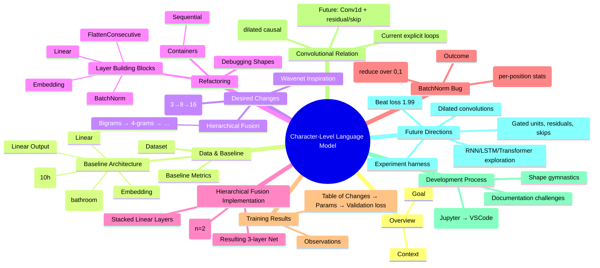

# Lesson 1

## 🧠 Mindmap of the Lecture “Building & Understanding Micrograd”

```mermaid
mindmap
  root((Micrograd Lecture – Neural‑Net Training Under the Hood))

  %% -------------------------------------------------
  %% 1. Introduction & Goals
  %% -------------------------------------------------
  Introduction
    What we’ll do
      • Start from a blank Jupyter notebook
      • Define & train a neural net step‑by‑step
      • Peek “under the hood” of back‑propagation
    Why it matters
      • Intuitive grasp of gradient‑based learning
      • Build a tiny autograd engine (micrograd)

  %% -------------------------------------------------
  %% 2. Micrograd – The Core Idea
  %% -------------------------------------------------
  Micrograd
    Definition
      • A **scalar‑valued autograd engine**
      • Implements **automatic differentiation** (back‑prop)
    Key Concepts
      • **Value object** – wraps a scalar & tracks graph info
      • **Expression graph** – nodes = operations, edges = data flow
      • **Forward pass** – compute output (e.g. g = …)
      • **Backward pass** – propagate gradients via chain rule
    Operations supported
      • add (+)          – local derivative = 1
      • mul (×)          – local derivative = other operand
      • pow (^)          – local derivative = n·xⁿ⁻¹
      • tanh (10h)       – local derivative = 1 – tanh²(x)
      • neg, sqrt, div, … (can be added similarly)

  %% -------------------------------------------------
  %% 3. Derivative Intuition
  %% -------------------------------------------------
  Derivative Basics
    • Definition: limₕ→0 (f(x+h) – f(x))/h
    • Numerical approximation with tiny h (e.g. 0.001)
    • Example: f(x)=3x²–4x+5 → f′(3)=14
    • Sign tells direction of change (positive → increase)

  %% -------------------------------------------------
  %% 4. Building the Value Object
  %% -------------------------------------------------
  Value Object
    Attributes
      • data  – raw scalar
      • grad  – ∂output/∂self (init 0)
      • _prev – set of child nodes (for graph traversal)
      • _op   – string name of operation that created it
    Operator Overloads
      • __add__(self, other) → Value
      • __radd__(self, other) → Value (handles const + Value)
      • __mul__(self, other) → Value
      • __rmul__(self, other) → Value (handles const × Value)
      • __pow__(self, exponent) → Value
      • __neg__, __sub__, __truediv__ (via mul & pow)
    Local Backward Functions
      • add:   self.grad += out.grad ; other.grad += out.grad
      • mul:   self.grad += other.data * out.grad
               other.grad += self.data * out.grad
      • pow:   self.grad += exponent * (self.data**(exponent-1)) * out.grad
      • tanh:  self.grad += (1 - self.data**2) * out.grad

  %% -------------------------------------------------
  %% 5. Graph Visualization
  %% -------------------------------------------------
  Graph Drawing (drawdot)
    • Uses Graphviz (graphviz‑dot) to render nodes & edges
    • Shows operation nodes (e.g. “+”, “*”) and value nodes
    • Helpful for debugging & teaching

  %% -------------------------------------------------
  %% 6. Back‑Propagation Mechanics
  %% -------------------------------------------------
  Back‑Propagation
    • Start at output node → set grad = 1
    • **Topological sort** (DFS) to order nodes so children processed first
    • Walk nodes in reverse topological order, calling each node’s _backward
    • **Chain rule**: local derivative × upstream gradient
    • Gradient accumulation (`+=`) – crucial when a node has multiple parents
      – Fixed bug: previously used `=` causing overwrites (e.g. a + a)

  %% -------------------------------------------------
  %% 7. Numerical Gradient Checks
  %% -------------------------------------------------
  Gradient Check
    • Perturb a leaf (e.g. a += h) → recompute output
    • Approximate ∂output/∂a ≈ (f(a+h) – f(a))/h
    • Verify against analytically computed grads

  %% -------------------------------------------------
  %% 8. Building Neural Networks with Micrograd
  %% -------------------------------------------------
  Neural‑Net Construction
    Neuron
      • Parameters: weights `w_i` (list of Value) + bias `b`
      • Forward: Σ w_i·x_i + b → activation (tanh)
    Layer
      • List of Neurons (fully‑connected to same inputs)
      • Forward: apply each neuron, collect outputs
    MLP (Multi‑Layer Perceptron)
      • Sequence of Layers
      • Forward: feed output of one layer as input to next
      • Example architecture: 3‑input → [4,4] hidden → 1‑output

  %% -------------------------------------------------
  %% 9. Loss Functions & Training Loop
  %% -------------------------------------------------
  Loss & Optimization
    Loss (Mean‑Squared‑Error)
      • L = Σ (y_pred – y_true)²
      • Gradient w.r.t. each prediction = 2·(y_pred – y_true)
    Training Loop (Stochastic Gradient Descent)
      1. Zero grads (`p.grad = 0` for all params)
      2. Forward pass → compute loss
      3. Backward pass (`loss.backward()`)
      4. Parameter update: `p.data -= lr * p.grad`
      5. Repeat (adjust learning‑rate, optionally decay)
    Common Pitfalls
      • Forgetting to zero grads → gradient accumulation bug
      • Too large learning rate → overshoot / divergence
      • Too small → slow convergence

  %% -------------------------------------------------
  %% 10. Comparison with PyTorch
  %% -------------------------------------------------
  PyTorch Parallel
    • Same API: `torch.tensor`, `requires_grad=True`
    • Autograd automatically builds the same graph (but with tensors)
    • Forward & backward behave identically for scalar case
    • Example: replicate micrograd network using `torch.nn.Module`
    • Extending PyTorch
      – Register custom ops (forward + backward) via `torch.autograd.Function`
      – Example shown for a cubic polynomial

  %% -------------------------------------------------
  │ 11. Advanced Topics (Briefly Mentioned)
  %% -------------------------------------------------
  Advanced Topics
    • Batching & mini‑batch SGD (process subsets of data)
    • Cross‑entropy loss for classification
    • L2 regularization (weight decay) for better generalization
    • Learning‑rate schedules (decay, momentum, Adam, etc.)
    • Scaling to billions of parameters (e.g., GPT‑style models)

  %% -------------------------------------------------
  %% 12. Summary & Take‑aways
  %% -------------------------------------------------
  Summary
    • Neural nets = **compositional mathematical expressions**
    • **Back‑prop = recursive application of the chain rule**
    • Micrograd shows the **minimal code** needed (≈150 lines)
    • Real libraries (PyTorch) add **tensor efficiency** but same math
    • Understanding the core mechanics helps debug & extend models
```

### How to Read the Mindmap
- **Indentation** → hierarchy (main topic → sub‑topic → details).  
- **Bold headings** indicate the most important concepts.  
- **Arrows (→)** show data flow or process steps (e.g., forward → backward).  
- **Bullet points** under each node give concrete examples, code snippets, or key take‑aways.

Feel free to copy the Mermaid block into any Markdown viewer that supports Mermaid (e.g., GitHub, VS Code, Jupyter with `%%mermaid`) to see the visual mindmap. Happy learning! 🚀
# Lesson 2

# 🧠 Make‑More: Character‑Level Language Modeling Mind‑Map  

*(All concepts are derived from the transcript.  Indentation = hierarchy.)*  

---  

## 1️⃣ Overview  
- **Goal** – Re‑implement *micrograd*‑style learning on a new repo **make‑more**.  
- **Dataset** – `names.txt` (~32 000 unique names scraped from a government site).  
- **Use‑case** – Generate novel, name‑like strings (e.g., baby‑name suggestions).  

---  

## 2️⃣ Core Idea: Character‑Level Language Model  
- **Treat each name as a sequence of characters** (including start & end tokens).  
- **Model task** – Predict the *next* character given the previous one(s).  

---  

## 3️⃣ Bigram (2‑gram) Model – The Simple Baseline  
### 3.1 Data Preparation  
- Load `names.txt` → massive string → `splitlines()` → list `words`.  
- Compute:  
  - `num_words ≈ 32 000`  
  - `min_len = 2`, `max_len = 15`  

### 3.2 Extracting Bigrams  
- For each word `w`:  
  ```python
  for c1, c2 in zip(w, w[1:]):   # sliding window of size 2
      bigram = (c1, c2)
  ```  
- Add **special start token** `.` before the first char and **end token** `.` after the last char.  

### 3.3 Counting Frequencies (Dictionary → 2‑D Tensor)  
- `counts[prev_char, next_char] += 1` (default 0).  
- Convert to a **28 × 28** integer tensor (`torch.int32`).  
  - 26 letters + **start** (`.`) + **end** (`.`).  

### 3.4 Visualisation (matplotlib)  
- Heat‑map of the count matrix.  
- Observations:  
  - Rows/columns for start/end tokens are mostly zeros (they never appear in the “wrong” position).  

### 3.5 Refinement of Token Set  
- Collapse to **27 × 27** matrix (single special token).  
- Re‑index:  
  - `.` → index 0, `a` → 1, …, `z` → 26.  

### 3.6 From Counts → Probabilities  
- Row‑wise normalization:  
  ```python
  probs = counts.float() / counts.sum(dim=1, keepdim=True)
  ```  
- Each row now sums to **1** → a categorical distribution for the next character.  

### 3.7 Sampling Names (using the bigram table)  
- Start at index 0 (`.`).  
- Loop:  
  1. Grab current row `p = probs[current_idx]`.  
  2. Sample `next_idx = torch.multinomial(p, 1, replacement=True, generator=g)`.  
  3. Break if `next_idx == 0` (end token).  
  4. Append the decoded character.  

### 3.8 Model Evaluation – Likelihood  
- **Likelihood** = product of probabilities assigned to the true bigrams.  
- **Log‑likelihood** = sum of `log(p_i)`.  
- **Negative Log‑Likelihood (NLL)** = `‑log_likelihood` → standard loss (lower is better).  
- Example: NLL ≈ **2.4–2.5** on the full training set.  

### 3.9 Smoothing (to avoid zero probabilities)  
- Add a small constant (e.g., `+1`) to every count before normalisation.  
- Guarantees non‑zero probabilities → prevents infinite NLL for unseen bigrams.  

---  

## 4️⃣ Neural‑Network Re‑Implementation (Gradient‑Based)  
### 4.1 Why Switch?  
- Counting works for bigrams but **doesn’t scale** to longer contexts (e.g., 10‑grams).  
- Neural nets can learn **compact, differentiable** representations for arbitrary context lengths.  

### 4.2 Data Encoding – One‑Hot Vectors  
- Map each character index `i` → 27‑dimensional one‑hot vector `x_i`.  
- Use `torch.nn.functional.one_hot(indices, num_classes=27)`.  
- Cast to `float32` for NN input.  

### 4.3 Model Architecture (initially)  
- **Linear layer** (no bias): `logits = x @ W`  
  - `W` shape **27 × 27** (each row = log‑counts for a given previous character).  
- **Softmax** → probabilities:  
  ```python
  probs = torch.softmax(logits, dim=1)   # exponentiate + normalise internally
  ```  

### 4.4 Forward Pass (vectorised)  
1. Encode all inputs → `X` (N × 27).  
2. Compute `logits = X @ W`.  
3. `probs = softmax(logits)`.  
4. Gather the probability of the *true* next character:  
   ```python
   true_probs = probs[torch.arange(N), targets]   # targets = next‑char indices
   ```  
5. Compute **NLL loss**:  
   ```python
   loss = -torch.log(true_probs).mean()
   ```  

### 4.5 Back‑Propagation & Parameter Update  
- Zero grads: `W.grad = None`.  
- `loss.backward()` → fills `W.grad`.  
- Gradient descent step (e.g., SGD):  
  ```python
  W.data -= lr * W.grad
  ```  
- Repeat for many epochs → loss drops from ~3.8 → ~2.4 (matches counting approach).  

### 4.6 Practical PyTorch Tips (from the transcript)  
- `torch.tensor` vs `torch.Tensor` → prefer lowercase `torch.tensor` for float tensors.  
- **Broadcasting**: dividing a (27 × 27) matrix by a (27 × 1) column works because the column is broadcast across rows.  
- `requires_grad=True` on parameters to enable autograd.  
- Use `torch.Generator` with a fixed seed for deterministic sampling.  

---  

## 5️⃣ Regularisation & Implicit Smoothing  
- **L2 regularisation** (weight decay) on `W`:  
  ```python
  reg = λ * (W**2).mean()
  loss_total = loss + reg
  ```  
- When `W` → 0, logits become uniform → equivalent to **label smoothing**.  
- Adjust λ to control the trade‑off between fitting data and keeping probabilities smooth.  

---  

## 6️⃣ Scaling Beyond Bigrams  
### 6.1 Word‑Level Modeling  
- Extend the same pipeline to **tokens = words** (instead of characters).  
- Larger vocab → larger embedding/linear layers.  

### 6.2 Longer Contexts (n‑grams, RNNs, Transformers)  
- Feed **multiple previous characters** (or embeddings) into deeper networks:  
  - **RNN / LSTM** → hidden state carries history.  
  - **Transformer** → self‑attention over the whole context.  
- Output layer always produces **logits → softmax → probability distribution** for the next token.  

### 6.3 Why Neural Nets Scale  
- Counting tables would explode (`|V|^k` entries for k‑gram).  
- Parameter sharing in NN (weights) keeps model size **linear** in vocabulary size, not exponential in context length.  

---  

## 7️⃣ Future Roadmap (as hinted in the talk)  
1. **Word‑level language model** – generate full sentences.  
2. **Image‑text models** – e.g., DALL·E, Stable Diffusion.  
3. **Full transformer implementation** – equivalent to GPT‑2 at character level, then scale up.  

---  

## 8️⃣ Quick Reference Cheat‑Sheet  

| Concept | Symbol / Code | Key Insight |
|--------|---------------|-------------|
| **Start token** | `.` (index 0) | Marks beginning of a name |
| **End token** | `.` (index 0 after collapse) | Marks termination |
| **Bigram count matrix** | `N` (28 × 28) | Raw frequencies |
| **Probability matrix** | `P = N / N.sum(dim=1, keepdim=True)` | Row‑wise categorical distribution |
| **One‑hot encoding** | `x_i = F.one_hot(i, 27).float()` | Turns integer index into NN input |
| **Weight matrix** | `W` (27 × 27) | Learns log‑counts (logits) |
| **Softmax** | `torch.softmax(logits, dim=1)` | Turns logits → probabilities |
| **Negative Log‑Likelihood** | `loss = -log(p_true).mean()` | Optimisation objective |
| **Gradient step** | `W.data -= lr * W.grad` | Simple SGD update |
| **L2 regularisation** | `λ * (W**2).mean()` | Encourages smoother (more uniform) predictions |
| **Sampling loop** | `while idx != 0: idx = torch.multinomial(P[idx], 1)` | Generates a new name |

---  

### 🎉 Take‑away  
- **Counting bigrams** gives a perfect baseline (NLL ≈ 2.4).  
- **Training the same model with gradient descent** reproduces the baseline *and* provides a flexible foundation for more powerful architectures (RNNs, Transformers).  
- Understanding **tensor shapes, broadcasting, and autograd** is essential for scaling up.  

*Happy modeling!* 🚀
# Lesson 3

# 🧠 Comprehensive Mind‑Map of the “Makemore” Lecture  

*(All points are derived from the transcript.  The hierarchy reflects the logical flow of ideas, concepts, and implementation details.)*  

---  

## 1️⃣ Introduction & Recap  
- **Previous lecture**  
  - Implemented a **bigram language model**  
    - Count‑based version → normalized to probabilities (rows sum to 1)  
    - Simple neural net with a **single linear layer**  
  - **Limitation:** only one previous character → poor “name‑like” predictions  

- **Problem with extending the count table**  
  - Context length *k* → table size grows **exponentially** (`27^k` for characters)  
  - Too many rows → insufficient counts → model “explodes”  

---  

## 2️⃣ Moving to a Multi‑Layer Perceptron (MLP)  
- **Goal:** Predict next character using **multiple previous characters** as context.  
- **Reference paper:** *Bengio et al., 2003* (word‑level, but ideas transfer).  

### 2.1 Core Idea from the Paper  
- **Word embeddings:** each word → 30‑dimensional vector (random init, learned).  
- **Neural net:**  
  1. **Embedding lookup** → concatenate embeddings of previous *n* words.  
  2. **Hidden layer** (size = hyper‑parameter).  
  3. **Linear output layer** → logits for all possible next tokens.  
  4. **Softmax** → probability distribution.  
- **Training objective:** Maximize log‑likelihood (same as cross‑entropy).  

### 2.2 Adapting to Characters  
- Vocabulary = **27 characters** (a‑z + “.”).  
- Embedding dimension initially **2** (for easy visualization).  
- Context length (block size) = **3** characters (can be changed).  

---  

## 3️⃣ Implementation Details (PyTorch)  

### 3.1 Data Preparation  
- **Build dataset** (`x`, `y`):  
  - `x` = list of *block‑size* integer indices (context).  
  - `y` = integer index of the next character.  
  - Pad with zeros for the first *block‑size* positions.  
- Example (word “emma”):  
  - Context `[0,0, e] → label m`, `[0, e, m] → label m`, …  

### 3.2 Embedding Lookup (`C`)  
- `C` shape: **27 × 2** (rows = characters, cols = embedding dim).  
- Two equivalent ways to embed an index `i`:  
  1. Direct indexing: `C[i]`.  
  2. One‑hot → matrix multiplication: `one_hot(i) @ C`.  
- For a batch `x` (shape `B × 3`): `C[x]` → **B × 3 × 2** tensor.  

### 3.3 Flattening the Context  
- Need shape **B × (3 × 2) = B × 6** to feed the hidden layer.  
- **Methods:**  
  - `torch.cat([c0, c1, c2], dim=1)` (naïve, not generic).  
  - `torch.unbind(x, dim=1)` → tuple of tensors → `torch.cat(..., dim=1)`.  
  - **Best:** `C[x].view(B, -1)` (uses `view` → no extra memory).  

### 3.4 Hidden Layer  
- Weight matrix `W1`: **6 × H** (H = hidden size, e.g., 100).  
- Bias `b1`: **H**.  
- Activation: **tanh** (`torch.tanh`).  

### 3.5 Output Layer  
- Weight matrix `W2`: **H × 27**.  
- Bias `b2`: **27**.  
- Logits: `h @ W2 + b2` → shape **B × 27**.  

### 3.6 Loss Computation  
- **Manual:**  
  - `logits.exp()` → “counts”.  
  - Normalize → probabilities.  
  - Pick probability of true class → `-log(p_true)`.  
- **Preferred:** `torch.nn.functional.cross_entropy(logits, y)`  
  - Faster (fused kernels).  
  - Numerically stable (log‑softmax internally).  

### 3.7 Training Loop (Core Steps)  
1. Zero grads: `p.grad = None` for each parameter.  
2. Forward pass → loss.  
3. `loss.backward()` → gradients.  
4. Parameter update: `p -= lr * p.grad`.  

### 3.8 Mini‑Batch Training  
- **Why:** Full dataset (~228 k examples) → too slow.  
- **How:**  
  - Sample random indices `ix = torch.randint(0, N, (batch_size,))`.  
  - Use `x[ix]`, `y[ix]` for each iteration.  
- **Effect:** Noisy gradient → need more steps, but far faster.  

---  

## 4️⃣ Hyper‑Parameter Exploration  

| Hyper‑parameter | Description | Typical Values (used) |
|----------------|-------------|----------------------|
| `block_size`   | Number of previous characters | 3 (tried 4, 5, 10) |
| `embed_dim`    | Dimensionality of character embeddings | 2 (visual), 10 (better) |
| `hidden_size`  | Neurons in hidden layer | 100 → 200 → 300 |
| `lr` (learning rate) | Step size for SGD | 0.1 (good), 0.01 (fine‑tune), 0.001 (slow) |
| `batch_size`   | Mini‑batch size | 32 (default), can increase |
| `num_steps`    | Training iterations | 10 k → 200 k (long runs) |
| `lr_decay`     | Reduce LR after N steps | ×0.1 after 100 k steps |

### 4.1 Learning‑Rate Search (Practical Trick)  
- Sweep **log‑space**: `lr_exps = torch.linspace(-3, 0, steps=1000)` → `lrs = 10**lr_exps`.  
- Run a few steps for each LR, record loss → plot **LR vs. loss**.  
- Choose LR in the “valley” (e.g., `10⁻¹ = 0.1`).  

### 4.2 Over‑/Under‑Fitting Diagnosis  
- **Training loss ≈ validation loss** → **under‑fitting** (model too small).  
- **Training loss << validation loss** → **over‑fitting** (model too large).  
- Adjust hidden size, embed dim, or regularization accordingly.  

---  

## 5️⃣ Data Splits & Evaluation  

1. **Training set** – ~80 % of words (≈ 25 k examples).  
2. **Dev/validation set** – ~10 % (≈ 3 k examples).  
3. **Test set** – remaining ~10 % (≈ 2 k examples).  

- **Training** uses only the training split.  
- **Hyper‑parameter tuning** uses the dev set.  
- **Final performance** reported on the test set **once**.  

---  

## 6️⃣ Embedding Visualization (2‑D case)  

- After training with `embed_dim = 2`, plot each character:  
  - `x = C[:,0]`, `y = C[:,1]`.  
  - Annotate with the character symbol.  
- Observations:  
  - Vowels cluster together → network learns similarity.  
  - Rare symbols (e.g., “q”, “.”) occupy distinct regions.  

*When `embed_dim` > 2, direct 2‑D plot isn’t possible; consider PCA/t‑SNE.*  

---  

## 7️⃣ Sampling from the Trained Model  

1. **Initialize context** with three “.” (or any start token).  
2. Loop:  
   - Embed current context → hidden state → logits.  
   - `prob = torch.softmax(logits, dim=-1)`.  
   - Sample next token: `next_idx = torch.multinomial(prob, 1)`.  
   - Shift context window, append `next_idx`.  
3. Convert indices back to characters → generated string.  

- Generated examples look **more name‑like** (e.g., “ham joes”, “emily”).  

---  

## 8️⃣ Practical Tips & Extras  

- **Tensor indexing tricks** (list, 1‑D tensor, multi‑dim tensor) → `C[x]`.  
- **`view` vs. `reshape`** – `view` is a *no‑copy* operation (fast).  
- **Broadcasting** – Adding bias `b1` to hidden activations works automatically (`B×H` + `H`).  
- **Avoid hard‑coding** magic numbers; use variables (`block_size`, `embed_dim`).  
- **Google Colab** – Ready‑to‑run notebook, no local install needed (link provided in video).  

---  

## 9️⃣ Take‑aways & Next Steps  

- **Achieved**: Loss ≈ 2.17 (better than bigram ≈ 2.45).  
- **Open knobs for improvement**:  
  - Increase hidden size / embedding dimension.  
  - Use longer context (`block_size`).  
  - Experiment with different optimizers (Adam, RMSprop).  
  - Add regularization (weight decay, dropout).  
  - Train longer with proper learning‑rate schedule.  
- **Read the paper** (Bengio et al., 2003) for deeper insights & advanced ideas.  

---  

### 📌 Quick Reference (Pseudo‑code)

```python
# 1. Build dataset
x, y = build_dataset(words, block_size=3)   # x: (N,3), y: (N,)

# 2. Model components
C   = torch.randn(27, embed_dim, requires_grad=True)   # embedding table
W1  = torch.randn(3*embed_dim, hidden, requires_grad=True)
b1  = torch.randn(hidden, requires_grad=True)
W2  = torch.randn(hidden, 27, requires_grad=True)
b2  = torch.randn(27, requires_grad=True)

# 3. Forward pass (batch)
def forward(x_batch):
    e = C[x_batch]                # (B,3,embed_dim)
    e = e.view(e.shape[0], -1)    # (B,3*embed_dim)
    h = torch.tanh(e @ W1 + b1)   # (B,hidden)
    logits = h @ W2 + b2          # (B,27)
    return logits

# 4. Training loop (mini‑batch)
for step in range(num_steps):
    ix = torch.randint(0, N, (batch_size,))
    logits = forward(x[ix])
    loss   = F.cross_entropy(logits, y[ix])
    loss.backward()
    for p in [C,W1,b1,W2,b2]:
        p.data -= lr * p.grad
        p.grad.zero_()
```

---  

*End of mind‑map.*  
# Lesson 4

# 🧠 Mind‑Map of the Lecture  

*(All points are derived from the transcript.  The hierarchy shows the logical flow and relationships between concepts.)*  

---  

## 1️⃣  Recap:  Multi‑Layer Perceptron (MLP) for character‑level language modelling  
- Implemented following **Benj 2003** (MLP → next‑character prediction).  
- **Current status**  
  - 11 k parameters, 200 k training steps, batch‑size = 32.  
  - Training/validation loss ≈ 2.16.  
  - Sampling produces readable but imperfect words.  

---  

## 2️⃣  Why look deeper?  
- Goal: move to **recurrent / LSTM / GRU** networks.  
- **Prerequisite:** solid intuition of **activations** & **gradients** during training.  
- Understanding these dynamics explains why RNNs are **hard to optimise** with plain first‑order methods.  

---  

## 3️⃣  Problem #1 – Bad Initialisation of the MLP  

### 3.1  Observed symptom  
- **Loss at iteration 0:** 27 → much higher than expected.  

### 3.2  Expected loss for a uniform softmax  
- 27 possible next characters → uniform probability = 1/27.  
- Negative‑log‑likelihood = `-log(1/27) ≈ 3.29`.  

### 3.3  What went wrong?  
| Issue | Effect |
|------|--------|
| **Logits far from 0** (extreme values) | Softmax becomes **over‑confident** → huge loss. |
| **Random bias `b₂`** | Adds a constant offset → pushes logits away from 0. |
| **Weight scale too large** (`W₂`) | Amplifies the offset, further saturating softmax. |

### 3.4  Fixes applied  
1. **Zero the output bias** (`b₂ = 0`).  
2. **Scale down `W₂`** (multiply by 0.1 → 0.01).  
3. Keep a tiny non‑zero variance (e.g., 0.01) for **symmetry breaking**.  

Result: loss curve loses the “hockey‑stick” shape; training becomes more productive.  

---  

## 4️⃣  Problem #2 – Saturated `tanh` (𝑡𝑎𝑛ℎ) activations  

### 4.1  Observation  
- Histogram of hidden‑state `H` after `tanh` shows **most values at ±1**.  
- Pre‑activations (input to `tanh`) range roughly **‑5 … 15** → many neurons in the **flat tails**.  

### 4.2  Consequence for back‑propagation  
- Derivative of `tanh` = `1 – t²`.  
- When `t ≈ ±1`, derivative ≈ 0 → **gradient vanishes** for those neurons.  
- “Dead neurons” (always saturated) never learn (gradient = 0).  

### 4.3  Diagnostic check  
- Compute **percentage of units with |t| > 0.99** → large white area in Boolean mask → many dead neurons.  

### 4.4  Remedy  
- Reduce magnitude of pre‑activations:  
  - **Scale down the first‑layer weights** (`W₁`) (e.g., multiply by 0.1).  
  - Optionally **bias = 0** (biases become useless after batch‑norm, see §6).  
- Result: hidden activations become **roughly Gaussian (≈ 𝒩(0,1))**, gradients stay alive.  

---  

## 5️⃣  General Weight‑Initialisation Theory  

### 5.1  Fan‑in / Fan‑out concept  
- For a layer with `fan_in` inputs, initialise weights with variance `1 / fan_in`.  
- Guarantees that **output variance ≈ input variance** (preserves a unit‑Gaussian flow).  

### 5.2  Gains for different non‑linearities (He / Xavier)  
| Non‑linearity | Recommended gain `g` | Reason |
|---------------|----------------------|--------|
| Linear / Identity | `1` | No contraction. |
| ReLU / Leaky‑ReLU | `√2` | Half the distribution is zeroed. |
| tanh | `5/3` (≈ 1.67) | Empirically balances contraction of tanh. |
| (others) | derived from variance analysis | – |

- **Final weight scale** = `gain / √fan_in`.  

---  

## 6️⃣  Batch Normalisation (BatchNorm) – The “Game‑Changer”  

### 6.1  Core idea  
1. **Collect batch statistics** → mean `μ_B` and variance `σ²_B`.  
2. **Standardise**: `x̂ = (x – μ_B) / √(σ²_B + ε)`.  
3. **Learnable affine transform**: `y = γ·x̂ + β`.  

### 6.2  Why it works  
- Forces **activations to stay unit‑Gaussian** throughout the network → prevents saturation / vanishing gradients.  
- Acts as a **regulariser** (batch‑wise noise).  

### 6.3  Training vs. Inference  
- **Training:** use batch statistics (`μ_B`, `σ²_B`).  
- **Inference:** use **running estimates** (`μ̂`, `σ̂²`) updated with exponential moving average:  

  `running_mean = momentum·running_mean + (1‑momentum)·μ_B`  

  `running_var  = momentum·running_var  + (1‑momentum)·σ²_B`  

- `momentum` ≈ 0.1 for large batches; smaller batches may need **lower momentum** (e.g., 0.001).  

### 6.4  Practical notes  
- **Bias before BatchNorm is useless** – BatchNorm already learns a bias (`β`).  
- Set `affine=True` (learnable `γ`, `β`).  
- `eps` (default 1e‑5) avoids division‑by‑zero.  
- **No gradient tracking** for running stats (`torch.no_grad()` context).  

---  

## 7️⃣  Diagnostic Toolbox for Neural‑Net Health  

| Diagnostic | What it tells you | Typical “good” range |
|------------|-------------------|---------------------|
| **Activation histogram** (per layer) | Distribution shape, saturation % | Std ≈ 1, saturation < 5 % |
| **Gradient histogram** (per layer) | Gradient magnitude, vanishing/exploding | Similar scale to activations |
| **Weight histogram** | Parameter spread, dead weights | Std ≈ 1 (or as per init) |
| **Update‑to‑Data ratio** `‖Δθ‖ / ‖θ‖` (log₁₀) | Relative step size per iteration | ≈ ‑3 (i.e., updates ≈ 0.001 × parameter) |
| **Learning‑rate sanity check** | If ratio ≪ ‑3 → LR too low; ≫ ‑2 → LR too high | Aim for –3 ± 0.5 |
| **Running‑mean / var convergence** | BatchNorm stats stabilise? | Small drift after a few epochs |

- Plot these **over training time** (not just a single snapshot) to see trends.  

---  

## 8️⃣  Putting It All Together – “Torch‑ify” the Code  

### 8.1  Modular design (mirrors `torch.nn`)  
- **Linear layer** → `nn.Linear(in_features, out_features, bias=False)` (bias omitted when followed by BatchNorm).  
- **BatchNorm1d** → `nn.BatchNorm1d(num_features, eps=1e‑5, momentum=0.001, affine=True)`.  
- **tanh activation** → custom wrapper (or `nn.Tanh`).  

### 8.2  Network construction pattern  

```text
Embedding → Linear → BatchNorm → tanh → Linear → BatchNorm → tanh → … → Linear → BatchNorm → Softmax
```

- **BatchNorm placed after each Linear, before tanh** (standard practice).  
- Can also be placed after tanh – results are similar.  

### 8.3  Training loop (high‑level)  

1. **Zero grads**.  
2. **Forward pass** (collect activations, apply BatchNorm).  
3. **Compute loss** (cross‑entropy).  
4. **Backward** (`loss.backward()`).  
5. **Optimizer step** (SGD / Adam).  
6. **Update running stats** (handled automatically by `nn.BatchNorm`).  

---  

## 9️⃣  Take‑aways & Outlook  

1. **Initialisation matters** – scaling weights & zeroing biases prevents early “over‑confidence”.  
2. **tanh saturation kills gradients** – keep pre‑activations near zero (via weight scaling).  
3. **BatchNorm stabilises deep nets** by constantly re‑Gaussianising activations; it also reduces sensitivity to exact gain choices.  
4. **Diagnostic visualisations** (histograms, update‑to‑data ratios) are essential for spotting dead neurons, exploding/vanishing gradients, and mis‑scaled learning rates.  
5. **Future work**  
   - Move to **recurrent architectures** (RNN, LSTM, GRU) – deeper unrolled graphs will amplify the issues we just mitigated.  
   - Explore **alternative normalisation** (LayerNorm, GroupNorm) that avoid batch coupling.  
   - Leverage **advanced optimisers** (Adam, RMSProp) and **residual connections** for even deeper models.  

---  

### 📌  Quick‑Reference Cheat‑Sheet  

| Concept | Formula / Setting | Typical Value |
|---------|-------------------|---------------|
| Weight init variance | `var = gain² / fan_in` | `gain = 1` (linear), `√2` (ReLU), `5/3` (tanh) |
| Softmax uniform loss | `-log(1/𝑘)` | `k = vocab size` |
| tanh derivative | `1 – t²` | → 0 when `|t| → 1` |
| BatchNorm scaling | `γ` (learned) | Initialise to `1` |
| BatchNorm shift | `β` (learned) | Initialise to `0` |
| Update‑to‑Data log₁₀ target | `≈ ‑3` | Adjust LR accordingly |
| Momentum for running stats | `0.1` (large batch) / `0.001` (batch = 32) | – |
| ε (epsilon) in BN | `1e‑5` | – |

---  

*End of mind‑map.*  
# Lesson 5

# 🧠 Mindmap – Manual Back‑Propagation for a Two‑Layer MLP  

---  

## 1️⃣ Overview  
- **Goal:** Replace `loss.backward()` with a fully manual backward pass (tensor‑level).  
- **Why?**  
  - Understand the internals of autograd.  
  - Debug subtle bugs (gradient clipping, dead neurons, exploding/vanishing gradients).  
  - Gain intuition about how gradients flow through each operation.  

---  

## 2️⃣ Historical Context  
- **~2006 – 2010:**  
  - Researchers (e.g., Hinton & Salakhutdinov) wrote their own back‑prop in MATLAB/NumPy.  
  - Manual gradient computation was the norm.  
- **2014:**  
  - Author’s “Fragmented Embeddings” paper – full manual forward + backward passes in NumPy.  
- **Today:**  
  - Autograd is standard, but the exercise remains valuable for learning.  

---  

## 3️⃣ Network Architecture (forward pass)  

```
Embedding → Linear1 (W1, B1) → 10‑H (tanh) → BatchNorm (γ, β) → Linear2 (W2, B2) → Logits → Softmax → Cross‑Entropy
```

| Layer | Shape (batch = 32) | Key tensors |
|------|-------------------|-------------|
| **Embedding** | 32 × 3 × 10 | `C` (27 × 10) |
| **Linear1** | 32 × 64 | `W1` (64 × 64), `B1` (1 × 64) |
| **10‑H** | 32 × 64 | `H = tanh(preact)` |
| **BatchNorm** | 32 × 64 | `μ` (1 × 64), `σ²` (1 × 64), `γ`, `β` |
| **Linear2** | 32 × 27 | `W2` (27 × 64), `B2` (1 × 27) |
| **Logits** | 32 × 27 | `logits` |
| **Softmax** | 32 × 27 | `probs` |
| **Loss** | scalar | `loss = -mean(log_probs[range(N), Y])` |

---  

## 4️⃣ Manual Back‑Propagation – Core Concepts  

### 4.1 Gradient of the Loss w.r.t. `log_probs` (`d_log_probs`)  
- **Shape:** 32 × 27 (same as `log_probs`).  
- **Derivation:**  
  - `loss = -(1/N) Σ_i log_probs[i, Y[i]]`  
  - `∂loss/∂log_probs[i, j] = -1/N` if `j == Y[i]`, else `0`.  
- **Implementation:**  
  ```python
  d_log_probs = torch.zeros_like(log_probs)
  d_log_probs[torch.arange(N), Y] = -1.0 / N
  ```

### 4.2 Back‑prop through `log` → `probs`  
- `log_probs = torch.log(probs)`  
- Local derivative: `∂log/∂probs = 1 / probs` (element‑wise).  
- Chain rule: `d_probs = d_log_probs / probs`.

### 4.3 Back‑prop through Softmax (logits → probs)  
- **Softmax formula:** `p_i = exp(l_i) / Σ_j exp(l_j)`.  
- **Gradient (batch version):**  
  ```python
  probs = torch.softmax(logits, dim=1)
  d_logits = probs.clone()
  d_logits[torch.arange(N), Y] -= 1   # subtract 1 at correct class
  d_logits /= N                        # average over batch
  ```
- **Intuition:**  
  - Pull up probability of the correct class, push down all others.  
  - Sum of each row of `d_logits` = 0 (conservation of probability).

### 4.4 Linear Layer (W2, B2)  
- Forward: `logits = H @ W2.T + B2`.  
- Gradients:  
  - `d_W2 = d_logits.T @ H` (shape 27 × 64).  
  - `d_B2 = d_logits.sum(dim=0, keepdim=True)`.  
  - `d_H  = d_logits @ W2`.

### 4.5 Batch Normalization  
- **Forward (simplified, γ = 1, β = 0):**  
  ```
  μ   = mean(H, dim=0)                # 1×64
  σ²  = var(H, dim=0, unbiased=False) # 1×64
  Ĥ   = (H - μ) / sqrt(σ² + ε)
  ```
- **Backward (key steps):**  
  1. `d_Ĥ = d_H_pre` (gradient from next layer).  
  2. `d_σ² = -0.5 * (d_Ĥ * (H-μ)) * (σ²+ε)^(-3/2)` → sum over batch.  
  3. `d_μ  = -d_Ĥ / sqrt(σ²+ε) - 2 * d_σ² * (H-μ) / N`.  
  4. `d_H  = d_Ĥ / sqrt(σ²+ε) + d_σ² * 2*(H-μ)/N + d_μ / N`.  
  5. `d_γ = (d_H_pre * Ĥ).sum(dim=0, keepdim=True)` (if γ kept).  
  6. `d_β = d_H_pre.sum(dim=0, keepdim=True)` (if β kept).  

- **Broadcasting rule:**  
  - When a scalar (e.g., `μ`) is broadcast to a matrix, the backward pass **sums** the incoming gradients over the broadcasted dimension.

### 4.6 Activation `10‑H` (tanh)  
- Forward: `H = tanh(preact)`.  
- Local derivative: `1 - H²`.  
- Backward: `d_preact = d_H * (1 - H**2)`.

### 4.7 Linear Layer (W1, B1)  
- Same pattern as W2/B2, but with `preact = X @ W1.T + B1`.  
- Gradients:  
  - `d_W1 = d_preact.T @ X`.  
  - `d_B1 = d_preact.sum(dim=0, keepdim=True)`.  
  - `d_X  = d_preact @ W1`.

### 4.8 Embedding Lookup (indexing)  
- Forward: `M[i, k, :] = C[Y[i, k]]`.  
- Backward:  
  ```python
  d_C = torch.zeros_like(C)
  for i in range(N):
      for k in range(3):
          idx = Y[i, k]
          d_C[idx] += d_M[i, k]   # accumulate if same idx appears multiple times
  ```

---  

## 5️⃣ Exercises (Progressive Refactoring)  

| Exercise | What’s changed | Key takeaway |
|----------|----------------|--------------|
| **1** | Compute every intermediate `d_…` tensor (as above). Verify with `torch.allclose`. | Manual gradients match autograd when shapes & broadcasting are handled correctly. |
| **2** | Derive a **single** analytic expression for `d_logits` (softmax + cross‑entropy). Implement it in one line. | Much faster forward + backward; shows that many intermediate ops can be collapsed. |
| **3** | Derive a compact formula for **batch‑norm** backward (see §4.5). Implement the whole layer in a few lines. | Highlights the “sum‑over‑broadcast” pattern; avoids per‑element code. |
| **4** | Assemble all manual pieces into a full training loop (no `loss.backward()`). | End‑to‑end manual training yields the same loss & samples as the autograd version. |

---  

## 6️⃣ Intuitive Insights  

- **Gradient “push‑pull”** on logits:  
  - Correct class gets a **negative** gradient (pull up).  
  - Incorrect classes get a **positive** gradient (push down).  
  - Row‑wise sum = 0 → probability mass conserved.  

- **Batch‑norm variance bias vs. unbiased:**  
  - Training often uses **biased** estimator (`1/N`).  
  - Inference (running stats) should use **unbiased** (`1/(N‑1)`).  
  - Mismatch can be a subtle bug; the author prefers the unbiased version throughout.  

- **Broadcast ↔ Sum Duality:**  
  - **Forward:** broadcasting replicates a smaller tensor across a larger one.  
  - **Backward:** the gradient w.r.t. the broadcasted tensor is the **sum** of the replicated gradients.  

---  

## 7️⃣ Next Steps  

- **Recurrent Neural Networks (RNNs) & LSTMs** – extend manual back‑prop to time‑unrolled architectures.  
- Explore **gradient clipping**, **weight tying**, and **teacher forcing** with manual gradients.  

---  

### 📌 TL;DR  

1. Replace `loss.backward()` with explicit tensor‑level derivatives.  
2. Derive and implement compact formulas for softmax‑cross‑entropy and batch‑norm.  
3. Verify each step against PyTorch’s autograd.  
4. Assemble a full training loop that runs as fast as the autograd version while giving you full visibility into every gradient flow.  

Happy hacking! 🚀  
# Lesson 6

## 📚 Mind‑Map of the Lecture  
*(Markdown + Mermaid diagram for quick visualisation)*  

---  

### 1️⃣  Overview  
- **Goal** – Extend a simple character‑level MLP language model into a deeper, hierarchical architecture (Wavenet‑style).  
- **Context** – Lecture recorded in a hotel room in Kyoto; continuation of previous parts (3 & 4).  

### 2️⃣  Data & Baseline Model  
- **Dataset** – 182 000 examples, each: 3‑character context → predict 4th character.  
- **Baseline Architecture**  
  - Embedding table (`C`) → Linear → BatchNorm (named *bathroom*) → 1D‑BatchNorm (`10h`) → Linear output.  
  - 12 000 parameters, validation loss ≈ 2.10.  
- **Observations**  
  - Model already generates plausible “name‑like” strings.  
  - Too much information is squashed in a single hidden layer.  

### 3️⃣  Desired Architectural Changes  
- **Take more context** – increase block size from 3 → 8 (later 16).  
- **Hierarchical fusion** – progressively combine neighboring characters (bigrams → 4‑grams → …) instead of flattening all at once.  
- **Wavenet inspiration** – dilated causal convolutions → tree‑like receptive field growth.  

### 4️⃣  Refactoring the Code  
#### 4.1  Layer Building Blocks  
- **Linear layer** – simple matrix multiply (mirrors `torch.nn.Linear`).  
- **BatchNorm (bathroom)** – maintains running mean/variance, behaves differently in train vs. eval.  
- **Embedding layer** – lookup table (`nn.Embedding`).  
- **Flatten / “FlattenConsecutive”** – custom module to reshape tensors, now able to group *n* consecutive embeddings.  

#### 4.2  Containers  
- **Sequential container** – custom implementation that stores a list of layers and forwards input through them.  
- **Model definition** – `model = Sequential([Embedding, FlattenConsecutive, Linear, BatchNorm, …])`.  

#### 4.3  Debugging & Shape‑Gymnastics  
- Inspected tensor shapes after each layer (e.g., `B×T×C → B×T×E → B×(T·E)`).  
- Realised flattening to `B×‑1` was too aggressive; needed a 3‑D view (`B×groups×(n·E)`).  

### 5️⃣  Implementing Hierarchical Fusion  
1. **FlattenConsecutive(n=2)** – groups every 2 consecutive characters → shape `B×(T/2)×(2·E)`.  
2. **Stacked linear layers** – each layer processes the grouped embeddings, progressively increasing receptive field.  
3. **Resulting network** – 3 hidden layers, each widening the context (2 → 4 → 8 characters).  

### 6️⃣  BatchNorm Bug & Fix  
- **Problem** – `BatchNorm1D` computed statistics over only the first dimension (`B`) → produced per‑position means/variances.  
- **Fix** – Reduce over dimensions `(0, 1)` when input is 3‑D, yielding a single mean/variance per channel (`1×1×C`).  
- **Outcome** – More stable statistics, slight validation loss improvement (2.029 → 2.022).  

### 7️⃣  Training Results & Hyper‑parameter Tweaks  
| Change | Params | Validation loss |
|--------|--------|-----------------|
| Baseline (3‑char) | ~12 k | 2.10 |
| ↑ Context to 8 chars (flat) | +10 k | 2.02 |
| Hierarchical (3‑layer) | ~22 k | 2.029 → 2.022 |
| ↑ Embedding dim to 24, hidden units ↑ | ~76 k | **1.99** (first sub‑2.0) |
- **Takeaway** – Bigger capacity helps, but training becomes slower; still no systematic hyper‑parameter search.  

### 8️⃣  Relation to Convolutional Networks (Wavenet)  
- **Current implementation** – Explicit “for‑loop” over each position (inefficient).  
- **Convolutional view** – Same linear filters applied via dilated causal convolutions → parallel GPU kernels, reuse of intermediate results.  
- **Future work** – Replace explicit loops with `nn.Conv1d` (dilated, causal), add gated activations, residual & skip connections.  

### 9️⃣  Development Process Insights  
- **Documentation pain** – PyTorch docs are good; the course’s own “Patreon” docs are sparse/inaccurate.  
- **Shape gymnastics** – Constantly checking NCL vs. NLC ordering, using `view`, `reshape`, `permute`.  
- **Prototyping workflow**  
  1. **Jupyter notebook** – rapid testing, shape inspection, debugging.  
  2. **Copy‑paste to VS Code repo** – clean module code.  
  3. **Run experiments** via scripts (future: experiment harness).  

### 🔟  Future Directions (Open Topics)  
1. **Implement true dilated causal convolutions** (Wavenet).  
2. **Add gated linear units, residual & skip connections**.  
3. **Build an experimental harness** – systematic hyper‑parameter sweeps, logging, early stopping.  
4. **Explore other architectures** – RNNs, LSTMs, GRUs, Transformers.  
5. **Beat the current best loss (≈ 1.99)** – try different channel allocations, embedding sizes, initialization schemes, optimizers.  

---  

## 🧭 Mermaid Mind‑Map (copy‑paste into a Mermaid‑enabled markdown viewer)



*Render the diagram with any Mermaid‑compatible markdown viewer (e.g., VS Code, GitHub, HackMD).*  

---  

**TL;DR:**  
We started from a simple 3‑character MLP, expanded the context, introduced a hierarchical “flatten‑consecutive” module, fixed a subtle BatchNorm bug, and built a deeper 3‑layer network that already beats the 2.0 validation‑loss barrier. The next steps are to replace the explicit loops with true dilated causal convolutions, add residual/skip connections, and set up a proper experimental harness for systematic hyper‑parameter search. Happy hacking!
# Lesson 7

# 🧠 Mind‑Map of the Transcript  

*(Markdown outline – each level deeper = a more detailed sub‑topic)*  

---  

## 1. Introduction & Motivation  
- **ChatGPT** – a text‑based AI that can perform many tasks (write poems, explain HTML, generate news, etc.)  
- **Probabilistic system** – same prompt → different plausible outputs  
- **Goal of the talk** – understand what’s “under the hood” of ChatGPT and build a tiny version ourselves  

## 2. Language‑Model Basics  
- **Definition** – models the sequence of tokens (characters, sub‑words, words)  
- **Task** – given a prefix, predict the next token → sequence completion  
- **Tokenization**  
  - *Character‑level* (used in the demo) → 65‑symbol vocab  
  - *Sub‑word / BPE* (used by OpenAI) → ~50 k vocab  
  - Encoder ↔ Decoder maps between strings ↔ integer IDs  

## 3. Data Set – “Tiny Shakespeare”  
- Single ~1 MiB file containing all Shakespeare works  
- Treated as a **single long integer sequence** after tokenization  
- Split: **90 % train**, **10 % validation**  

## 4. Model Architecture – From Simple to Full Transformer  

### 4.1. Simple Baseline: Byte‑Level (BYR) Model  
- Embedding table → directly produces logits for each position  
- Loss = **Cross‑Entropy** (negative log‑likelihood)  

### 4.2. Adding Positional Information  
- Positional‑embedding matrix (block‑size × embed‑dim)  
- Token embedding + positional embedding → input **X**  

### 4.3. Self‑Attention (single head)  
- **Queries (Q)**, **Keys (K)**, **Values (V)** = linear projections of **X**  
- Attention scores = `Q · Kᵀ / sqrt(head_dim)`  
- **Masking** – lower‑triangular mask to prevent future tokens from attending (decoder‑only)  
- Softmax → weighted sum of **V** → output of the head  

### 4.4. Multi‑Head Attention  
- Run several independent heads in parallel (e.g., 4 heads)  
- Concatenate their outputs → same dimension as original embed size  

### 4.5. Feed‑Forward Network (FFN)  
- Linear → GELU (or ReLU) → Linear  
- Hidden dimension = 4 × embed_dim (as in the original paper)  

### 4.6. Residual (Skip) Connections  
- `X → Self‑Attention → +X`  
- `X → FFN → +X`  

### 4.7. Layer Normalization  
- Applied **before** each sub‑layer (pre‑norm formulation)  
- Normalizes across the embedding dimension per token  

### 4.8. Dropout  
- Applied on attention weights, after attention output, and after FFN  

### 4.9. Full Decoder‑Only Block  
```
X ──► LayerNorm ──► Multi‑Head Self‑Attention ──► Dropout ──► +X
   │                                            │
   └─► LayerNorm ──► Feed‑Forward ──► Dropout ──► +X
```

### 4.10. Stacking Blocks  
- Stack **N** identical blocks (e.g., 6 layers) → deep Transformer  

### 4.11. Final Projection  
- LayerNorm → Linear (embed_dim → vocab_size) → logits  

## 5. Training Procedure  
- **Batching** – sample random chunks (block‑size) → shape B × T  
- **Optimizer** – Adam (often with weight‑decay)  
- **Learning rate** – e.g., 3e‑4 (scaled down for larger models)  
- **Training loop** – forward → loss → backward → optimizer step  
- **Evaluation** – periodic “estimate_loss” over several batches (train & val)  

## 6. Scaling Experiments & Results  

| Experiment | Model Size | Block Size | Heads | Embed Dim | Layers | Validation Loss |
|------------|------------|------------|-------|-----------|--------|-----------------|
| BYR (char) | ~10 M params | 8 | 1 | 32 | 1 | ~4.8 |
| Add Self‑Attention (1 head) | ~10 M | 8 | 1 | 32 | 1 | ~2.4 |
| Multi‑Head (4 heads) | ~10 M | 8 | 4 | 8 each | 1 | ~2.28 |
| + Feed‑Forward (4×) | ~10 M | 8 | 4 | 8 each | 1 | ~2.24 |
| Deep + Residual + LayerNorm | ~10 M | 256 | 6 | 384 | 6 | ~2.08 |
| Deep + LayerNorm (pre‑norm) | ~10 M | 256 | 6 | 384 | 6 | ~2.06 |
| Full‑Scale (64‑batch, 256‑ctx, 6 heads, 6 layers, dropout 0.2) | ~10 M | 256 | 6 | 384 | 6 | **1.48** |

- **Observation:** Adding attention, multi‑heads, FFN, residuals, layer‑norm, and scaling up context dramatically reduces loss.  
- Generated text becomes more “Shakespeare‑like” (still nonsensical at character level).  

## 7. Decoder‑Only vs Encoder‑Decoder  

| Component | Decoder‑Only (GPT) | Encoder‑Decoder (e.g., original “Attention is All You Need”) |
|-----------|-------------------|-----------------------------------------------------------|
| Masking   | Causal (triangular) → autoregressive generation | No causal mask in encoder; decoder still causal |
| Cross‑Attention | **Absent** (only self‑attention) | Present – decoder attends to encoder outputs |
| Use‑case  | Unconditioned language modeling / text generation | Conditional generation (e.g., translation) |
| In this demo | Only decoder block → generates Shakespeare‑style text | Not implemented (no encoder, no cross‑attention) |

## 8. Fine‑Tuning & Alignment (ChatGPT)  

1. **Pre‑training** – massive corpus (≈300 B tokens) → decoder‑only Transformer (e.g., GPT‑3 175 B params)  
2. **Supervised fine‑tuning** – small dataset of *question → answer* pairs (few‑k examples) to make the model an “assistant”  
3. **Reward Modeling** – collect multiple model outputs, rank them, train a reward model to predict human preference  
4. **RLHF (Reinforcement Learning from Human Feedback)** – use Proximal Policy Optimization (PPO) to fine‑tune the policy so generated answers score high on the reward model  

- The fine‑tuning stages are **not** publicly released; they require large‑scale infrastructure.  

## 9. nanogpt Repository (by the presenter)  

- **Two files**: `model.py` (definition of the Transformer) and `train.py` (training loop, checkpointing, distributed support)  
- Mirrors the notebook implementation:  
  - Tokenizer (character‑level)  
  - Embedding + positional embedding  
  - Multi‑head self‑attention (batched)  
  - Feed‑forward, residuals, layer‑norm, dropout  
  - Optimizer, learning‑rate schedule, evaluation utilities  

## 10. Take‑aways & Next Steps  

- **Core idea:** “Attention is all you need” → a stack of self‑attention + feed‑forward blocks is enough for powerful language models.  
- **Building a GPT‑like model** can be done in ~200 lines of PyTorch code when using a tiny dataset.  
- **Scaling** (larger context, more heads, deeper stacks, regularization) yields dramatic loss improvements.  
- **Real‑world ChatGPT** adds two major phases beyond pre‑training: supervised fine‑tuning and RLHF.  
- **Further work:**  
  - Experiment with sub‑word tokenizers (BPE, SentencePiece).  
  - Train larger models on bigger corpora (e.g., Wikipedia, OpenWebText).  
  - Implement encoder‑decoder architecture for conditional tasks (translation, summarization).  
  - Explore RLHF pipelines to align models with human preferences.  

---  

*End of mind‑map.*  
# Lesson 8

## 🧠 Tokenization Mind‑Map (Markdown + Mermaid)

Below is a **comprehensive mind‑map** that captures every major idea, sub‑idea and detail from the transcript.  
The map is written in **Mermaid** syntax (supported by most Markdown viewers) and is followed by a plain‑text outline for quick reference.

---  

### Mermaid Diagram  

```mermaid
mindmap
  root((Tokenization in Large Language Models))

    subgraph Overview
      Overview[What is tokenization?]
      WhyItMatters[Why tokenization is the “atom” of LLMs]
      HiddenIssues[Hidden foot‑guns & odd behaviours]
    end

    subgraph Naive_Char_Level
      CharTokenizer[Character‑level tokenizer (65 chars)]
      EmbeddingTable[Embedding table = vocab size rows]
      Limitations[Too coarse → real models use chunk‑level]
    end

    subgraph BPE_Concept
      BPE[Byte‑Pair Encoding (BPE)]
      InputEncoding[UTF‑8 → bytes (0‑255)]
      InitialVocab[256 raw byte tokens]
      MergeProcess[Iteratively merge most‑frequent byte pairs]
      VocabularyGrowth[New token IDs appended (256,257,…)]
      Example[Example: “AA” → token 256, then “AB” → token 257 …]
    end

    subgraph Tokenizer_Implementation
      GetStats[Function: get_stats(list of ints)]
      MergeStep[Function: replace_pair(ids, pair, new_id)]
      YLoop[Iterate merges → target vocab size]
      Compression[Sequence length shrinks, vocab grows]
      CodeRepo[MBP repo – reference implementation]
    end

    subgraph Real_World_Tokenizers
      Tiktoken[Tiktoken (OpenAI)]
        TiktokenApp[Web UI – live tokenisation]
        GPT2_Tokenizer[~50 k vocab, 1.24‑token context]
        GPT4_Tokenizer[~100 k vocab, denser, better whitespace handling]
        SpecialTokens[<eos>, <pad>, <bos>, <fim> prefixes]
        TokenSizeEffect[More tokens → denser context, but larger embedding & LM head]
      SentencePiece[Google SentencePiece]
        SP_Encoding[Can train & infer]
        SP_BPE[Runs BPE on Unicode code‑points]
        ByteFallback[Rare code‑points → UTF‑8 bytes → extra tokens]
        ConfigComplexity[Many hyper‑params, “shrink‑factor”, etc.]
        RegexChunking[Regex rules to prevent bad merges (punctuation, numbers, etc.)]
    end

    subgraph Tokenization_Issues
      Spelling[LLMs struggle with spelling (long tokens like “defaultstyle”)]
      Arithmetic[Numbers split arbitrarily → poor arithmetic]
      NonEnglish[More tokens for same sentence → context waste]
      Python_Code[Spaces become separate tokens → context loss]
      TrailingSpace[Warning: trailing space adds a token → hurts performance]
      UnstableTokens[“unstable” token handling in tiktoken source]
      SolidGoldMagikarp[Rare Reddit‑user token never seen in LM training → undefined behaviour]
    end

    subgraph Model_Surgery
      ExtendVocab[Add new special tokens → resize embedding rows]
      LMHeadResize[Resize final linear layer (logits) accordingly]
      FreezeBase[Freeze original weights, train only new token embeddings]
      GistTokens[Compress long prompts into a few learned tokens (distillation)]
    end

    subgraph Multimodal_Tokenization
      VisionTokens[Image patches → tokens]
      AudioTokens[Audio frames → tokens]
      SoftTokens[Continuous embeddings (auto‑encoders) vs hard tokens]
      UnifiedTransformer[Same architecture, different token vocabularies]
    end

    subgraph Efficiency_Considerations
      ContextLength[Longer vocab → shorter sequences → more context per token]
      EmbeddingCost[More rows → more parameters & compute]
      DataFormats[JSON vs YAML token count (JSON 116 tokens, YAML 99 tokens)]
      TokenEconomy[Pay‑per‑token APIs → choose dense encodings]
    end

    subgraph Recommendations
      UseGPT4_Tiktoken[Prefer GPT‑4 tokeniser (dense, good whitespace handling)]
      IfTrainingNeeded[Use SentencePiece BPE (but copy‑paste Meta’s config)]
      AvoidDIY[Don’t hand‑tune many SP hyper‑params – easy to mis‑configure]
      WaitForM‑BPE[Future: a training‑ready version of tiktoken’s BPE]
      BewareSpecialTokens[Know special‑token IDs when fine‑tuning]
    end

    %% Connections
    Overview --> WhyItMatters
    Overview --> HiddenIssues
    Naive_Char_Level --> CharTokenizer
    Naive_Char_Level --> EmbeddingTable
    Naive_Char_Level --> Limitations
    BPE_Concept --> InputEncoding
    BPE_Concept --> InitialVocab
    BPE_Concept --> MergeProcess
    BPE_Concept --> VocabularyGrowth
    BPE_Concept --> Example
    Tokenizer_Implementation --> GetStats
    Tokenizer_Implementation --> MergeStep
    Tokenizer_Implementation --> YLoop
    Tokenizer_Implementation --> Compression
    Tokenizer_Implementation --> CodeRepo
    Real_World_Tokenizers --> Tiktoken
    Real_World_Tokenizers --> SentencePiece
    Tokenization_Issues --> Spelling
    Tokenization_Issues --> Arithmetic
    Tokenization_Issues --> NonEnglish
    Tokenization_Issues --> Python_Code
    Tokenization_Issues --> TrailingSpace
    Tokenization_Issues --> UnstableTokens
    Tokenization_Issues --> SolidGoldMagikarp
    Model_Surgery --> ExtendVocab
    Model_Surgery --> LMHeadResize
    Model_Surgery --> FreezeBase
    Model_Surgery --> GistTokens
    Multimodal_Tokenization --> VisionTokens
    Multimodal_Tokenization --> AudioTokens
    Multimodal_Tokenization --> SoftTokens
    Multimodal_Tokenization --> UnifiedTransformer
    Efficiency_Considerations --> ContextLength
    Efficiency_Considerations --> EmbeddingCost
    Efficiency_Considerations --> DataFormats
    Efficiency_Considerations --> TokenEconomy
    Recommendations --> UseGPT4_Tiktoken
    Recommendations --> IfTrainingNeeded
    Recommendations --> AvoidDIY
    Recommendations --> WaitForM‑BPE
    Recommendations --> BewareSpecialTokens
```

---  

### Plain‑Text Outline (for quick skim)

| **Section** | **Key Points** |
|------------|----------------|
| **Tokenization Overview** | Converts raw text → sequence of integer tokens. Tokens are the atomic unit of LLMs; many hidden quirks stem from this step. |
| **Naïve Character‑Level Tokenizer** | 65‑character vocab from Shakespeare data; each char → token; embedding table size = vocab size. Works but far from state‑of‑the‑art. |
| **Byte‑Pair Encoding (BPE)** | Start with 256 byte tokens (UTF‑8). Repeatedly find most frequent adjacent byte pair, replace with a new token (ID 256, 257, …). Reduces sequence length while growing vocab. |
| **Implementation Details** | `get_stats` counts consecutive pairs; `merge` replaces a pair with a new ID; a Y‑loop repeats until target vocab size (e.g., 276 → 20 merges). Compression ratio ≈ 1.27 on example text. |
| **Real‑World Tokenizers** | **Tiktoken** (OpenAI): fast inference, pre‑trained vocab (GPT‑2 ≈ 50 k, GPT‑4 ≈ 100 k). Handles special tokens (`<eos>`, `<pad>`, `<fim>`). **SentencePiece**: can train & infer, runs BPE on Unicode code‑points, falls back to byte tokens for rare chars, many configurable options, regex‑based chunking to avoid bad merges. |
| **Tokenization Issues** | • Spelling: long tokens (e.g., “defaultstyle”) make the model treat whole words as single atoms → poor spelling. <br>• Arithmetic: numbers split arbitrarily (e.g., “127” → two tokens) → bad math. <br>• Non‑English: same sentence uses many more tokens → context waste. <br>• Python code: each space becomes a token → huge context consumption. <br>• Trailing spaces add a token → API warns of degraded performance. <br>• “Unstable” tokens in tiktoken source cause edge‑case failures. <br>• “Solid Gold Magikarp” – a Reddit‑user token never seen during LM training → untrained embedding → undefined behaviour. |
| **Model Surgery for New Tokens** | To add special tokens: enlarge embedding matrix (new rows) and LM head (new columns). Usually freeze original weights, train only new token embeddings. “Gist tokens” compress long prompts into a few learned tokens via distillation. |
| **Multimodal Tokenization** | Same Transformer can process image patches, audio frames, or soft continuous embeddings as tokens. No architectural change needed – just different vocabularies. |
| **Efficiency & Token Economy** | Larger vocab → shorter sequences → more context per token, but larger embedding & final linear layer → more compute. Choose dense data formats (YAML < JSON) to save tokens; token cost matters for API pricing. |
| **Practical Recommendations** | 1. Use **tiktoken (GPT‑4)** for inference – most efficient. <br>2. If you must train a tokenizer, copy Meta’s SentencePiece config (avoid fiddling with many hyper‑params). <br>3. Don’t reinvent SentencePiece; it’s easy to mis‑configure. <br>4. Await a training‑ready version of tiktoken’s BPE (M‑BPE). <br>5. When fine‑tuning, remember to resize embeddings & LM head for any new special tokens. |

---  

#### How to view the diagram
- If you’re using **GitHub**, **GitLab**, **VS Code**, **Obsidian**, or any Markdown editor that supports Mermaid, simply copy the Mermaid block above into a `.md` file and it will render automatically.  
- For plain‑text viewers, refer to the outline table.

Feel free to expand any node (e.g., dive deeper into the regex used by SentencePiece, or explore the exact token IDs for special tokens) by adding sub‑branches in the Mermaid code. Happy tokenizing! 🚀